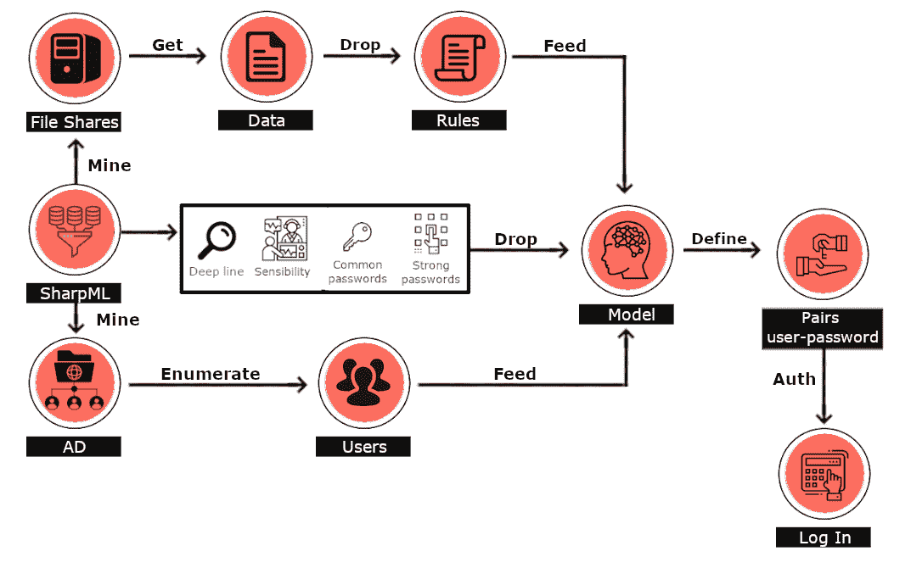

# SharpML:机器学习网络共享密码搜索工具包

> 原文：<https://kalilinuxtutorials.com/sharpml/>

**SharpML** 是一个概念验证文件共享数据挖掘工具，使用 Python 和 C#中的机器学习。

该工具在我们的博客中有更详细的讨论，但也总结如下:

SharpML 是基于 C#和 Python 的工具，它执行许多操作，以挖掘文件共享、查询用户的活动目录、删除 ML 模型和相关规则、执行活动目录认证检查，以通过将挖掘的数据输入 ML 模型来自动搜索文件共享中的密码。

ML 模型是用 Python 编写的，并使用自定义算法来识别密码的可能性。该模型已经用 PyInstaller 编译过，并作为 C#包装器中的资源文件，在它本身、数据和模型之间进行互操作。程序逻辑如下所示:

目前，它允许评估单个文件共享。

您需要对目标文件共享具有读取权限，之后该工具将主要自动执行其活动。

在发布部分有一个编译版本，需要注意的是，这个工具目前是一个概念验证，需要进行大量改进。

**用途**

cmd.exe

SharpML.exe-u \文件共享\d$

钴罢工

**execute-assemb**l**y SharpML.exe-u \ file share \ d $**

[**Download**](https://github.com/HunnicCyber/SharpML)