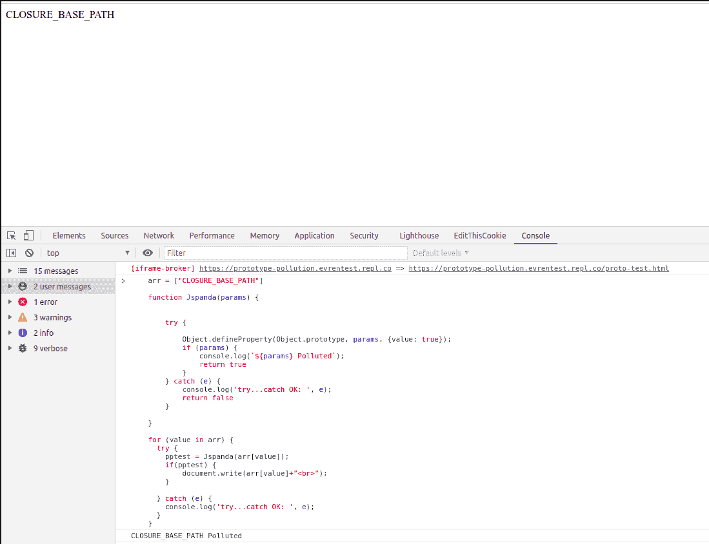

# JSPanda:客户端原型污染漏洞扫描器

> 原文：<https://kalilinuxtutorials.com/jspanda/>

**JSpanda** 是客户端原型污染漏洞扫描器。它有两个关键特性，扫描漏洞提供的网址和分析 JavaScript 库的源代码。

但是，JSpanda 无法检测高级原型污染漏洞。

**js panda 如何工作？**

*   针对原型污染漏洞使用多种有效载荷。
*   收集目标中的所有链接进行扫描，并将有效负载添加到 JSpanda 获得的 URL，使用 headless Chromedriver 导航到每个 URL。
*   扫描潜在易受攻击的 JavaScript 库的源代码中的所有单词，并通过找到脚本小工具来创建一个简单的 JS PoC，帮助您手动分析代码。

**要求**

*   下载最新版本的谷歌 Chrome 和 Chromedriver
*   硒

**用法**

扫描:python3.7 jspanda.py

*   向 url.txt 文件添加 url，*例如:example.com*

基础源代码分析:python3.7 analyze.py

*   向 analyze.js 添加 JavaScript 库的源代码
*   使用 analyze.py 生成 PoC 代码
*   在 Chrome 的控制台上执行 PoC 代码。它污染了从源代码中收集的所有单词，并显示在屏幕上。因此可能会产生假阳性结果。这些输出为研究人员提供了额外的信息，但并没有使一切自动化。

**源代码分析–截图**

[**Download**](https://github.com/RedSection/jspanda)