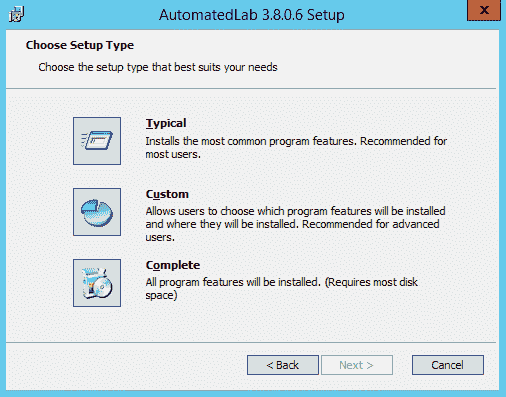
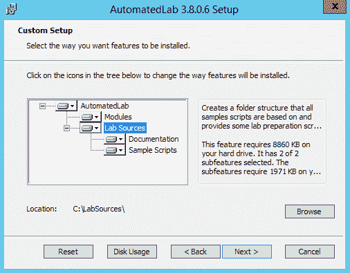
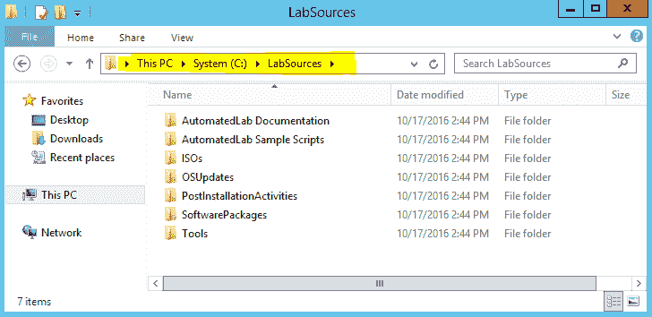
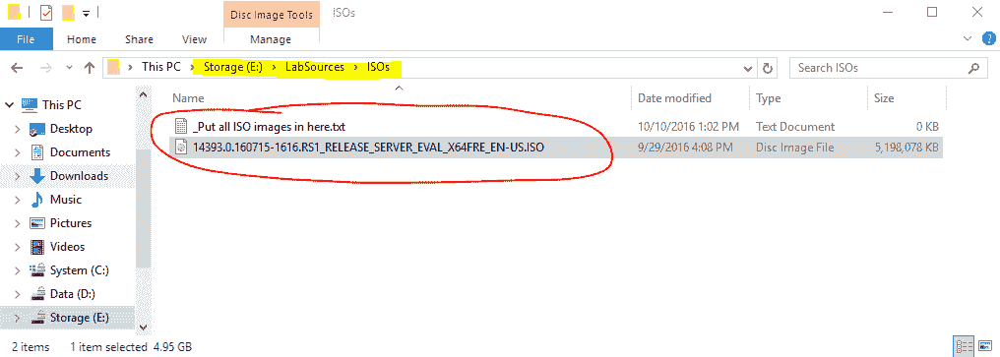
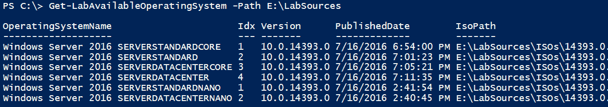
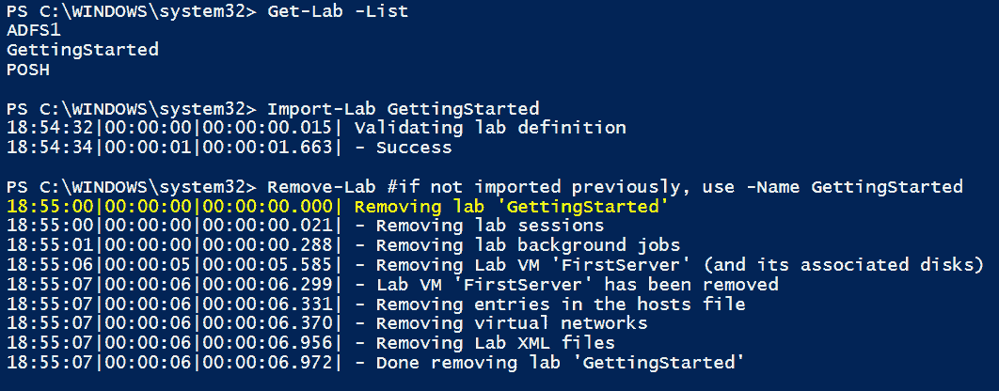

# AutomatedLab:一个配置解决方案和框架，允许您使用简单的 PowerShell 脚本在 HyperV 和 Azure 上部署复杂的实验室

> 原文：<https://kalilinuxtutorials.com/automatedlab/>

**AutomatedLab** (AL)使您能够在很短的时间内在 Hyper-v 或 Azure 上使用多个产品或单个虚拟机设置测试和实验室环境。你只需要确定两个需求:你需要 DVD ISO 镜像和 Hyper-V 主机或者 Azure 订阅。

**要求**

除了模块本身，您的系统还需要满足以下要求:

*   Windows 管理框架 5+ (Windows)
*   。NET 4.7.1 (Windows PowerShell)或。NET Core 2.x (PowerShell 6+)
*   Windows Server 2012 R2+/Windows 8.1+(Hyper-V，Azure)或 Linux (Azure)
*   推荐的操作系统语言是美国英语
*   需要管理员权限
*   要部署的所有操作系统和角色的 ISO 文件
*   支持英特尔 VT-x 或 AMD/V 的 CPU
*   相当多的内存
*   低延迟高吞吐量存储(请不要旋转磁盘，因为存在与它们相关的问题)

**视窗**

*   Windows 管理框架 5+
*   Windows Server 2012 R2+/Windows 8.1+版
*   推荐的操作系统语言是美国英语
*   需要管理员权限

**Linux**

*   支持 WSL，支持 Azure 云外壳
*   在 Fedora 和 Ubuntu 上测试，应该可以在任何能够运行 PowerShell 的系统上运行
*   PowerShell 6+
*   gss-ntlmssp 启用远程处理(强制的——没有远程处理，AutomatedLab 无法完成它的工作)
*   可用的 ip 和路由命令
*   Azure 订阅——目前，AutomatedLab 只能使用 Azure。科索沃核查团计划在晚些时候成立。

**下载 AutomatedLab**

安装 AutomatedLab 有两个选项:

*   可以使用 GitHub 上发布的 MSI 安装程序。
*   或者使用 cmdlet Install-Module 从 PowerShell Gallery 安装。请参考维基了解一些细节。

**安装**

Raimund Andée [MSFT]于 2018 年 2 月 11 日编辑了此页面 5 次修订

AutomatedLab (AL)是一组 PowerShell 模块。为了便于安装，您可以使用提供的 MSI 或 PowerShell Gallery。

MSI 安装程序

下载链接:https://github.com/AutomatedLab/AutomatedLab/releases

装 AL 的时候选择不多。

选项 Typical 和 Complete 实际上是做同样的事情，将 al 安装到默认位置。PowerShell 模块转到“C:\ Program Files \ windows PowerShell \ Modules”，其余的转到“C:\LabSources”。

由于 LabSources 可能会变得很大，您应该进行自定义安装，并将该组件放在一个有足够空闲空间来存储 ISO 文件的磁盘上。该磁盘不一定是 SSD。除非你真的知道你在做什么，否则不要改变模块的位置。

对 AL 来说非常重要的是 LabSources 文件夹，看起来应该是这样的:

如果所有的工作，你已经准备好开始了。

**PowerShell 图库**

PowerShell Gallery 上提供了 AutomatedLab，并定期更新。所有的依赖关系将被考虑在内，并安装一些其他模块。

AutomatedLab 的一个重要部分是 LabSources 文件夹，它不能在 PowerShell Gallery 上提供。引入了一个新的 Cmdlet (New-LabSourcesFolder)，它下载 AutomatedLab 源，仅提取 Lab sources 文件夹并将其放在给定的驱动器上。

您只需要运行两个命令:

**安装-模块-名称自动实验室-允许实验室
新实验室资源文件夹**

**入门**

Raimund Andée [MSFT]于 2017 年 12 月 23 日编辑本页 16 次修订

完成安装后，是时候测试安装第一个完全自动化的实验室了。

**放置 ISO 文件**

当然，没有这些位，AutomatedLab (AL)无法安装操作系统。因此，您需要从 MSDN、TechNet 评估中心或其他地方下载 ISO 文件。这些文件需要放到你的文件夹“ISOs”里，它位于“LabSoures”文件夹里。

“ISOs”文件夹在安装 AL 后只包含一个文件:“_ 把所有 ISO 镜像放在 here.txt”。我已经从 TechNet 评估中心下载了 Windows Server 2016，并将文件如下所示。

**测试 ISO 文件**

为了确保 AL 可以读取该文件，请尝试获取可用操作系统的列表。打开一个**提升的** PowerShell ISE 并调用以下命令(确保指向 LabSources 文件夹的正确位置:

**Get-labavailableoperationsystem-Path E:\ lab sources**

这将返回在 ISO 文件中找到的所有操作系统映像的列表(当然，如果文件夹中有一堆不同的操作系统 ISOS，这也是可行的)。

**安装第一个实验室**

请打开一个**提升的** PowerShell ISE 并创建一个新的空文档(CTRL+N )(如果尚未打开)。

将下列行复制并粘贴到 ISE 中:

**New-Lab definition-Name getting started-default virtualization engine hyper v
Add-labmachinedidefinition-Name first Server-operating system ' Windows Server 2016 Server standard '
Install-Lab
Show-LabDeploymentSummary**

只需按下运行按钮或按下 F5 即可开始部署。

这就是将要发生的事情。许多事情会自动发生，但可以定制:

*   AutomatedLab 启动了一个名为“GettingStarted”的新实验室。实验室定义将存储在 C:\ Users % username % \ Documents \ automated lab-Labs \ getting started 中。可以自定义位置。
*   AL 将更新下载 SysInternals 工具，并将其放入 LabSources 文件夹。
*   AL 查找包含指定操作系统的 ISO 文件。如果找不到 ISO 文件，部署将停止。
*   AL 将唯一的一台机器添加到实验室，发现没有定义网络。在这种情况下，a1 会自动创建一个虚拟交换机，并使用一个空闲的 IP 范围。
*   AL 测量磁盘速度并为实验室选择最快的驱动器，因为在对“New-LabDefinition”的调用中没有定义位置。在我的例子中，它选择 d。测量只进行一次，结果被缓存。
*   然后开始实际部署。艾尔创造了
*   虚拟交换机
*   然后，它为操作系统创建一个基础映像，该映像在所有使用相同操作系统的机器之间共享。
*   然后，创建并启动虚拟机
*   AL 等待机器准备就绪，并显示总安装时间。

我已经上传了延期的日志。您的输出应该看起来非常相似。在我的情况下，部署需要大约 10 分钟。如果基本磁盘已经存在，速度会快得多。

**移除一个实验室**

如果想去掉 lab，只需调用 Remove-Lab。cmdlet 删除虚拟机，包括磁盘和虚拟交换机。它不接触基盘。

如果您同时关闭了 ISE，请指定实验室名称或先将其导入。

**总结**

有了 AutomatedLab，创建各种类型的实验室变得极其容易。通过代码定义您的实验室越多，重新部署它就越容易，并且您长期投资的时间就越少。

如果你喜欢你所看到的，看看文件夹“LabSources \ Sample Scripts \ Introduction”。这些脚本演示了如何创建域、面向互联网的实验室、PKI 等。

如果事情没有按预期进行，请提供反馈。如果你错过了一个功能或有一些伟大的想法，请打开一个问题。

**支持的产品**

该解决方案支持使用以下产品设置虚拟机

*   Windows 7，2008 年 R2，8 / 8.1 和 2012 / 2012 年 R2，2016 年 10 月
*   SQL Server 2008、2008R2、2012、2014、2016、2017、2019
*   Visual Studio 2012、2013、2015
*   Team Foundation Services 2018，Azure DevOps 服务器
*   交换 2013，2016，2019
*   系统中心 Orchestrator 2012
*   系统中心运营经理 2019
*   系统中心服务经理 2019
*   Microsoft Endpoint Manager 配置管理器 1902(及更新版本)
*   山区夏令时
*   ProGet(私有 PowerShell 画廊)
*   办公室 2013，2016，2019
*   DSC 拉式服务器(带 SQL 报告)

**功能列表**

*   AutomatedLab (AL)使实验室的设置变得极其简单。建立一个只有一台机器的实验室只有 3 行代码。甚至复杂的实验也可以用大约 100 行代码来定义(参见示例脚本)。
*   Azure 上的实验室可以相互连接，或者使用一个命令连接到 Hyper-V 实验室。
*   AL 可用于设置场景以演示使用 Inedo ProGet 的 PowerShell Gallery、PowerShell DSC Pull 服务器场景、ADFS 或具有 3 个相互信任的活动目录林的实验室。
*   使用一个 cmdlet (Checkpoint-LabVM，Restore-LabVMSnapshot，Remove-LabVMSnapshot)创建、恢复和删除部分或所有实验室机器的快照。
*   用一行代码(Install-LabWindowsFeature)在一台、一些或所有实验室机器上安装 Windows 功能。
*   只需一个 cmdlet(Install-labsoftware packages)就可以将软件安装到一堆实验室机器上。您只需要知道使 MSI 或 EXE 进入静默安装模式的参数。由于 PowerShell 工作流，这也可以并行工作。
*   在多台实验室机器上运行任何自定义活动(脚本或脚本块)(Invoke-LabCommand)。您不必担心凭据或双跃点身份验证问题，因为 CredSsp 始终处于启用状态，并且可以与 UseCredSsp 开关一起使用。
*   创建一个连接到互联网的虚拟环境从未如此简单。唯一的要求是定义一个面向外部的虚拟交换机和一台带有两个网卡的机器，作为路由器。AL 负责所有的配置细节，如在所有机器上设置网关以及 DNS 设置(参见介绍脚本 05 单域加入服务器(面向互联网). ps1)。
*   AL 只需一个命令就能提供离线补丁。由于所有机器都基于每个操作系统一个磁盘，所以为用于创建基本映像的 ISO 文件打补丁要高效得多。有关更多详细信息，请参见脚本 11 ISO 离线修补. ps1。
*   如果不再需要某个实验室，一个命令就足以删除一切准备从头开始(Remove-Lab)

[**Download**](https://github.com/AutomatedLab/AutomatedLab)