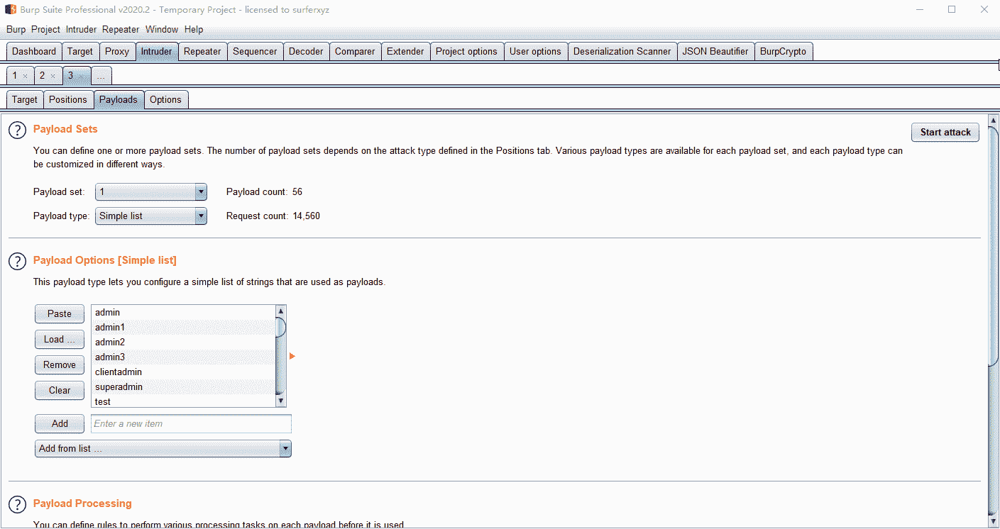
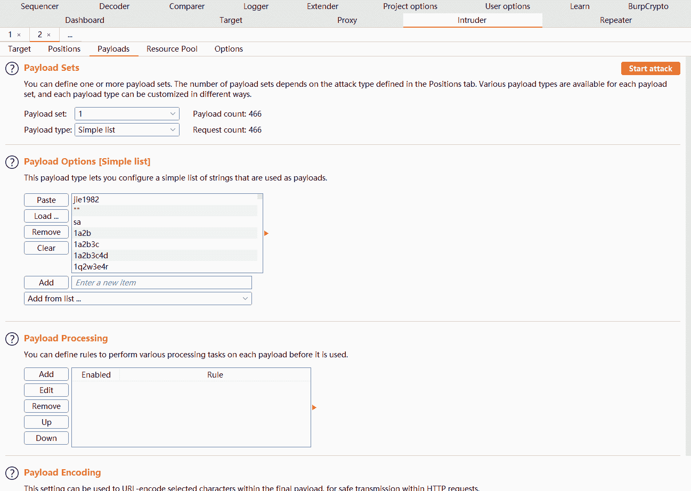
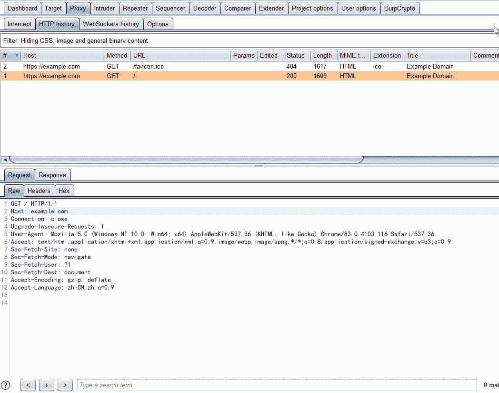

# BurpCrypto:Burpsuite 加密插件的集合，支持 AES/RSA/DES/ExecJs(在 burp suite 中执行 Js 加密代码)

> 原文：<https://kalilinuxtutorials.com/burpcrypto/>

**Burpcrypto** 是 burpsuite 加密插件的集合，支持 AES/RSA/DES/ExecJs(在 burpsuite 中执行 Js 加密代码)。

**打造**

`**$ mvn package**`

**用法**

Chinese instructions for use

*   从发行版下载预编译的 jar 包。
*   将这个 jar 包添加到您的 burpsuite 的扩展中。
*   切换到密码选项卡，选择您需要的密码选项卡。
*   设置键或某个值。
*   按“添加处理器”，并为此处理器命名。
*   切换到入侵者->有效载荷->有效载荷处理。
*   按“添加”，选择“调用打嗝扩展”，并选择您刚刚创建的处理器。
*   按“开始攻击”，玩得开心！

**重点例子**

*   Aes Key(UTF8String): abcdefgabcdefg12
*   Aes IV(UTF8String): abcdefgabcdefg12
*   Rsa X509 密钥:migfma 0 gcsqgsib 3 dqebaquea 4 gndcbiqbkbgqc 0 hrrijb 3 nodwntbpanbjt 5 iwu 2 nfidu 16 EC 87 toqeoim 2 ki+cos 81 jp 9 atdk/jkalu 97 Mn 8 wzkemder 5 utaztmvht 7 glx 33 wx 9 xjqxudfsgkqnl 8 dxjklwdu 9 zh 80 ui 2 ug+340 dztktd+NV 09 qzggdnsp 9
*   Rsa 模块:ca 27d 90 f 03753 cbbc 9958011 BAF 701 AC 99305 b 63 f68 e 26 ab 56517593 e 01 d2fb 51927 FB 87 BAF 6 e 0472 EC 3 a 03575 fa 292 adadbc 79390 a 955 a 61 b 2931 f 78 f 4734773048 a 45 DCF 100 e 23 cabf 2 df 11a 55 aa 90 CD 6b 024 a 44 eed 1096 c 3 b 9 e 1408d 46 aae 54d 7291 b 82 Fe 4 b 7867 c
*   Rsa 指数:010001
*   DES 密钥:12345678
*   需要密钥:12345 678123456812345678

**截图**

AES 示例:

ExecJs 示例(这里是修改后的 MD5 算法):

快速加密:

[**Download**](https://github.com/whwlsfb/BurpCrypto)