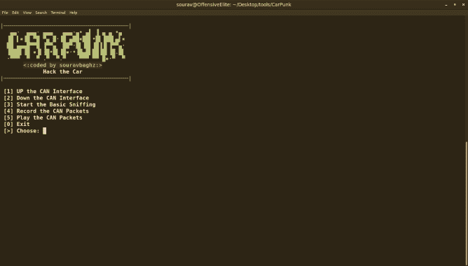
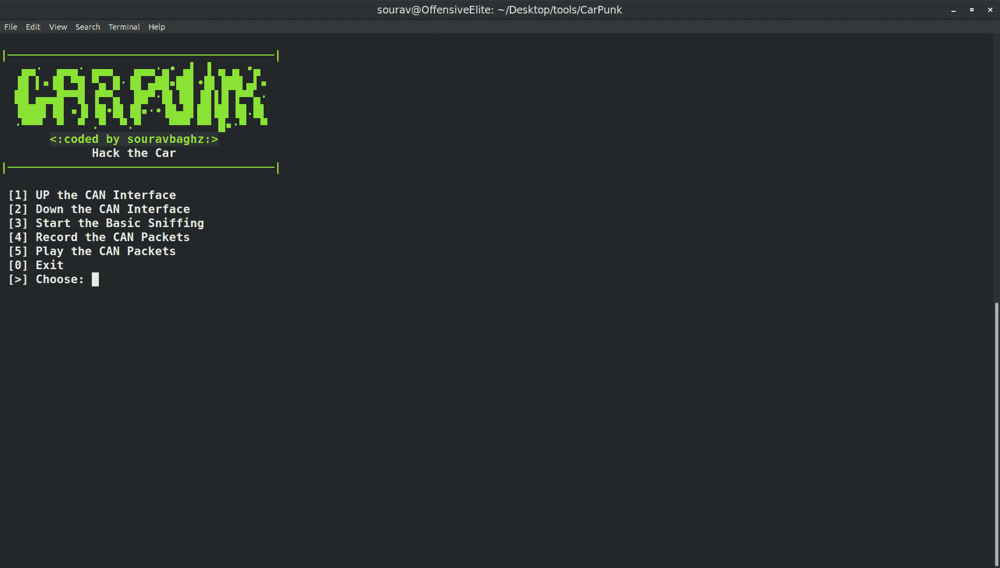

# CarPunk:汽车黑客工具包

> 原文：<https://kalilinuxtutorials.com/carpunk/>

CarPunk 与 CANghost 非常相似，唯一不同的是，它额外提供了启用或禁用接口和基本嗅探的选项。

*   它适用于模拟和真实的汽车。
*   具有录制和播放 CAN 数据包的选项。
*   运行时不需要任何参数，但需要更改(日志文件的接口和名称)，如果你在现实世界中尝试。
*   在 UBUNTU 上用模拟器和实车进行了测试。

* * *

**运行 CARPUNK 前要做的事情**

*   你必须手动加载你的 CANBUS 驱动，CARPUNK 只做 UP 和 DOWN。
*   打开 carpunk.sh 文件到你喜欢的文本编辑器中，根据你的需要改变界面和日志文件名。延迟接口是 vcan0 & carpunk 作为日志文件名。
*   **安装&CarPunk 的使用:**

**git 克隆 https://github.com/souravbaghz/CarPunk
CD carbonk
sudo bash carbonk . sh**

*   [1]打开 CAN 接口:启用/打开 CAN 接口。
*   [2]关闭 CAN 接口:关闭 CAN 接口。
*   [3]启动基本嗅探:仅启动嗅探(通过 ctrl+c 停止后立即清除终端)。
*   [4]记录 CAN 数据包:将 CAN 数据包捕获/记录到文件中(如 carpunk1.log-名称多次为 carpunk2.log、carpunk3.log 等)。
*   [5]播放 CAN 数据包:重放您之前捕获的 CAN 数据包(需要指定日志文件。例如:carpunk1.log)。
*   [0]退出:退出 CarPunk 脚本。

[**Download**](https://github.com/souravbaghz/CarPunk)