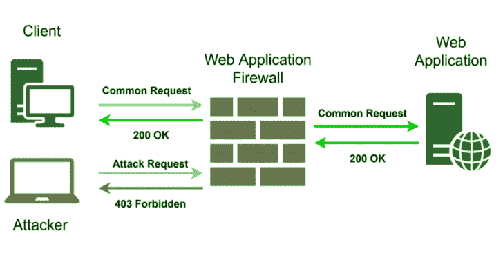
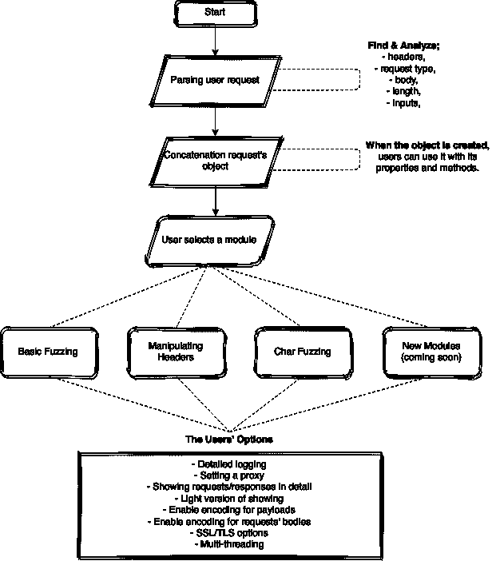

# pFuzz:通过同时使用不同的方法帮助我们绕过 Web 应用程序防火墙

> [https://kallinuxxtauthorities . com/pfzz/](https://kalilinuxtutorials.com/pfuzz/)

pFuzz 是一款先进的 red teaming fuzzing 工具，是我们为自己的研究开发的。它帮助我们通过同时使用不同的方法来绕过 web 应用防火墙。

这是我们为无病毒 web 应用程序研究开发的一种高级模糊处理工具。旨在加速在不同安全应用程序上尝试各种攻击方法。

**描述【en】**

pFuzz 是用 python 语言开发的工具，在 web 应用程序研究中具有高级模糊功能。由于该应用程序具有模块化结构，它能够快速将新的已发现/待发现 WAF 旁路方法添加到 pFuzz 中，并在所有其他 WAF 上进行测试。除了模块化结构之外，还使用了多线程、多处理和队列结构来提高工具的灵活性，并为未来的开发创建了基础架构。

该工具经过编程，可以解析给定的请求，并轻松地在对象上进行更改。由于这种结构，那些将开发应用程序的人将能够轻松地做出贡献，并开发符合自己需求的工具，而不必改变应用程序的核心结构，也不必学习。

* * *

**注意**:如果你想为开发做贡献，你不仅可以开发 pFuzz，还可以添加新的模块。请随意打开新的 PR🙂

* * *

说明【tr】

pfuzz 是 python 开发的工具，可在 web 应用程序研究中提供高级模糊功能。由于应用程序具有模块化结构，因此新的/将要发现的 WAF 绕过方法可以快速添加到 pfz 中，并且可以在所有其他 WAF 上进行测试。除了模组化的架构之外，还建立了子架构，可使用多执行绪、多重处理、queue 等架构，让您的工具更具弹性，并可在未来进行改良

该应用程序是为通过解析给定的请求而设计的，可以方便地在对象上进行修改。通过这种结构，开发应用程序的人员可以轻松地帮助开发应用程序，而无需更改应用程序的核心结构，也无需学习如何根据自己的需求进行开发

* * *

**注**:如果您想为开发作出贡献，您可以通过添加新模块来实现，而不仅仅是内核的开发。我们正在等待您的新公关

**流量**

**安装和使用**

**sudo pip 3 install virtualenv
python 3-m venv myvenv
source myvenv/bin/activate
pip 3 install-r requirements . txt
python 3 pfuzz . py–help**

**依赖关系**

**cffi = 1 . 14 . 3
密码学= 3 . 1 . 1
num py = 1 . 19 . 2
熊猫= 1 . 1 . 3
pycparser = 2.20
pyopenssl = 19 . 1 . 0
python-date util = 2 . 8 . 1**

**用途**

**帮助**

**python 3 pfuzz . py–帮助**

**操纵表头模块**

**python 3 pfuzz . py-r request . txt-m**

**Charfuzzing 模块**

**python 3 pfuzz . py-r request . txt-cf**

**模糊模块**

**python 3 pfuzz . py-r request . txt-f**

**添加代理**

**python 3 pfuzz . py-r request . txt-f–proxy 127 . 0 . 0 . 1:8080**

**在请求之间添加延迟**

**python 3 pfuzz . py-r request . txt-f-d 3**

**启用 TLS/SSL 连接**

**python 3 pfuzz . py-r request . txt-f-s**

**启用日志记录**

**python 3 pfuzz . py-r request . txt-f-l**

**启用有效载荷编码/全编码功能**

**python 3 pfuzz . py-r request . txt-f-e**

**python 3 pfuzz . py-r request . txt-f-Fe**

**设置多线程**

**python 3 pfuzz . py-r request . txt-f-t 5**

**输出到端子**

**python 3 pfuzz . py-r request . txt-f-o 终端**

**python 3 pfuzz . py-r request . txt-f-od 终端**

**输出到文件**

**python 3 pfuzz . py-r request . txt-f-o ~/Desktop/**

**python 3 pfuzz . py-r request . txt-f-od ~/tmp/**

**帮助**

**用法:pfuzz . py[-h][–REQUEST REQUEST][–PROXY PROXY][–log][–SSL]
[–THREADS THREADS][–OUTPUT][–delay TIME]
[–OUTPUT-details OUTPUT][–full-encode][–encode]
[–fuzz][–charfuzz][–manipulate][–version]
可选参数:
–help/-h 显示此帮助消息并退出【T6–PROXY/-p PROXY PROXY[IP:PORT]
–version/-v 显示程序的版本号并退出
【请求选项】:
–Request/-r 请求请求文件
–delay/-d 时间设置请求之间的延迟[默认值= 0.05]
–encode/-e 编码 uri/body 中的空格字符
–full-encode/-Fe 编码 uri/body 中的所有字符
【输出选项】:
–Output/-o 输出重要信息[终端/文件夹名] 【T18
【模块】:
–fuzz/-f 运行模糊化模块
–char fuzz/-cf 运行 char 模糊化模块
–manipulate/-m 运行操纵头模块
用法:python 3 pfu ZZ . py-r req . txt–log-s–fuzz-d 1–encode-o terminal–threads 2
用法:python 3 pfu ZZ . py-r req . txt-f-l–proxy 127 . 0 . 0 . 1:8080–proxy**

**临时演员**

**如何开发新模块**

*   应该在 **modules/** 文件夹中创建一个指定模块名称的 python 文件。
*   **模块**
*   **–charfuzzer . py**
*   **–ex parse . py**
*   **–fuzzer . py**
*   **–header operations . py**
*   **–manipulating headers . py**

您可以使用类似于 **myreq = HTTPReq.getobj()** 的解析对象

**从 reqparser 导入 http req
myreq = http req . get obj()**

它有许多从 **HTTPReq** 类派生的属性。您可以在 **reqparser.py.** 中查看

**…
myreq . uri
myreq . body
myreq . http
myreq . referer
myreq . origin
myreq . host
myreq . cookie
…**

如果您想从 excel 中获取有效负载，可以使用来自 modules.exparse 的 **getpayloads** 方法。

*   getpayloads(fuzzsheetName，genericcolmnName，fuzzingpayloads)

**从 modules.exparse 导入 get payloads
get payloads(fuzzsheetName，genericcolmnName，fuzzingpayloads)**

我们在 **static/** 文件夹下的 statics.py 中设置 statics-objects，比如 fuzzsheetName。

**# static/statics . py 中的 Fuzzing 模块
fuzz sheet name = ' Fuzzing '
genericcolmnName = ' Payload '
Fuzzing payloads =[]**

现在，您可以随意更改/添加/删除属性。

**myreq . uri = tmpuri+payload
myreq . add header(header，" 127 . 0 . 0 . 1 ")
myreq . content _ type = " text/html "**

要停止多线程，您应该在有效载荷的末尾添加 **#exitme#** 有效载荷，并设置 **statics.exitCall = True** 来检查队列是否为空。

**from modules . ex parse import get payloads
for payloads in fuzzing payloads:
if payload = = ' # exit me # ':
statics . exit call = True
else:
【操作】**

当您的对象(请求)准备好被发送时，您可以使用 **sendit()** 函数对其进行排队。

**从 reqsender 导入 sendit
sendit(myreq)**

如果您需要更改 pFuzz 中的核心功能，您可以启动一个 pull 请求或打开一个问题。

#### 开发新模块的一些重要功能

| 目标 | 模块/类别 | 功能 | 参数 |
| --- | --- | --- | --- |
| 发送请求 | reqsender.py | sendit() | 目标 |
| 要使用请求对象 | reqparser.py/HTTPReq | getobj() | – |
| 添加自定义页眉 | reqparser.py/HTTPReq | OBJECT.addheader() | newHeadername,value |
| 删除标题 | reqparser.py/HTTPReq | OBJECT.delheader() | headerName |
| 要更改页眉 | reqparser.py/HTTPReq | OBJECT.changeheader() | headerName,newHeaderName |
| 从文件中获取有效载荷 | exparse.py | getpayloads() | sheetName,columnName |
| 写日志信息/调试/警告 | waflogger.py | loginfo/logdebug/logwarn() | 日志消息 |

[**Download**](https://github.com/RedSection/pFuzz)