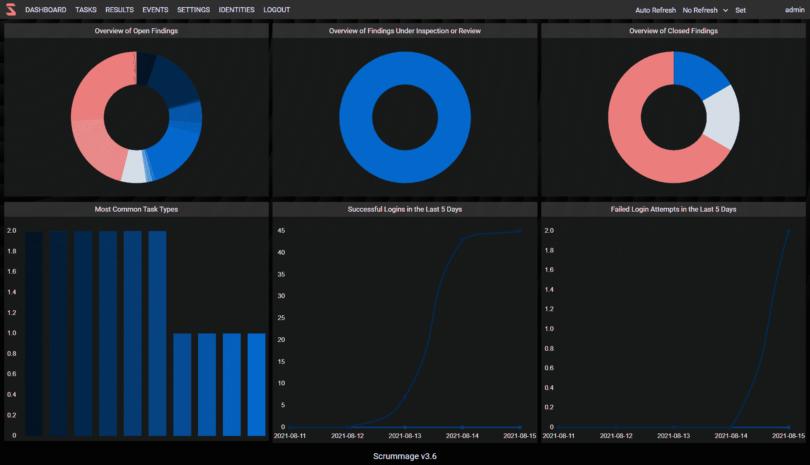
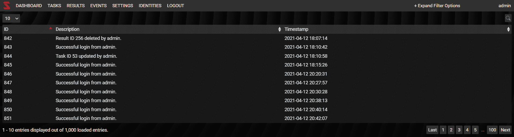
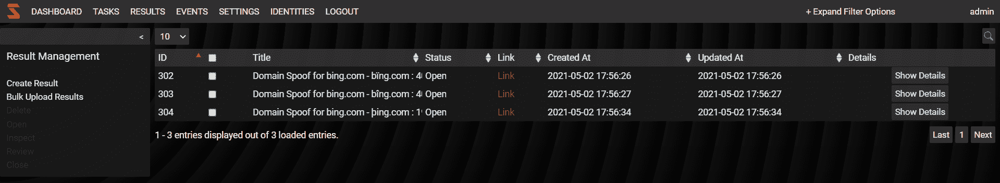
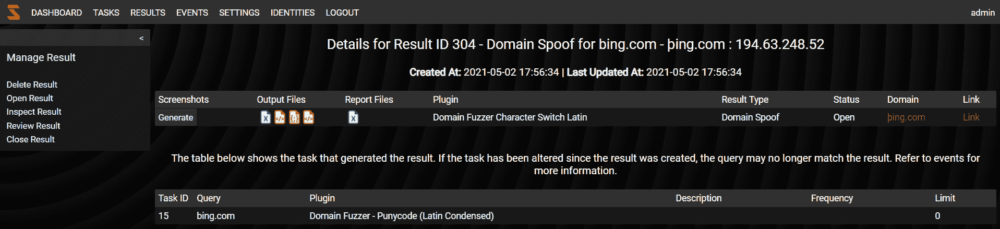
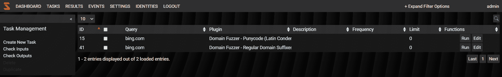
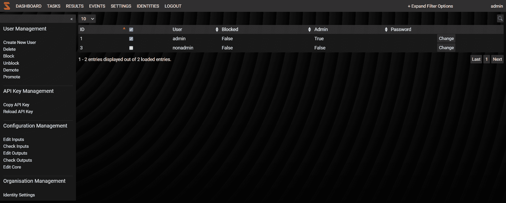
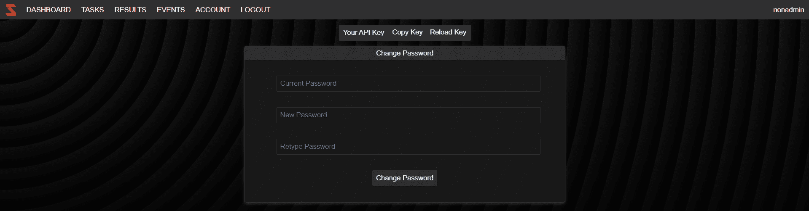
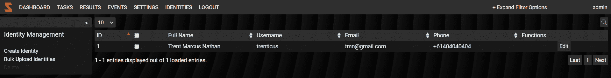
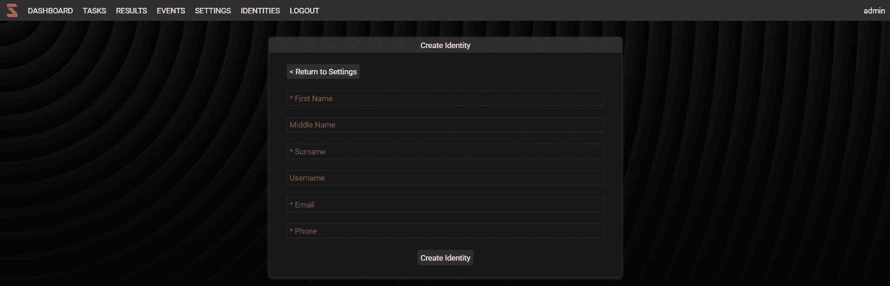
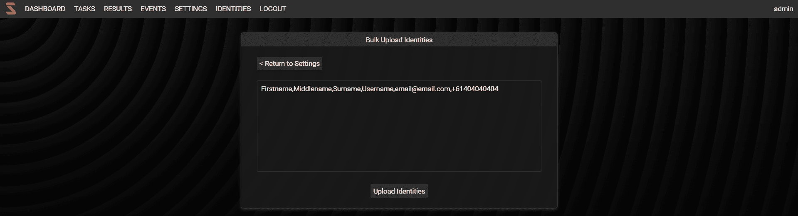

# Scrummage:终极的犯罪和威胁搜索框架

> 原文：<https://kalilinuxtutorials.com/scrummage/>

Scrummage 是一个 OSINT 工具，它集中了强大而简单的 OSINT 网站的搜索功能。该项目主要从另外两个项目中获得灵感，包括:

*   Scumblr 项目启发了这个概念，虽然现在已经被否决了。
*   OSINT 框架项目，这是一个可视化工具，描述了一系列可以用来搜索各种东西的站点。

虽然乍一看，与 Scumblr 相比，web 应用程序可能看起来没有什么不同，但这个工具附带的大量插件是这个项目的独特之处，其中提供的 Python/Flask web 应用程序只是一种简单、轻量级和可扩展的方式，为用户提供了管理大型结果池的能力。该项目吹嘘的另一个主要好处是安装过程更简单，与现在已被否决的 Scumblr 相比，安装过程是最新的。

欢迎任何反馈。

**网络应用概述**

**许多可用的 Scrummage 插件中的一些**

*   区块链搜索
*   领域模糊器
*   推特刮刀
*   Instagram 搜索
*   我被搜查了吗
*   Ahmia Darkweb 搜索
*   IP 堆栈搜索
*   威胁人群搜索
*   Yandex 和 Naver 搜索
*   Vkontakte 搜索
*   Vulners 搜索
*   通过搜索构建
*   YouTube 搜索
*   更多…请参考这里的 wiki 页面获取完整列表。

* * *

**仪表盘**

仪表板是应用程序在用户登录时引导用户到的主屏幕。它提供了一个高级图表，根据结果类型显示每个结果的数量。它对每一种发现都这样做。但是，如果没有加载图表，这很可能是因为没有结果属于该类别，即如果没有已关闭的结果，则“已关闭结果概述”下不会显示任何图表。

**事件**

“事件”页面显示 web 应用程序中发生的任何变化，从登录、失败的登录尝试，到针对任务执行的任何操作。这有助于理解 web 应用程序中最近发生的事情，并有助于检测暴力登录尝试或追踪谁修改了任务。

***注意:**该页面仅加载最新的 1000 个事件，用于优化 web 应用程序。*

**结果**

结果页面只显示任务创建的结果。结果表显示了结果的基本元数据，还提供了一个“详细信息”按钮，可用于进一步调查结果。如前所述，所有结果都有某种输出文件，如果结果是一个链接，该文件将是页面 HTML 的副本。此外，还提供截屏功能，以帮助保存结果的照片记录。如果结果被删除，输出和截图文件都将被删除。

***注意:**本页面只加载最新的 1000 个结果，用于网络应用的优化。*

出于优化目的，结果表仅显示关于结果的一些一般信息，要进一步调查结果，用户应使用详细信息按钮。详细信息页面允许用户查看结果链接的软拷贝，并为用户提供生成屏幕截图的能力。

**任务**

任务页面显示所有创建的任务，并为用户提供运行每个任务的能力。此页面没有任务限制；然而，不要疯狂地创建任务，你总是可以给一个任务添加一个列表，而不是为一个搜索多次创建同一个任务。所以实际上你不应该有超过 50 个任务。任务都有缓存和日志记录，可以在任务名下的“protected/output”目录中找到。谷歌搜索被称为“谷歌”。如果需要删除缓存，可以编辑/删除相应的缓存文件。

所有的插件都是开源的，对个人免费，就像其他代码一样。此外，您可以随意使用其他插件中已有的库。如果您正在创建或编辑插件，请确保了解当您第一次运行它时，web 应用程序可能会重新加载 python 缓存。这很正常。

**账户设置**

此页面根据用户的权限而变化，如果用户是管理员，他们可以更改自己的密码以及其他用户的密码，他们可以阻止和取消阻止用户，降级和提升用户的权限，当然还可以创建新用户和删除现有用户。另外，拥有管理权限的用户可以检查和编辑工具的输入、输出和核心配置。
管理用户的账户页面如下:

对于非管理用户，帐户页面如下所示:

**身份**

这个概念是在 Scrummage 平台的 3.6 版本中引入的，这个页面不要和账户设置页面混淆。帐户设置是用来管理 Scrummage 平台本身的用户的，身份是一个完全可选的特性，如果有行，其中的信息可以在执行任务时使用。
这是主页面，描述了一个出于文档目的而创建的假身份表:

可以通过以下三种方式之一创建身份:

*   个人创建(使用“创建身份”功能。)

*   批量上传身份(使用“批量上传”功能。)

*   如果你有一个 IDM 系统，欢迎你直接进入 Scrummage 数据库，在`**org_identities**`桌子下面。这将有助于有效地简化和维护您的身份列表。

[**Download**](https://github.com/matamorphosis/Scrummage)