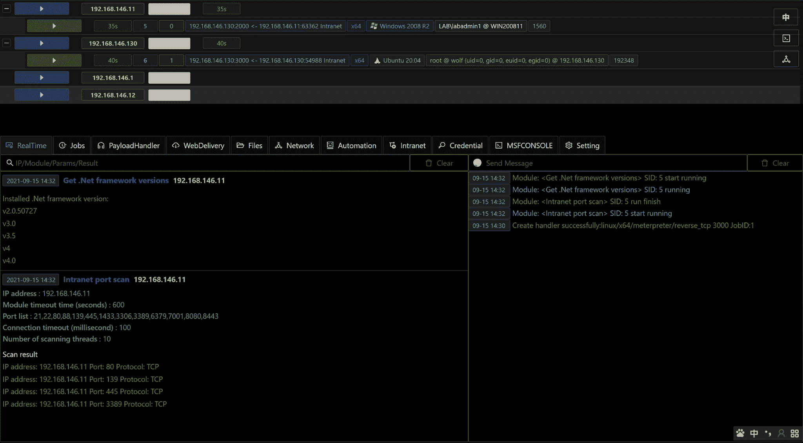
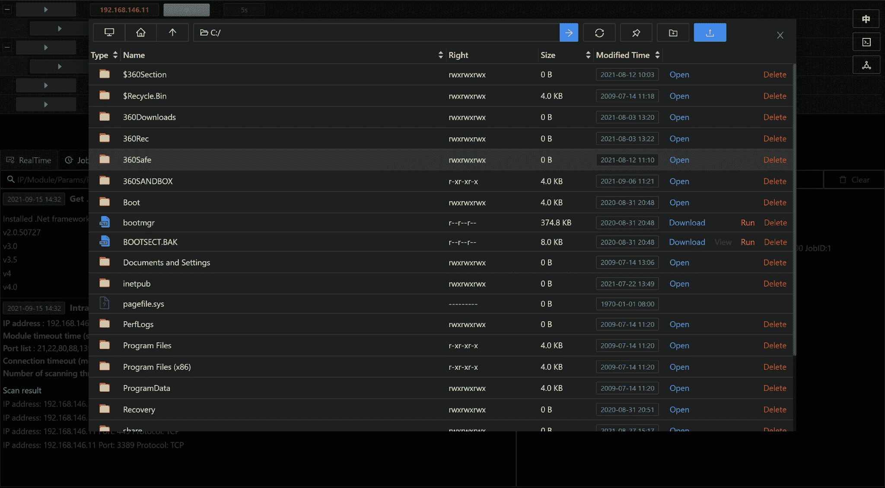
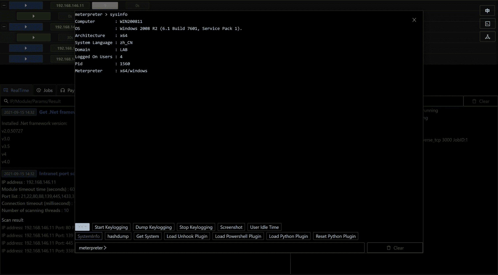
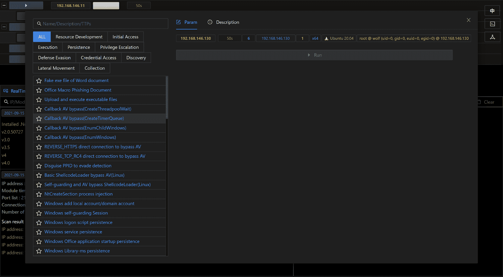
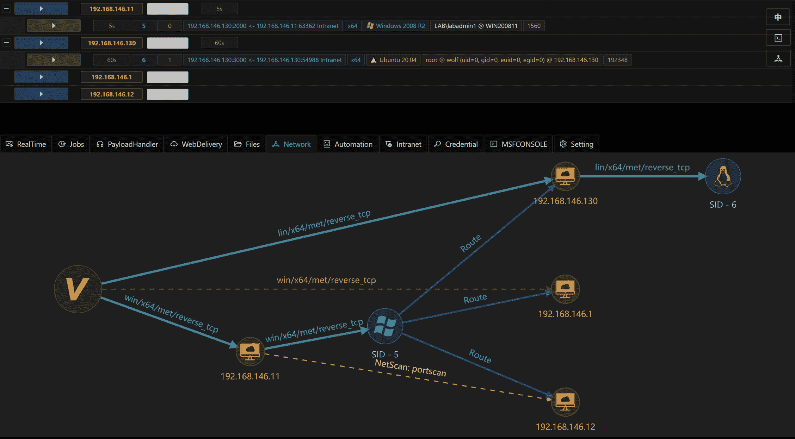
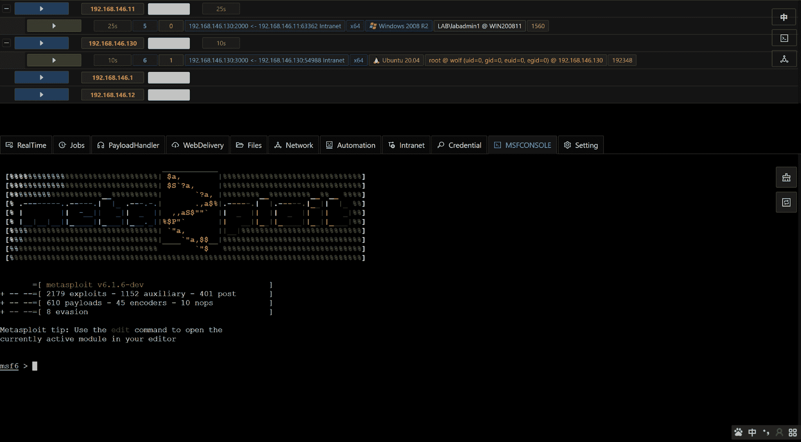

# Viper:带有 Webui 的内部网测试工具

> 原文：<https://kalilinuxtutorials.com/viper/>

*   **Viper** 是一款图形化的内网渗透工具，将内网渗透过程中常用的战术和技术模块化和武器化
*   Viper 集成了旁路杀毒软件、内网隧道、文件管理、命令行等基本功能
*   Viper 集成了 80+模块，涵盖资源开发/初始访问/执行/持久化/权限提升/防御规避/凭证访问/发现/横向移动/收集等类别
*   Viper 的目标是帮助红队工程师提高攻击效率，简化操作，降低技术门槛
*   Viper 支持在浏览器中运行本机 msfconsole 和多人协作

[**Download**](https://github.com/FunnyWolf/Viper)