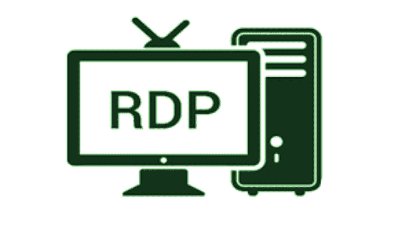

# Rdesktop:微软 RDP 协议的开源客户端

> 原文：<https://kalilinuxtutorials.com/rdesktop/>

Rdesktop 是微软 RDP 协议的开源客户端。众所周知，它适用于从 NT 4 终端服务器到 Windows 2012 R2 RDS 的 Windows 版本。rdesktop 目前已经实现了 RDP 版本 4 和 5 协议。

**安装**

rdesktop 使用 GNU 风格的构建过程。通常，安装 rdesktop 所需的全部内容如下:

**%。/configure
% make
% make install**

默认是安装在`**/usr/local**`下。这可以通过在配置行添加`**--prefix=<directory>**`来改变。

智能卡支持模块使用 PCSC 精简版。您应该使用 PCSC-建兴 1.2.9 或更高版本。要在 rdesktop 中启用智能卡支持，请将`**--enable-smartcard**`添加到配置行。

**用户注意事项构建来源**

如果您已经获取了 rdesktop 源代码的快照，那么您将首先需要运行`**./bootstrap**`来生成构建基础设施。对于 rdesktop 的发布版本，这不是必需的。

**用法**

用以下方式连接到 RDP 服务器:

**% rdesktop 服务器**

其中`**server**`是终端服务机器的名称。如果您收到“连接被拒绝”，这可能意味着服务器没有启用终端服务，或者有防火墙阻止访问。

您还可以在命令行上指定许多选项。这些在 rdesktop 手册页中列出(运行`**man rdesktop**`)。

[**Download**](https://github.com/rdesktop/rdesktop)