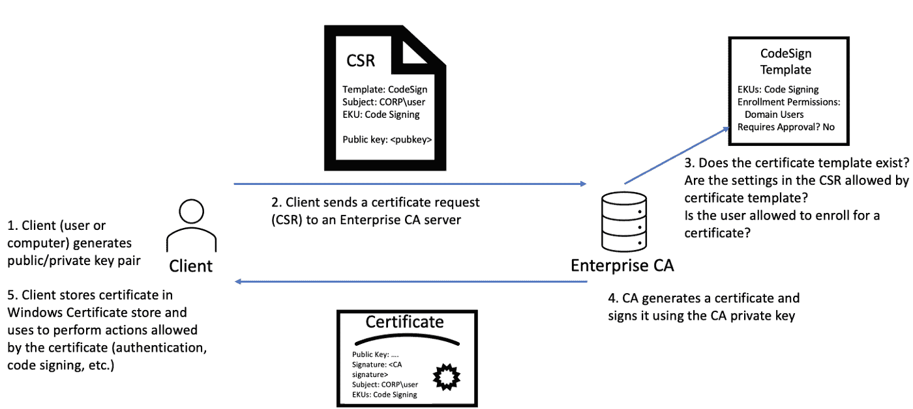

# 伪造证书:“黄金”证书

> 原文：<https://kalilinuxtutorials.com/forgecert/>

ForgeCert 使用 BouncyCastle C# API 和一个窃取的证书颁发机构(CA)证书+私钥为能够对 Active Directory 进行身份验证的任意用户伪造证书。

在我们的“认证二手车”白皮书中，这种攻击被编码为`**DPERSIST1**`。该代码库是在白皮书发布后大约 45 天发布的。

@tifkin_ 是 ForgeCert 的第一作者。

@tifkin [_](https://twitter.com/tifkin_) 和@harmj0y 是相关 Active Directory 证书服务研究(博客和白皮书)的主要作者。

**背景**

如我们的白皮书的`**Background**`和`**Forging Certificates with Stolen CA Certificates - DPERSIST1**`部分所述，认证机构的 CA 证书的私钥在 CA 服务器上通过 DPAPI 或硬件(HSM/TPM)受到保护。此外，证书(sans 私钥)被发布到 **NTAuthCertificates** 森林对象，该对象定义了启用 AD 身份验证的 CA 证书。总之，其证书存在于 **NTAuthCertificates** 中的 CA 使用其私钥对来自请求客户端的证书签名请求(CSR)进行签名。下图总结了这一过程:

CA 私钥的安全性至关重要。如上所述，如果私钥不受 TPM 或 HSM 等硬件解决方案的保护，则该密钥将使用数据保护 API (DPAPI)进行加密，并存储在 CA 服务器的磁盘上。如果攻击者能够破坏 CA 服务器，他们可以通过使用@gentilkiwi 的 Mimikatz 或 GhostPack 的 SharpDPAPI 项目来提取不受硬件保护的任何 CA 证书的私钥。白皮书中的`**THEFT3**`描述了机器证书的这一过程。

因为用于签署颁发的证书的唯一密钥材料是 CA 的私钥，如果攻击者窃取了这样的密钥(对于 **NTAuthCertificates** 中的证书),他们就可以伪造能够进行域认证的证书。这些伪造的证书可以用于域中的任何主体(尽管帐户需要“活动”才能进行身份验证，所以像 krbtgt 这样的帐户将不起作用)，并且只要 CA 证书有效，证书就有效(默认情况下通常为 5 年，但可以设置得更长)。

此外，由于这些证书不是正常发行过程的产物，CA 不知道它们是被创建的。因此，证书不能被撤销。

**注意:**在 **NTAuthCertificates** (根或下级 CA)中任何 CA 证书的私钥都可以用来伪造能够在林中认证的证书。如果证书/密钥来自下级 CA，则必须提供用于验证证书链的合法 CRL。

ForgeCert 使用 BouncyCastle 的 X509V3CertificateGenerator 来执行伪造。

**命令行用法**

**C:\ Temp>ForgeCert.exe
forcert 1 . 0 . 0 . 0
Copyright C 2021
错误:
缺少必需选项‘CaCertPath’。
缺少必需选项“SubjectAltName”。
缺少必需的选项“NewCertPath”。
缺少必需的选项“NewCertPassword”。
–需要 CaCertPath。CA 私钥为. pfx 或. p12 文件
–CA 私钥文件的 CaCertPassword 密码
–Subject(默认值:CN=User)证书中的主题名称
–Subject altname 必填。要验证为
的用户的 UPN–需要 NewCertPath。保存新的路径。pfx 证书
–需要新证书密码。的密码。pfx 文件
–伪造证书 CRL 的 CRL ldap 路径
–帮助显示此帮助屏幕。
–版本信息显示 versi** 。

**用途**

**注意**:关于窃取 CA 私钥和伪造认证证书的完整演练，请参见白皮书中的`**DPERSIST1**`。

背景:

*   被盗 CA 的证书是`**ca.pfx**`，用密码`**Password123!**`加密
*   主题是任意的，因为我们为证书指定了一个主题替换名称。
*   主题别名(即我们正在为其伪造证书的用户)是`**localadmin@theshire.local**`。
*   伪造的证书将保存为`**localadmin.pfx**`，用密码`**NewPassword123!**`加密

ForgeCert.exe–cacert path ca . pfx–cacert password " password 123！"–Subject " CN = User "-Subject altname " local admin @ the shire . local "-NewCertPath local admin . pfx-NewCertPassword " new password 123！"
CA 证书信息:
Subject: CN=theshire-DC-CA，DC=theshire，DC = local
Issuer:CN = the shire-DC-CA，DC=theshire，DC=local
开始日期:2021 年 1 月 4 日 10:48:02 AM
结束日期:2026 年 1 月 4 日 10:58:02 AM
指纹:187d 81530 E1 adbb 6 b 8 b 9 b 961 eaadc 1 使用密码“NewPassword123！”将伪造的证书保存到 localadmin.pfx

这种伪造可以在攻击者控制的系统上完成，生成的证书可用于 Rubeus 请求 TGT(和/或检索用户的 NTLM😉

**防守注意事项**

当前 ForgeCert 代码库的 TypeRefHash 为 b 26 b 451 ff 2c 947 AE 5904 f 962 e 56 facbb 45269995 fbb 813070386472 f 307 cfcf 0。

ForgeCert 的 TypeLib GUID 为**BD 346689-8ee 6-40 B3-858 b-4 ed 94 f 08d 40 a**。这反映在当前回购协议中的 Yara 规则中。

参见我们白皮书 [r](https://specterops.io/assets/resources/Certified_Pre-Owned.pdf) 中的`**PREVENT1**`、`**DETECT3**`、`**DETECT5**`进行预防和检测指导。

Fabian Bader 发表了一篇很棒的文章，讲述了如何通过 OSCP 的调整来减少“黄金证书”的使用。请注意，在**最终想法**部分，他提到`**This method is not bulletproof at all. Since the attacker is in charge of the certificate creation process, she could just change the serial number to a valid one.**`这是在他的 PR 中实现的，尽管记住默认情况下序列号是随机的，这意味着 OSCP 预防应该在许多情况下有效，并且在我们看来值得实现。

我们相信可能有机会为该项目产生的伪造证书类型建立 Yara/其他检测规则——如果任何防御研究人员找到签署这些文件的好方法，请告诉我们，我们将在此更新 Yara 规则/防御指南。

**反思**

“黄金门票”(伪造的 TGT)和这些“黄金证书”(强制广告 CS 证书)之间有明显的相似之处。krbtgt 哈希和 CA 私钥都是对 Active Directory 环境的安全性至关重要的加密材料，并且都可以用于为任意用户伪造授权码。然而，虽然 krbtgt 散列可以通过 DCSync 远程检索，但 CA 私钥必须(至少就我们所知)通过在 CA 机器本身上执行代码来恢复。虽然 krbtgt 散列可以相对容易地旋转*，但是旋转 CA 私钥要困难得多。*

在公开披露方面，我们在发布白皮书后的大约 45 天内自行禁止发布我们的攻击性工具(ForgeCert 和 Certify ),以便让组织有机会了解有关 Active Directory 证书服务的问题。然而，我们发现，组织和供应商在历史上通常不会修复问题或建立对“理论”攻击的检测，直到有人通过概念证明证明某些事情是可能的。

这反映在一些人对我们所说的 **`this IS StUPId, oF COurse YoU Can FORge CERts WITH ThE ca PriVAtE KeY.`到**的研究的反应上，是的，很多事情都是可能的，但是 **`PoC||GTFO`**

[**Download**](https://github.com/GhostPack/ForgeCert)