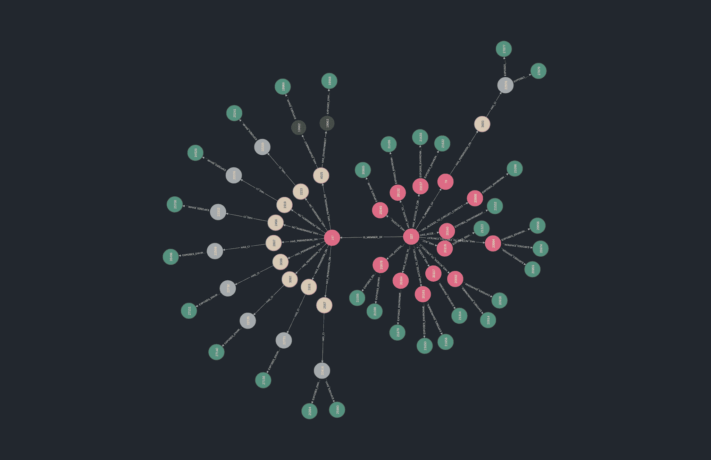

# 吉图斯:所有的路都通向云

> 原文：<https://kalilinuxtutorials.com/gitoops/>

**GitOops** 是一个工具，通过滥用 CI/CD 管道和 GitHub 访问控制，帮助攻击者和防御者识别 GitHub 组织中的横向移动和权限提升路径。

它通过映射 GitHub 组织与其 CI/CD 作业和环境变量之间的关系来工作。它将使用任何 Bolt 兼容的图形数据库作为后端，因此您可以使用 openCypher 查询您的攻击路径:

**匹配 p=(:用户{登录:“爱丽丝”})-[ *..5]- > (v:EnvironmentVariable)其中 v.name =~”。*秘密。*
返回 p**

**文档**

**概述**

除了映射用户、团队和存储库之间的关系之外，GitOops 还映射这些和 CI/CD 系统中的环境变量之间的关系。

目前支持以下 CI/CD 系统:

*   GitHub 操作
*   绕圈圈圈圈圈圈圈圈圈圈圈圈圈圈圈圈圈圈圈圈圈圈圈圈圈圈圈圈圈圈圈圈圈圈圈圈圈圈圈圈圈圈圈圈圈圈圈圈

除此之外，GitOops 从其他流行的 CI/CD 系统的存储库中获取 CI/CD 配置文件，允许对这些系统进行不太精确的查询。

最后，GitOops 还将 webhooks 和状态检查从提交映射到存储库的 pull 请求和默认分支。这些允许您找到通常在服务器端配置的集成(例如 AWS CodeBuild)。

**安装，构建&运行**

你可以自己构建 GitOops 或者使用我们的二进制文件。

如果您想运行一些定制的摄取，也可以考虑将它作为一个包来使用。

**安装**

从版本页面或以下网址下载适用于您的操作系统的最新版本:

**$ export OS=linux #或 MAC OS/windows
$ curl-Lso gitoops " https://github . com/ovo tech/gitoops/releases/latest/download/gitoops-$ OS "**

**建造**

**$ go 版本
go 版本 go 1 . 16 . 6 Linux/amd64**
**$ git 克隆 git @ github . com:ovo tech/gitoops . git**
**$ CD gitoops
$ make
$。/gitoops
用法:。/gitoops[子命令][选项]…
可用子命令:
circle ci
enrich
github**

CLI

**数据库**

您将需要一个 Bolt 兼容的数据库。我们为 Neo4j 提供了一个`docker-compose`文件。

重要提示:这将设置一个*未认证的* Neo4j 实例监听本地主机。建议您设置一个密码。

**$ docker-compose-f docker-compose . yml up-d**

**摄取 GitHub 数据**

GitOops 使用个人访问令牌(PAT)来接收 GitHub 数据。你需要`**read:org**`和`**repo**` ( `**Full control of private repositories**`)瞄准镜。

要获得全面保障，您应该使用组织所有者 PAT。您可以使用组织成员 PAT，但您将只能获得部分保险。

**$ git oops GITHUB \
-debug \
-organization fake news \
-NEO4J-PASSWORD $ NEO4J _ PASSWORD \
-NEO4J-uri = " NEO4J://localhost:7687"
-TOKEN $ GITHUB _ TOKEN \
-ingestor default \
-ingestor secrets \
-session hello world**

大多数参数应该是不言自明的。

有关`**-ingestor**`的更多信息，请查看`**gitoops github -h**`。

`**session**`只是本次吸入器运行的唯一标识符。您可以使用它来删除不再相关的旧节点和关系(通过从数据库中删除任何没有最新会话标识符的节点和关系)。

**关于费率限制的说明**

如果您的目标是大型 GitHub 组织，您可能会遇到速率限制。如果发生这种情况，您可以使用`-ingestor`标志来限制您一次摄取的信息。

下列变阻器需要首先运行，并按特定顺序运行:

*   组织
*   组
*   用户
*   回购

顺序对其他人来说无关紧要。

**GitHub 企业服务器**

如果您的目标是一个自托管的 GitHub 企业服务器，您将需要设置`**-github-rest-url**`和`**-github-graphql-url**`参数。这些默认为 GitHub 云 URL。

**摄取 CircleCI 数据**

不幸的是，文档化的 CircleCI REST API 并没有提供我们想要的一切。幸运的是，我们可以通过 cookie 访问一个“隐藏的”GraphQL API。使用您的浏览器，导航到 CircleCI web UI 并获取您的`ring-session` cookie。当加载一些页面时，您应该能够在对`**graphql-unstable**`端点的请求中找到这一点。

**$ export circle ci _ COOKIE = RING _ SESSION _ COOKIE _ VALUE
$ gitoops circle ci \
-debug \
-organization fake news \
-NEO4J-PASSWORD $ NEO4J _ PASSWORD \
-NEO4J-uri = " NEO4J://localhost:7687 "\
-COOKIE = $ circle ci _ COOKIE \
-SESSION hello world**

**数据丰富**

我们做一些非常粗糙的数据“丰富”。摄入 GitHub 后，请继续:

**$ gitoops enrich \
-debug \
-organization fake news \
-session hello world \
-NEO4J-PASSWORD $ NEO4J _ PASSWORD \
-NEO4J-uri = " NEO4J://localhost:7687"**

**模式**

*该文件由`**./scripts/generate_schema_doc.py**`* 生成

**分支保护规则**

**属性**

| 钥匙 | 类型 |
| --- | --- |
| 身份证明（identification） | 线 |
| 模式 | 线 |
| 要求检查 | 布尔型 |
| 会议 | 线 |

**人际关系**

| 开往外地的 | 入境的 |
| --- | --- |
|  | 散列 _ 分支 _ 保护 _ 规则 |

**圈词语境**

**属性**

| 钥匙 | 类型 |
| --- | --- |
| 全体成员 | 布尔型 |
| 身份证明（identification） | 线 |
| 名字 | 线 |
| 会议 | 线 |

**人际关系**

| 开往外地的 | 入境的 |
| --- | --- |
| 暴露环境变量 | HAS _ ACCESS _ TO _ CIRCLECI _ 上下文 |

**圈 CI 项目**

**属性**

| 钥匙 | 类型 |
| --- | --- |
| 身份证明（identification） | 线 |
| 仓库 | 线 |
| 会议 | 线 |

**人际关系**

| 开往外地的 | 入境的 |
| --- | --- |
| 暴露环境变量 | HAS_CI |

**环境**

**属性**

| 钥匙 | 类型 |
| --- | --- |
| customBranchPolicy | 布尔型 |
| 身份证明（identification） | 线 |
| 名字 | 线 |
| 受保护的分支 | 布尔型 |
| 会议 | 线 |
| 全球资源定位器(Uniform Resource Locator) | 线 |

**人际关系**

| 开往外地的 | 入境的 |
| --- | --- |
| 暴露环境变量 | HAS 环境 |

**环境变量**

**属性**

| 钥匙 | 类型 |
| --- | --- |
| 身份证明（identification） | 线 |
| 会议 | 线 |
| 截断值 | 线 |
| 可变的 | 线 |

**人际关系**

| 开往外地的 | 入境的 |
| --- | --- |
|  | 暴露环境变量 |

**文件**

**属性**

| 钥匙 | 类型 |
| --- | --- |
| 身份证明（identification） | 线 |
| 小路 | 线 |
| 会议 | 线 |
| 文本 | 线 |

**人际关系**

| 开往外地的 | 入境的 |
| --- | --- |
|  | 哈希配置文件 |

**组织**

**属性**

| 钥匙 | 类型 |
| --- | --- |
| 身份证明（identification） | 线 |
| 注册 | 线 |
| 会议 | 线 |
| 全球资源定位器(Uniform Resource Locator) | 线 |

**人际关系**

| 开往外地的 | 入境的 |
| --- | --- |
| 暴露环境变量 | 是的成员 |
|  | 所有者 _ 拥有者 |

**知识库**

**属性**

| 钥匙 | 类型 |
| --- | --- |
| databaseId | 整数 |
| 身份证明（identification） | 线 |
| 已存档 | 布尔型 |
| isPrivate | 布尔型 |
| 名字 | 线 |
| 会议 | 线 |
| 全球资源定位器(Uniform Resource Locator) | 线 |

**人际关系**

| 开往外地的 | 入境的 |
| --- | --- |
| 暴露环境变量 | 拥有 _ 权限 _ 开启 |
| HAS_WEBHOOK |  |
| 具有 _ 状态 _ 检查 |  |
| 所有者 _ 拥有者 |  |
| 散列 _ 分支 _ 保护 _ 规则 |  |
| HAS_CI |  |
| 哈希配置文件 |  |
| HAS 环境 |  |

**状态检查**

**属性**

| 钥匙 | 类型 |
| --- | --- |
| 语境 | 线 |
| 宿主 | 线 |
| 身份证明（identification） | 线 |
| 会议 | 线 |

**人际关系**

| 开往外地的 | 入境的 |
| --- | --- |
|  | 具有 _ 状态 _ 检查 |

**团队**

**属性**

| 钥匙 | 类型 |
| --- | --- |
| 身份证明（identification） | 线 |
| 名字 | 线 |
| 会议 | 线 |
| 鼻涕虫 | 线 |
| 全球资源定位器(Uniform Resource Locator) | 线 |

**人际关系**

| 开往外地的 | 入境的 |
| --- | --- |
| 拥有 _ 权限 _ 开启 | 是的成员 |
| HAS _ ACCESS _ TO _ CIRCLECI _ 上下文 |  |

**用户**

**属性**

| 钥匙 | 类型 |
| --- | --- |
| 身份证明（identification） | 线 |
| 注册 | 线 |
| 会议 | 线 |
| 全球资源定位器(Uniform Resource Locator) | 线 |

**人际关系**

| 开往外地的 | 入境的 |
| --- | --- |
| 拥有 _ 权限 _ 开启 |  |
| 是的成员 |  |
| HAS _ ACCESS _ TO _ CIRCLECI _ 上下文 |  |

**Webhook**

**属性**

| 钥匙 | 类型 |
| --- | --- |
| 事件 | 字符串列表 |
| 宿主 | 线 |
| 身份证明（identification） | 线 |
| 名字 | 线 |
| 会议 | 线 |
| 目标 | 线 |
| 全球资源定位器(Uniform Resource Locator) | 线 |

**人际关系**

| 开往外地的 | 入境的 |
| --- | --- |
|  | HAS_WEBHOOK |

[Download](https://github.com/ovotech/gitoops/)