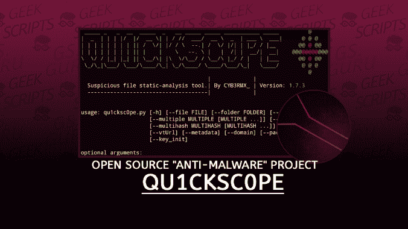
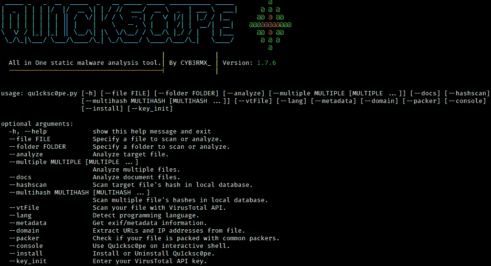
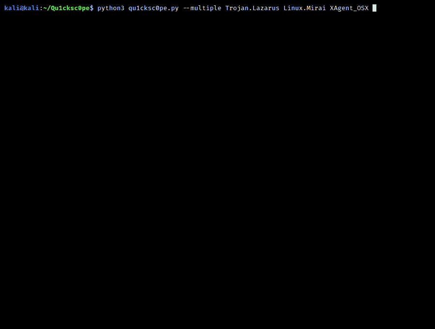
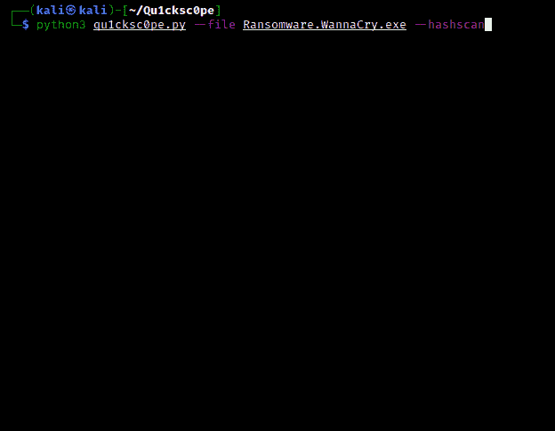
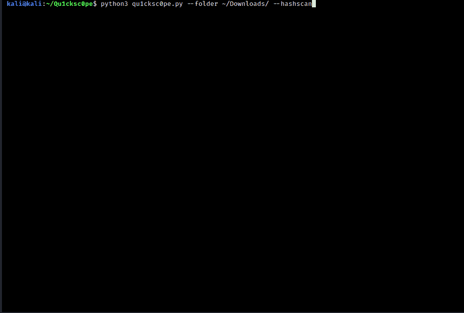
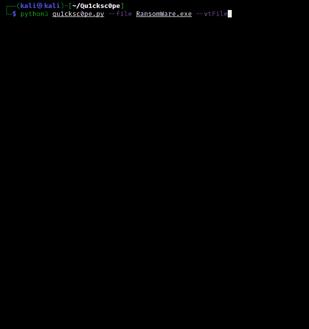
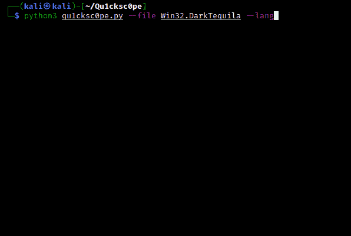
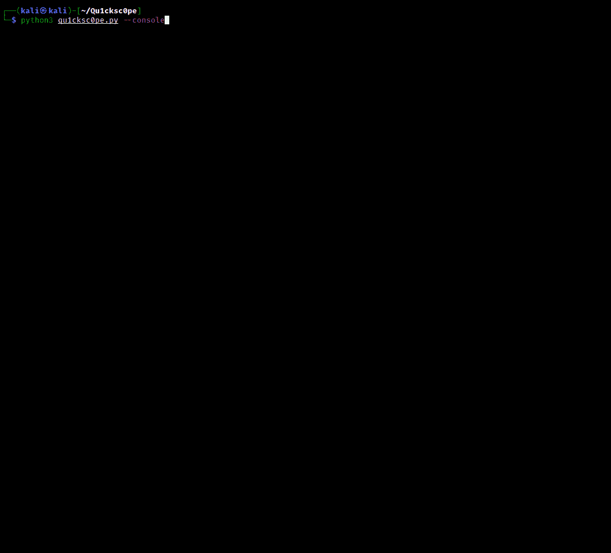

# qu 1 cks 0 PE:一体化静态恶意软件分析工具

> 原文：<https://kalilinuxtutorials.com/qu1cksc0pe/>

qu 1 cks 0 PE 工具允许你静态分析 Windows，Linux，OSX 可执行文件和 APK 文件。

*可以得到*:

*   使用什么 DLL 文件。
*   函数和 API。
*   区段和段。
*   网址，IP 地址和电子邮件。
*   安卓权限。
*   文件扩展名及其名称。
    **以此类推……**

qu 1 cks 0 PE 旨在获取更多关于可疑文件的信息，并帮助用户了解该文件的能力。

**用途**

**python 3 qu1 cks 0 PE . py–文件可疑 _ 文件–分析**

**截图**

**更新**

**2021 年 9 月 10 日**

*   增加了`**AndroidRuntime**`模块。现在您可以动态分析 android 应用程序了！！

**在**可用

**注**

*   也可以在 Windows 10 中使用来自`**Windows Subsystem Linux**`的 qu 1 cks 0 PE。

**设置**

**必要的 python 模块**:

*   `**puremagic**` = > *分析目标 OS 和幻数。*
*   `**androguard**` = > *分析 APK 的文件。*
*   `**apkid**` = > *检查混淆器，反反汇编，反 VM，反调试。*
*   `p**rettytable**` = > *漂亮的输出。*
*   `**tqdm**` = > *进度条动画。*
*   `**colorama**` = > *彩色输出。*
*   `**oletools**` = > *解析 VBA 宏。*
*   `**pefile**` = > *从 PE 文件中收集所有信息。*
*   `**quark-engine**` = > *从 APK 文件中提取 IP 地址和 URL。*
*   从目标 APK 文件中收集信息。
*   `**yara-python**` = > *安卓库扫描用 Yara 规则。*
*   `**prompt_toolkit**` = > *交互外壳。*
*   `**frida**` = > *针对 android 应用进行动态分析。*

**安装 python 模块** : `**pip3 install -r requirements.txt**`
**聚集其他依赖**:

*   *VirusTotal API 密钥* : `**https://virustotal.com**`
*   *比努蒂尔斯* : `**sudo apt-get install binutils**`
*   *ExifTool* : `**sudo apt-get install exiftool**`
*   *琴弦* : `**sudo apt-get install strings**`

**警报**

**必须在 Systems/Android/libscanner . conf**中指定 jadx 二进制路径

**【Rule _ PATH】
Rule PATH =/Systems/Android/yara rules/
【反编译器】
反编译器= JADX _ BINARY _ PATH<——你必须指定这个。**

**安装**

*   您可以在您的系统上轻松安装 qu 1 cks 0 PE。只需执行以下命令。
    **命令 0** : `**sudo pip3 install -r requirements.txt**`
    **命令 1** : `**sudo python3 qu1cksc0pe.py --install**`

**扫描参数**

**正常分析**

**用法** : `**python3 qu1cksc0pe.py --file suspicious_file --analyze**`

**多重分析**

**用法** : `**python3 qu1cksc0pe.py --multiple FILE1 FILE2 ...**`

**哈希扫描**

**用法** : `**python3 qu1cksc0pe.py --file suspicious_file --hashscan**`

**文件夹扫描**

**支持的参数**:

*   `**--hashscan**`
*   `**--packer**`

**用法** : `**python3 qu1cksc0pe.py --folder FOLDER --hashscan**`

**病毒总数**

**报告内容**:

*   `**Threat Categories**`
*   `**Detections**`
*   `**CrowdSourced IDS Reports**`

**用于–vt file**的用法:`**python3 qu1cksc0pe.py --file suspicious_file --vtFile**`

**文件扫描**

**用法** : `**python3 qu1cksc0pe.py --file suspicious_document --docs**`

**编程语言检测**

**用法** : `**python3 qu1cksc0pe.py --file suspicious_executable --lang**`

**交互外壳**

**用法** : `**python3 qu1cksc0pe.py --console**`

**域**

**用法** : `**python3 qu1cksc0pe.py --file suspicious_file --domain**`

**关于类别的信息**

**注册表**

**此类别包含关于:**的函数和字符串

*   创建或销毁注册表项。
*   更改注册表项和日志。

**文件**

**此类别包含关于:**的函数和字符串

*   创建/修改/感染/删除文件。
*   获取关于文件内容和文件系统的信息。

**联网/网络**

**此类别包含关于:**的函数和字符串

*   与恶意主机通信。
*   下载恶意文件。
*   发送关于受感染机器及其用户的信息。

**流程**

**此类别包含关于:**的函数和字符串

*   创建/感染/终止进程。
*   操纵流程。

**Dll/资源处理**

**此类别包含关于:**的函数和字符串

*   处理 DLL 文件和其他恶意软件的资源文件。
*   感染和操纵 DLL 文件。

**闪避/绕过**

**此类别包含关于:**的函数和字符串

*   操纵 Windows 安全策略并绕过限制。
*   检测调试器和做规避把戏。

**系统/持久性**

**此类别包含关于:**的函数和字符串

*   执行系统命令。
*   操作系统文件和系统选项以在目标系统中获得持久性。

**共同主题**

**此类别包含关于:**的函数和字符串

*   微软的组件对象模型系统。

C **瑞普克**

**此类别包含关于:**的函数和字符串

*   加密和解密文件。
*   创建和销毁散列。

**信息收集**

**此类别包含关于:**的函数和字符串

*   从目标主机收集信息，如进程状态、网络设备等。

**键盘/按键记录**

**此类别包含关于:**的函数和字符串

*   跟踪被感染机器的键盘。
*   收集关于目标键盘的信息。
*   管理输入法等。

**内存管理**

**此类别包含关于:**的函数和字符串

*   操作和使用目标机器的内存。

[**Download**](https://github.com/CYB3RMX/Qu1cksc0pe)