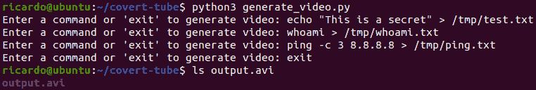
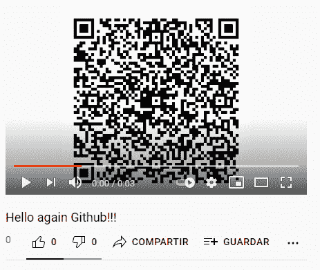
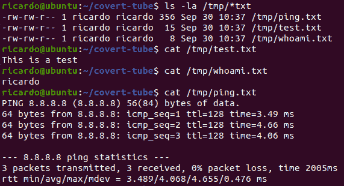

# 隐蔽管道:作为隐蔽通道的 Youtube——通过上传视频到 Youtube 来远程控制系统和执行命令

> 原文：<https://kalilinuxtutorials.com/covert-tube/>

Covert-Tube 是一个通过上传视频到 Youtube 来远程控制系统的程序，使用 Python 来创建视频和监听器，模仿我读到的一些恶意软件。它允许创建由简单文本、明文 QR 码或使用 AES 加密的 QR 码组成的视频帧。

**创建视频**

可以使用 *generate_video.py* 创建视频:输入命令，生成视频，并写上“退出”。生成的视频默认调用 *output.avi* (可以在 *config.py* 中更新):

**python3 generate_video.py**

**运行监听器并将视频上传到 Youtube**

**python3 main.py**

监听器默认每 300 秒检查一次 Youtube 频道(可以在 *config.py* 中更新)。首先上传视频:

发现频道中有新视频后，下载并执行命令:

我们可以看到命令的输出:

**配置**

更新 *config.py* 文件:

*   **channel_id** (必填！！！):从此处获取您的 Youtube 频道 ID。
*   **api_key** (必填！！！):要获得 API 密钥，请创建一个应用程序并从这里生成密钥。
*   **image_type** (可选。默认:“qr_aes”):视频的不同类型的图像。
    *   “明文”用命令的文字创建图像。
    *   “qr”使用命令创建 QR 代码。
    *   “qr_aes”使用 aes 加密的命令创建 qr 代码。
*   **上传 _ 秒 _ 延迟**(可选。默认值:300):检查是否有新视频上传之前的延迟秒数。
*   **调试**(可选。默认值:True):是否打印消息。
*   **aes_key** (可选。默认:“covert-tube _ 2021”):AES 加密的密钥，在“qr_aes”选项中使用。
*   **生成 _ 视频 _ 路径**(可选。默认:“output.avi”):用 *generate_video.py* 生成的视频的路径。
*   **下载 _ 视频 _ 路径**(可选。默认值:"/tmp/test.mp4 "):新视频将下载到的路径。
*   **temp_folder** (可选。默认:"/tmp/":存储视频中每一帧图像的路径，格式为 *image_X.png* 。

**安装**

对于所有项目:

**sudo apt 安装 libzbar0
pip3 安装 Pillow opencv-python YouTube _ dl pytesserac pyqr code pypng pyzbar py crypto
git 克隆 https://github.com/ricardojoserf/covert-tube**

创建独立的二进制文件

**py installer–one file main . py
CP dist/main 隐蔽管道
RM-RF dist build
RM main . spec**

[**Download**](https://github.com/ricardojoserf/covert-tube)