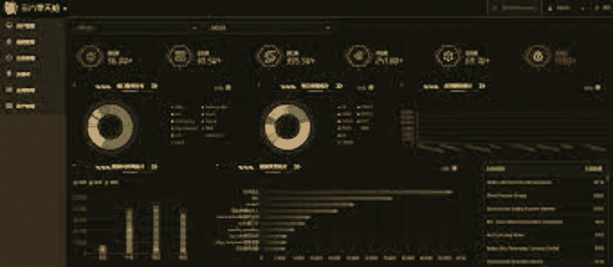
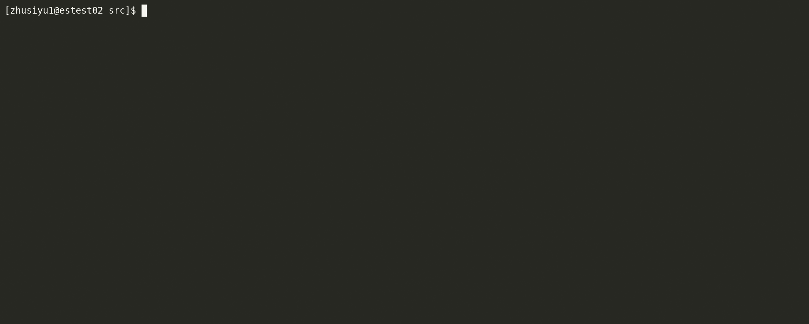
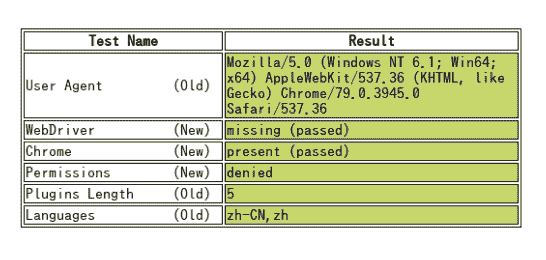
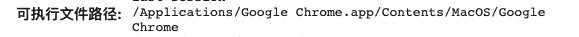

# Crawlergo:一个强大的网络漏洞扫描器浏览器爬虫

> 原文：<https://kalilinuxtutorials.com/crawlergo/>

**crawlergo** 是一个浏览器爬虫，使用`**chrome headless**`模式进行 URL 收集。它用 DOM 渲染 stage 钩住整个网页的关键位置，自动填充和提交表单，具有智能 JS 事件触发，尽可能多地收集网站暴露的条目。内置的 URL 去重模块过滤掉了大量的伪静态 URL，仍然保持了对大型网站的快速解析和抓取速度，最终得到高质量的请求结果集合。

crawlergo 目前支持以下功能:

*   chrome 浏览器环境渲染
*   智能填表，自动提交
*   具有自动触发功能的完整 DOM 事件集合
*   智能 URL 重复数据删除可删除大多数重复请求
*   智能分析网页和 URL 集合，包括 javascript 文件内容、页面评论、robots.txt 文件和常用路径的自动模糊
*   支持主机绑定，自动修复和添加引用
*   支持浏览器请求代理
*   支持将结果推送到被动的 web 漏洞扫描器

**截图**

**安装**

安装和使用前，请仔细阅读并确认免责声明。

建设

**CD crawl ergo/cmd/crawl ergo
去构建 crawlergo_cmd.go**

*   crawlergo 只依赖 chrome 环境运行，去下载新版 chrome，或者直接点击下载 Linux 版。
*   转到 crawlergo 最新版本的下载页面，并将其解压缩到任何目录。如果你在 linux 或者 macOS 上，请给 crawlergo **可执行权限(+x)** 。
*   或者可以修改代码，自己构建。

如果您使用的是 linux 系统，chrome 会提示您缺少依赖项，请参见下面的故障排除

**快速启动**

**出发！**

假设你的 chromium 安装目录是`**/tmp/chromium/**`，设置 10 个标签同时打开，抓取`**testphp.vulnweb.com**`:

**。/crawl ergo-c/tmp/chromium/chrome-t 10 http://testphp.vulnweb.com/**

**使用代理**

**。/crawl ergo-c/tmp/chromium/chrome-t 10–request-proxy socks 5://127 . 0 . 0 . 1:7891 http://testphp.vulnweb.com/**

**用 python 调用 crawlergo】**

默认情况下，crawlergo 直接在屏幕上打印结果。接下来，我们将输出模式设置为`**json**`，使用 python 调用它的示例代码如下:

**#！/usr/bin/python 3
#编码:utf-8
导入 simplejson
导入子流程
def main():
target = " http://test PHP . vulnweb . com/"
cmd =["。/crawlergo "、"-c "、"/tmp/chromium/chrome "、"-o "、" json "、target]
rsp =子进程。Popen(cmd，stdout =子进程。管道，stderr =子进程。PIPE)
output，error = RSP . communicate()
# "–[任务完成]–"是任务结束分隔符字符串
result = simple JSON . loads(output . decode()。split("–[任务完成]–)[1])
req _ list = result[" req _ list "]
print(req _ list[0])
if name = = ' main ':
main()**

**抓取结果**

当输出模式设置为`**json**`时，JSON 反序列化后返回的结果包含四个部分:

*   `**all_req_list**`:在此爬网任务中发现的所有请求，包含来自其他域的任何资源类型。
*   `**req_list**`:返回本次抓取任务的**当前域结果**，伪静态去重，无静态资源链接。它是`**all_req_list **`的子集。
*   `**all_domain_list**`:找到的所有域的列表。
*   `**sub_domain_list**`:找到的子域列表。

**例子**

crawlergo 返回完整的请求和 URL，可以以多种方式使用:

*   与其他被动 web 漏洞扫描器配合使用首先，启动一个被动扫描器，设置监听地址为:`**http://127.0.0.1:1234/**`接下来，假设 crawlergo 与扫描器在同一台机器上，启动 crawlergo，设置参数:`**--push-to-proxy http://127.0.0.1:1234/**`
*   主机绑定(不适用于高版本 chrome)(示例)
*   自定义 Cookies(示例)
*   定期清理 crawlergo 产生的僵尸进程(示例)，供稿@ring04h

**绕过无头探测**

默认情况下，crawlergo 可以绕过无头模式检测。

https://intoli.com/blog/not-possible-to-block-chrome-headless/chrome-headless-test.html

**故障排除**

*   ' Fetch.enable '未找到 Fetch 是新版 chrome 支持的功能，如果出现此错误，说明你的版本太低，请升级 chrome 版本。
*   chrome 运行时缺少依赖项，比如 xxx.so

**//Ubuntu
【apt-get install-yq–no-install-re commendations \
libsound 2 liba tk 1.0-0 libc 6 libc 开罗 2 libcups 2 libb dbus-1-3 \
libat 1 libfont config 1 libc C1 libc conf-2-4 libg CK-pixbuf 2.0-0 libg b2.0-0 libg GTK-3-3**

运行提示**导航超时** /浏览器未找到/不知道正确的**浏览器可执行路径**

确保浏览器可执行文件路径配置正确，在地址栏中键入:`**chrome://version**`，找到可执行文件路径:

**参数**

**必需参数**

*   chrome 可执行文件的路径。(**必选**)

**基本参数**

*   `**--custom-headers Headers**`自定义 HTTP 头。请在 JSON 序列化之后传入数据，这是全局定义的，将用于所有请求。(默认值:null)
*   **`--post-data PostData, -d PostData`** 发布数据。(默认值:null)
*   `**--max-crawled-count Number, -m Number**`爬虫避免因伪静态而导致爬行时间过长的最大任务数。(默认值:200)
*   `**--filter-mode Mode, -f Mode**`过滤模式，`**simple**`:只过滤静态资源和重复请求。`**smart**`:具有过滤伪静态的能力。`**strict**`:更严格的伪静态过滤规则。(默认:智能)
*   `**--output-mode value, -o value**`结果输出模式，`**console**`:将美化后的结果直接打印到屏幕上。`**json**`:打印所有结果的 json 序列化字符串。`**none**`:不打印输出。(默认:控制台)
*   【JSON 序列化后将结果写入指定文件。(默认值:null)
*   `**--request-proxy proxyAddress**` socks5 代理地址，所有来自 crawlergo 和 chrome 浏览器的网络请求都通过代理发送。(默认值:null)

**展开输入网址**

*   `**--fuzz-path**`使用内置字典进行路径模糊化。(默认值:false)
*   `**--fuzz-path-dict**`自定义模糊路径，传入一个字典文件路径，例如/home/user/fuzz_dir.txt，文件的每一行代表一个要模糊的路径。(默认值:null)
*   `--robots-path`解析/robots.txt 文件中的路径。(默认值:false)

**表单自动填充**

*   `**--ignore-url-keywords, -iuk**`不想访问的 URL 关键字，一般用于自定义 cookies 时排除注销链接。用法:`**-iuk logout -iuk exit**`。(默认:“注销”、“退出”、“退出”)
*   `**--form-values, -fv**`自定义表格填充的值，由文本类型设置。支持定义类型:默认、邮件、代码、电话、用户名、密码、qq、id_card、url、日期和号码。文本类型由输入框标签的四个属性值关键字**`id``name``class``type`**标识。比如定义邮箱输入框自动填充 A，密码输入框自动填充 B，`**-fv mail=A -fv password=B**`。其中 default 表示无法识别文本类型时的填充值，如“Cralwergo”。(默认值:Cralwergo)
*   `**--form-keyword-values, -fkv**`自定义表单填充的值，通过关键字模糊匹配来设置。关键字匹配输入框标签的**`id``name``class``type`**四个属性值。比如模糊匹配 pass 关键字填充 123456，用户关键字填充 admin，`**-fkv user=admin -fkv pass=123456**`。(默认值:Cralwergo)

**抓取过程的高级设置**

*   `--incognito-context, -i`浏览器启动微服模式。(默认值:真)
*   `**--max-tab-count Number, -t Number**`爬虫可以同时打开的最大标签数。(默认值:8)
*   单个标签页的最大运行时间。(默认值:20 秒)
*   `**--wait-dom-content-loaded-timeout Timeout**`等待页面完成加载的最大超时时间。(默认值:5s)
*   `**--event-trigger-interval Interval**`自动触发事件的间隔时间，一般用在目标网络缓慢和 DOM 更新冲突导致 URL 捕获失败的情况下。(默认值:100 毫秒)
*   `**--event-trigger-mode Value**` DOM 事件自动触发模式，有`**async**`和`**sync**`，用于 DOM 更新冲突导致的 URL 漏检。(默认值:异步)
*   `**--before-exit-delay**`延迟退出，在单个标签任务结束时关闭 chrome。用于等待部分 DOM 更新和 XHR 请求被捕获。(默认值:1s)

**其他**

*   `**--push-to-proxy**`要接收的爬虫结果的监听器地址，通常是被动扫描器的监听器地址。(默认值:null)
*   `**--push-pool-max**`向监听地址发送爬虫结果时的最大并发数。(默认值:10)
*   `**--log-level**`记录级别、调试、信息、警告、错误和致命。(默认值:信息)
*   `**--no-headless**`关闭 chrome 无头模式，可视化抓取过程。(默认值:false)

[**Download**](https://github.com/Qianlitp/crawlergo)