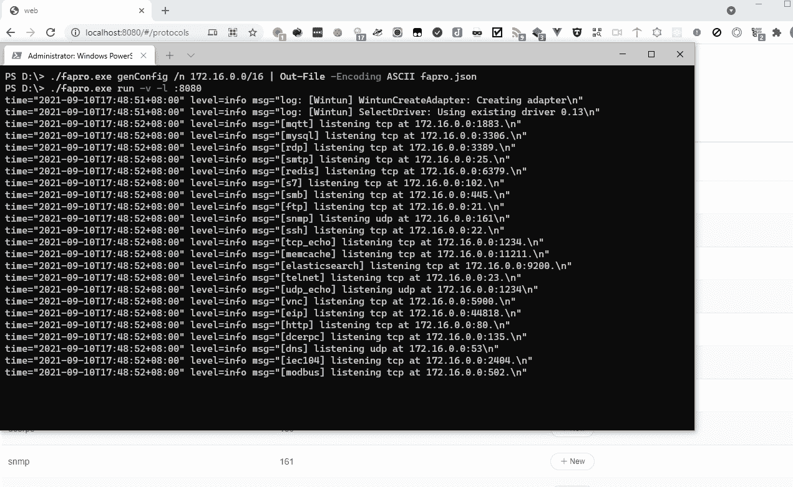
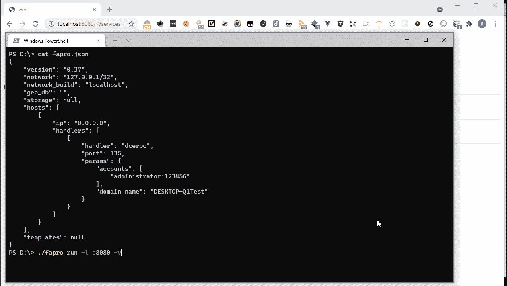
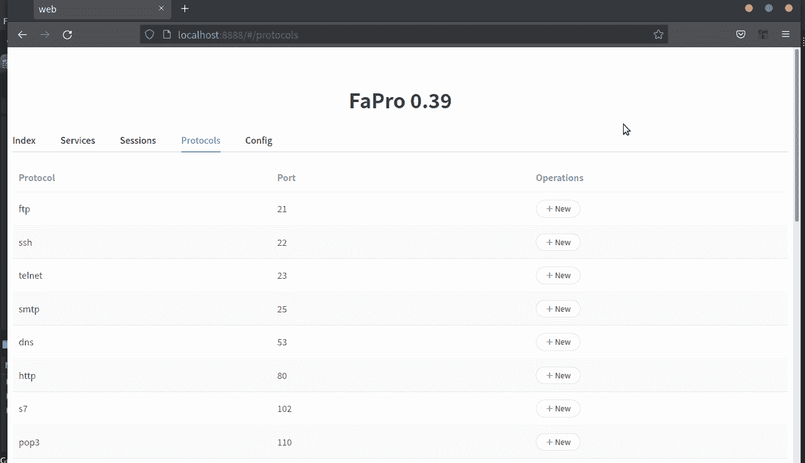

# 免费、跨平台、单文件海量网络协议服务器模拟器

> 原文：<https://kalilinuxtutorials.com/fapro/>

**FaPro** 是一个伪协议服务器工具，可以轻松启动或停止多个网络服务。

目标是支持尽可能多的协议，并为每个协议支持尽可能多的深度交互。

演示网站

**特色**

*   支持的运行模式:
    *   本地机器
    *   虚拟网络
*   支持的协议:
    *   域名服务器(Domain Name Server)
    *   DCE/RPC
    *   EIP
    *   弹性搜索
    *   文件传送协议
    *   超文本传送协议
    *   IEC 104
    *   Memcached
    *   Modbus
    *   MQTT
    *   关系型数据库
    *   RDP
    *   雷迪斯
    *   正常人血清中的一种蛋白质成分
    *   服务器信息块
    *   简单邮件传输协议
    *   简单网络管理协议(Simple Network Management Protocol)
    *   嘘
    *   用于远程联接服务的标准协议或者实现此协议的软件(可为动词)
    *   VNC
    *   因特网邮件访问协议
    *   POP3
    *   标准温度和压力
    *   RTSP
    *   端口映射
*   使用 TcpForward 转发网络流量
*   支持 tcp syn 日志
*   支持 icmp ping 日志记录
*   支持 udp 数据包记录

**协议模拟演示**

 **支持 credssp ntlmv2 nla 身份验证。

支持配置用户登录时显示的图像。

嘘

支持用户登录。

支持假的终端命令，比如 id，uid，whoami 等。

帐户格式:用户名:密码:主页:uid

**IMAP & SMTP**

支持用户登录和交互。

**Mysql** 的实现

支持 sql 语句查询交互

**HTTP**

支持网站克隆，需要安装 chrome 浏览器和 chrome 驱动才能工作。

**快速启动**

**生成配置**

所有协议和参数的配置由 genConfig 子命令生成。

使用 172.16.0.0/16 子网生成配置文件:

**fapro gen config-n 172 . 16 . 0 . 0/16>fapro . JSON**

或者使用本地地址而不是虚拟网络:

**fapro gen config>fapro . JSON**

**运行协议模拟器**

在详细模式下运行 FaPro，并在端口 8080 上启动 web 服务:

**fapro run -v -l :8080**

**Tcp syn 日志**

对于 windows 用户，请安装 winpcap 或 npcap。

**日志分析**

使用 ELK 分析协议日志:

**配置**

本节包含 FaPro 使用的示例配置。

**{
"version": "0.40 "，
"network": "127.0.0.1/32 "，
"network_build": "localhost "，
"storage": null，
" geo _ db ":"/tmp/GeoIP _ city . MMDB "，
"hostname": "fapro1 "，
"use_logq": true，
"cert_name": "unknown "，
。**

*   版本:配置版本。
*   网络:虚拟网络使用的子网或绑定到本地机器的地址(本地模式)。
*   network_build:网络模式(支持的值:localhost、all、userdef)
    *   localhost:本地模式，所有服务都在本地机器上监听
    *   all:创建子网中的所有主机(即，可以 ping 通子网中的所有主机)
    *   userdef:仅创建主机配置中指定的主机。
*   存储:指定用于日志收集的存储，支持 sqlite，mysql，elasticsearch。例如
    *   sqlite3:logs.db
    *   MySQL://用户:密码@ TCP(127 . 0 . 0 . 1:3306)/日志
    *   es://http://username:password @ 127 . 0 . 0 . 1:9200(目前仅支持 Elasticsearch 7.x)
*   geo_db: MaxMind geoip2 数据库文件路径，用于生成 ip 地理位置信息。如果您使用 Elasticsearch 存储，从不需要此字段，它将使用 Elasticsearch 的 geoip 处理器自动生成。
*   主机名:在日志中指定主机字段。
*   use_logq:使用本地磁盘消息队列保存日志，然后发送到远程 mysql 或 Elasticsearch，防止远程日志丢失。
*   cert_name:生成的证书的通用名称。
*   syn_dev:指定用于捕获 tcp syn 数据包的网络接口。如果为空，则不会记录 tcp syn 数据包。在 windows 上，设备名称类似于“\设备\NPF_{xxxx-xxxx}”。
*   udp_dev:与 syn_dev 相同，但用于 udp 数据包。
*   icmp_dev:与 syn_dev 相同，但用于 icmp ping 数据包。
*   排除:从日志中排除远程 IP。
*   主机:每个项目都是一个主机配置。
*   handlers: Service configuration，在主机上配置的服务，每一项都是一个服务配置。
*   处理程序:服务名(即协议名)
*   params:设置服务支持的参数。

**例子**

创建一个虚拟网络，子网为 172.16.0.0/24，包含 2 台主机，

172.16.0.3 运行 dns、ssh 服务，

和 172.16.0.5 运行 rpc、rdp 服务，

协议访问日志保存到 elasticsearch，不包括 127.0.0.1 和 8.8.8.8 的访问日志。

**{
"version": "0.40 "，
"network": "172.16.0.0/24 "，
"network_build": "userdef "，
" storage ":" es://http://127 . 0 . 0 . 1:9200 "，
"use_logq": true，
"cert_name": "unknown "，
"syn_dev": "any "，【T8
" params ":{
" accounts ":[
" root:5555555:/root:0 "
]，
"prompt": "$ "，
" server _ version ":" SSH-2.0-OpenSSH _ 7.4 "
}
}

}，
{
"ip": "172.16.0 .
" domain _ name ":" DESKTOP-Q1 test "，
"image": "rdp.jpg "，
" sec _ layer ":" auto "
}
}
]
}
]
}**

**自动生成服务配置**

使用脚本中的 **ipclone.py** 脚本，可以从 fofa 克隆 ip 服务配置，快速生成真机的服务配置。**