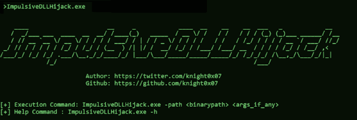
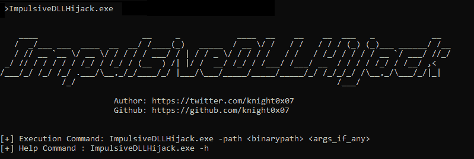
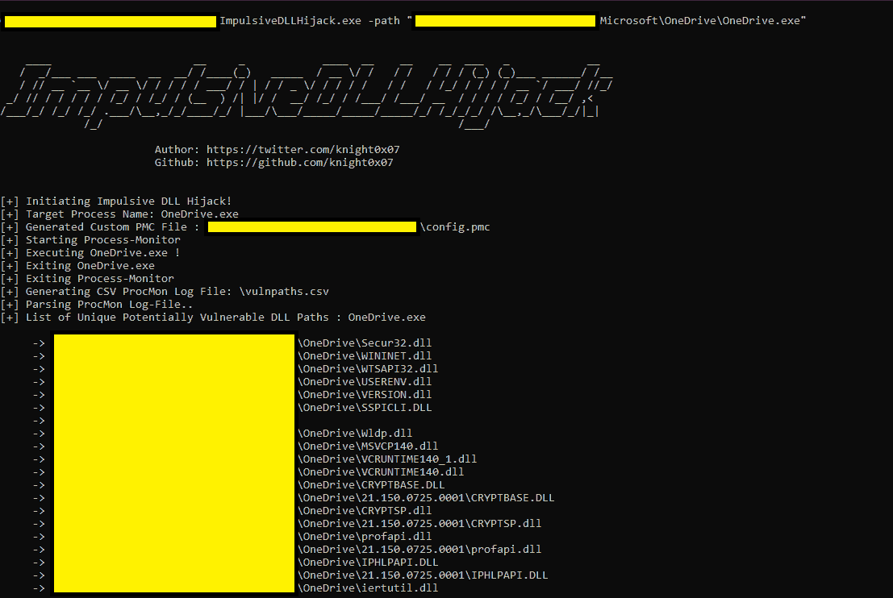
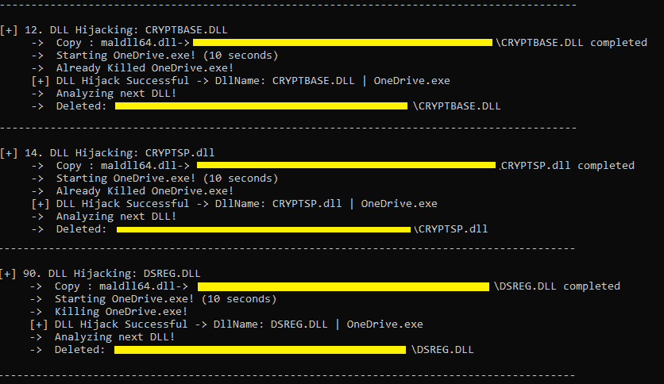
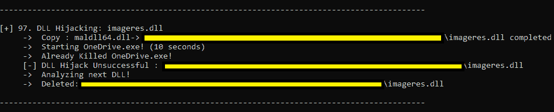
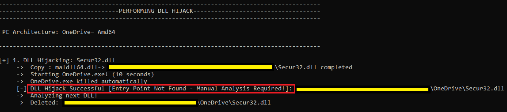
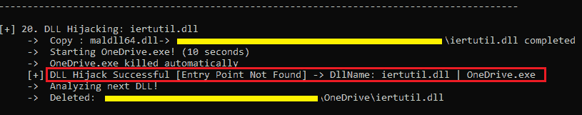
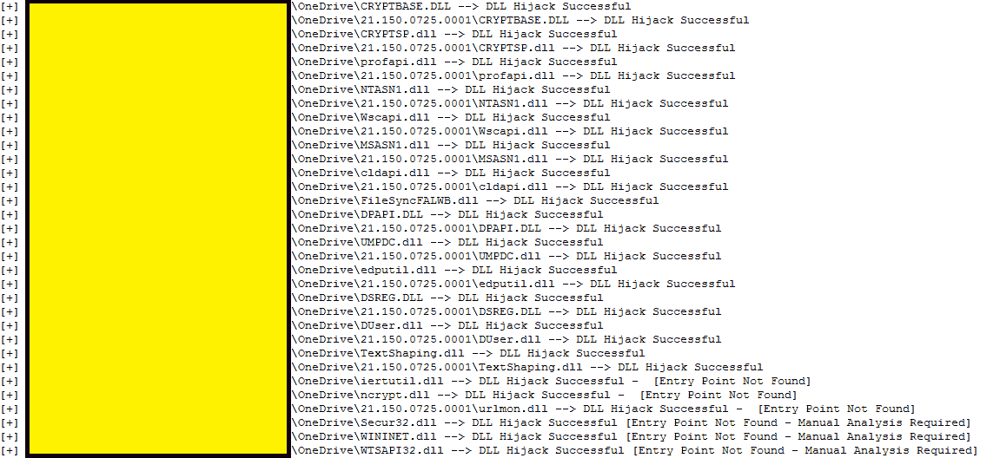

# impulveddlljacking:基于 C#的工具，可以自动发现和利用目标二进制文件中的 DLL 劫持

> 原文：<https://kalilinuxtutorials.com/impulsivedllhijack/>

是一个基于 C#的工具，可以自动发现和利用目标二进制文件中的 DLL 劫持。发现的被劫持路径可以在红队行动中被武器化，以避开 EDR 的攻击。

**方法论**

该工具主要用于自动执行针对 DLL 劫持的以下阶段:

*   **发现**–发现潜在易受攻击的 DLL 劫持路径
*   **利用**–确认确认 DLL 是否从劫持路径加载，导致确认 100%可利用的 DLL 劫持！

**发现方法**

*   提供到 ImpulsiveDLLHijack.exe 的目标二进制路径
*   ProcMon 的自动化以及目标二进制文件的执行，以发现潜在易受攻击的 DLL 劫持路径。

**开发方法**

*   从通过 ProcMon 自动生成的 CSV 中解析潜在易受攻击的 DLL 劫持路径。
*   将确认性 DLL(按照 PE 架构)逐个复制到劫持路径，同时在预定义的时间段内执行目标二进制文件。
*   由于 DLL 劫持过程正在进行，以下是可以从劫持场景中收集的输出:**找不到入口点场景:**
    *   潜在易受攻击的可劫持路径上存在的确认性 DLL 由目标二进制文件加载，我们在控制台上得到以下输出，表明 DLL 劫持成功-**DLL 劫持成功->DLL name:|<Target _ Binary _ name>**
    *   潜在易受攻击的可劫持路径上存在的确认性 DLL 未被目标二进制文件加载，我们在控制台上得到以下输出，声明 DLL 劫持不成功-**DLL 劫持不成功- > < DLL_Path >**
    *   目标二进制文件不加载存在于潜在易受攻击的可劫持路径上的确认 DLL，因为 DLL 的入口点不同于我们的默认入口点“DllMain ”,抛出一个错误–“未找到入口点”,我们在控制台上得到以下输出，声明如果入口点正确，DLL 劫持是可劫持的-> **DLL 劫持成功->[未找到入口点–需要手动分析！]: <劫持 _ 路径>**
    *   即使在 DLL 的入口点不同于我们的默认入口点" DllMain "并抛出错误" Entry Point Not Found "之后，目标二进制文件仍会执行存在于潜在易受攻击的可劫持路径上的确认 DLL，即使在入口点不正确之后，我们仍会在控制台上得到以下输出，声明 DLL 劫持成功-->**DLL 劫持成功- >【未找到入口点】:<劫持 _ 路径>**

**注意:“找不到入口点”错误由代码以编程方式处理，无需手动关闭 MsgBox🙂#这反而会使代码进一步崩溃*** * * * *

*   一旦针对每个潜在易受攻击的 DLL 劫持路径完成了 DLL 劫持过程，我们将在控制台上以及文本文件(C:\DLLLogs\output_logs.txt)中获得以下格式的最终输出:
    *   <dllhijack_path>–> DLL 劫持成功(**如果劫持成功**)</dllhijack_path>
    *   <dllhijack_path>–> DLL 劫持不成功(**如果劫持不成功**</dllhijack_path>
    *   <dllhijack_path>–> DLL 劫持成功[未找到入口点–需要手动分析] ( **如果未找到入口点，但手动分析后可以成功**)</dllhijack_path>
    *   <dllhijack_path>–> DLL 劫持成功[找不到入口点] ( **如果在找不到入口点后劫持仍然成功**</dllhijack_path>
    *   <dllhijack_path>–>复制:访问路径被拒绝(**访问被拒绝**)</dllhijack_path>

* *这些已确认的 DLL 可劫持路径随后可以在 Red Team 交战期间被武器化，以通过合法的可执行文件(如 OneDrive、Firefox、MSEdge、“自带 LOLBINs”等)加载恶意 DLL 植入。)并绕过最先进的 EDR，因为它们中的大多数都无法检测到 DLL 劫持，正如 George Karantzas 和 Constantinos Patsakis 在他们的研究论文《https://arxiv.org/abs/2108.10422》中提到的那样

**先决条件**

*   **Procmon.exe**->https://docs . Microsoft . com/en-us/sysinternals/downloads/proc mon
*   **自定义确认 DLL 的**:
    *   这些是 DLL 文件，帮助工具确认 DLL 是否从识别的劫持路径成功加载
    *   从上面提供的 MalDLL 项目编译而来(或者如果你信任我，就使用预编译的二进制文件！)
    *   32 位 dll 名称应该是:maldll32.dll
    *   64 位 dll 名称应该是:maldll64.dll
    *   安装 NuGet 包:* * PeNet * *--> https://www.nuget.org/packages/PeNet/(编译 ImpulsiveDLLHijack 项目时的先决条件)

**注意:i & ii 先决条件应该放在 ImpulsiveDLLHijacks.exe 本身的目录下。**

*   **构建和设置信息:**
    *   **冲动劫持**
        *   在 Visual Studio 中克隆存储库
        *   项目加载到 Visual Studio 后，进入“项目”->“管理 NuGet 包”->“浏览包并安装“PeNet”->“https://www.nuget.org/packages/PeNet/”
        *   构建项目！
        *   ImpulsiveDLLHijack.exe 将位于 bin 目录中。
    *   **对于确认 DLL:**
        *   在 Visual Studio 中克隆存储库
        *   使用 x86 和 x64 构建项目
        *   将 x86 版本重命名为 maldll32.dll，x64 版本重命名为 maldll64.dll
    *   **设置:**复制 ImpulsiveDLLHijack.exe 目录下的确认 DLL(maldll 32&maldll 64】然后执行 ImpulsiveDLLHijack.exe:)

**用途**

**例题**

*   目标可执行文件:OneDrive.exe
*   阶段:发现

阶段:剥削

*   成功的 DLL 劫持

不成功的 DLL 劫持:

由于入口点不同，DLL 未加载！手动分析可能使其成为成功的 DLL 劫持:

DLL 劫持成功，即使在不相同的入口点！

阶段:最终结果和日志

*   C:\DLLLogs\output_logs.txt:

[**Download**](https://github.com/knight0x07/ImpulsiveDLLHijack)