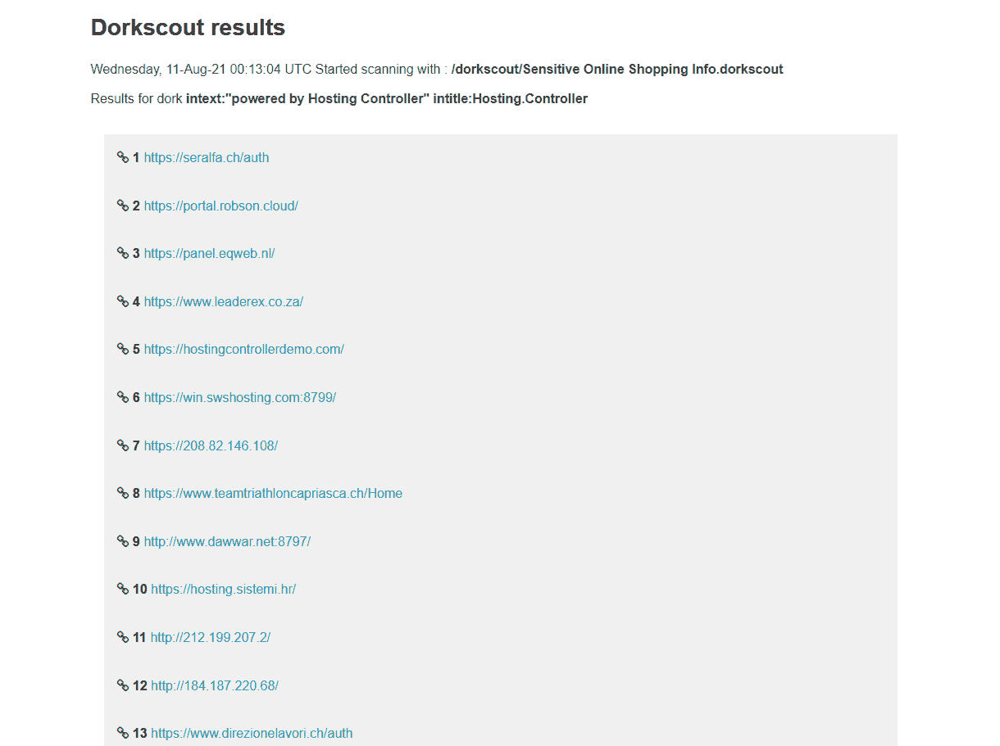

# DorkScout : Golang 工具，用于自动扫描整个互联网或特定目标

> 原文：<https://kalilinuxtutorials.com/dorkscout/>

DorkScout 是一款通过谷歌搜索在互联网上自动寻找易受攻击的应用程序或秘密文件的工具，它首先从 https://www.exploit-db.com/google-hacking-database 获取呆瓜名单，然后扫描给定的目标或它找到的任何东西

**安装**

dorkscout 可以以不同的方式安装:

**Go 套餐**

想

去找 github.com/R4yGM/dorkscout

这将适用于每个平台

**码头工人**

如果你没有安装 docker，你可以遵循他们的指南

首先，您必须从 docker 注册表中提取 docker 映像(只有 **17.21 MB** )，您可以在这里看到它，如果您不想提取映像，您也可以克隆存储库，然后从 docker 文件构建映像

**docker pull r4yan/dorkscout:最新**

如果您不想提取映像，您可以下载或复制 dorkscout Dockerfile 文件，该文件可在此处找到[，然后从 docker 文件构建映像](https://github.com/R4yGM/dorkscout/blob/1.0/Dockerfile)

然后，如果您想要启动容器，您必须首先创建一个卷来共享您的文件到容器

**docker 卷创建–名称 dorkscout_data**

使用 docker 启动容器时，它会自动在名为“dorkscout”的目录中安装 dork 列表:

110 年 7 月 31 日 14:56。多克斯科特
-rw-r–r–1 r4yan r4yan 79312 Aug 10 20:30 '建议和漏洞.多克斯科特'
-rw-r–r–1 r4yan r4yan 6352 Jul 31 14:56 '错误消息.多克斯科特'
-rw-r–r–r–1 r4yan r4yan 38448 Jul 31 14:56 '包含多汁信息的文件.多克斯科特'
-rw-r–r 14:56 '网络或漏洞数据. dork scout '
-rw-r–r–1 r4yan r4yan 49048 Jul 31 14:56 '包含登录门户的页面. dork scout '
-rw-r–r–1 r4yan r4yan 16112 Jul 31 14:56 '敏感目录. dork scout '
-rw-r–r–r–1 r4yan r4yan 451 Jul 31 14:56 '敏感的网上购物信息

这样您就不必安装它们，然后您可以通过执行以下操作来开始扫描:

**docker run-v dork scout:/dork scout r4yan/dork scout scan**

将`**<options>**`替换为您要提供给 dorkscout 的选项/参数，例如:

**docker run-v dork scout _ data:/dork scout r4yan/dork scout scan-d = "/dork scout/Sensitive 网购 info . dork scout "-H = "/dork scout/a . html "**

**如果您想使用 docker 容器扫描代理，您必须添加–net 主机选项**例如:

**docker run–net host-v dork scout _ data:/dork scout r4yan/dork scout scan-d = "/dork scout/Sensitive 网购 info . dork scout "-H = "/dork scout/a . html-x socks 5://127 . 0 . 0 . 1:9050 "**

请始终将您的结果保存在卷中，而不是容器中，因为这样结果会被删除！您可以通过写入与您正在保存结果的目录相同的卷路径来保存它们

如果你添加了这个并且在每次扫描结束时都做对了，你会在文件夹`**/var/lib/docker/volumes/dorkscout_data/_data**`中找到结果

**这将适用于所有平台**

**可执行**

您也可以在这里下载已经编译好的二进制文件，然后执行它们

**用法**

**多用途步枪-h**

**用法:
dorkscout【命令】
可用命令:
完成生成指定 shell 的自动完成脚本
删除删除所有。给定目录中的呆瓜文件
help 关于任何命令的帮助
install 安装来自 exploit-db.com 的呆瓜列表
scan 扫描特定网站或它找到的所有网站以查找呆瓜列表
标志:
-h，–Help 关于呆瓜的帮助
使用“呆瓜[命令]–Help”了解关于命令的更多信息。**

使用单词列表和代理开始扫描，然后以 HTML 格式返回结果

**多克斯科特 scan-d = "/多克斯科特/敏感网购信息.多克斯科特"-H = "/多克斯科特/a . html "-x socks 5://127 . 0 . 0 . 1:9050**

结果:

**安装单词表**

要开始扫描，你需要一些呆子名单，并有这些名单，你可以安装它们通过安装命令

**多尔科夫斯基安装-输出-目录/多尔科夫斯基**

这将从 exploit.db 获取所有可用的呆子

**[+]。/Advisories and vulnerability . dork scout
[+]。/Vulnerable files . dork scout
[+]。/包含 Juicy Info.dorkscout
[+]的文件。/敏感的网购信息. dorkscout
[+]。/包含密码的文件. dorkscout
[+]。/Vulnerable servers . dork scout
[+]。/各种在线设备. dorkscout
[+]。/包含登录 Portals.dorkscout
[+]的页面。/footouts . dork scout
[+]。/Error messages . dork scout
[+]。/包含用户名. dorkscout
[+]的文件。/Network or Vulnerability data . dork scout
[+]。/.多克斯科特
[+]。/Sensitive directory . dork scout
[+]。/Web Server detection . dorkscout
2021/08/11 19:02:45 在/dorks** 上的安装在 2.007928 秒内完成

[Download](https://github.com/R4yGM/dorkscout)