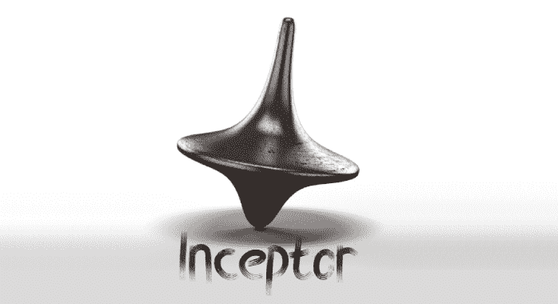
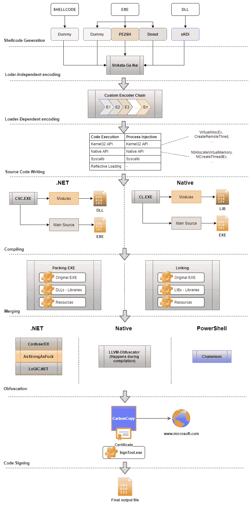

# Inceptor:模板驱动的反病毒/EDR 规避框架

> 原文：<https://kalilinuxtutorials.com/inceptor/>

**Inceptor** 是一种现代渗透测试，Red Teaming 通常需要绕过常见的反病毒/EDR 设备，以便在目标上执行代码。随着时间的推移，防御变得越来越复杂，也越来越难以持续绕过。

Inceptor 是一个工具，可以帮助自动化这个过程的大部分，希望不需要进一步的努力。

**特色**

Inceptor 是一个基于模板的 PE packer for Windows，旨在帮助渗透测试人员和 red teamers 绕过常见的 AV 和 EDR 解决方案。Inceptor 的设计注重可用性，并允许大量的用户定制。

为了更好地了解实施的内容和原因，查看以下资源可能会有所帮助:

*   EDR、下一代 AVs 和 AMSI 时代的代码执行之路
*   结合众所周知的技术的旁路 AV-EDR 解决方案

**外壳代码转换/加载**

Inceptor 能够使用各种开源转换器将现有的 EXE/DLL 转换为外壳代码:

*   甜甜圈:甜甜圈是“转换器”。这个工具更像是一件艺术品，可以用来转换本机二进制文件、DLL 和。Net 二进制文件转换成与位置无关的代码外壳代码。
*   sRDI:通过 Monoxgas，这个工具可以将现有的 naticcve DLL 转换成 PIC，然后可以作为常规的外壳代码注入。
*   Pe2Sh:通过 Hasherazade，这个工具可以将现有的原生 EXE 转换成 PIC 外壳代码，也可以作为普通 EXE 运行。

**李编码器 vs LD 编码器**

Inceptor 可以使用不同的方法对外壳代码进行编码、压缩或加密。在开发这个工具时，我开始区分我称之为独立于加载器(LI)的编码和依赖于加载器(LD)的编码。

与加载程序无关的编码是一种不由用户(加载程序)选择的模板管理的编码类型。这通常意味着解码存根不是模板的一部分，而是嵌入在外壳代码本身中。Inceptor 使用开源工具 sgn 提供了这种功能，该工具用于使有效负载具有多态性，并且使用常见的签名检测无法检测到。

尽管 Shikata-Ga-Nai 很强，但它并不真正适合某些模板。出于这个原因，Inceptor 还实现了与加载器相关的编码器，它被设计成让加载器负责解码。因此，LD 编码器将解码存根直接安装在模板中。在 Inceptor 中实现的这种编码器也是“可链接的”，这意味着它们可以链接在一起对有效载荷进行编码。

虽然使用编码器链有时可以改善给定有效载荷的混淆，但这种技术也可以暴露多个解码例程，这可以帮助防御者设计针对它们的签名。出于这个原因，Inceptor 提供了多种方法来混淆最终的工件，强化 RE 过程。

在撰写本文时，Inceptor 的公共版本已经提供了以下编码器/压缩器/加密器:

*   当地的
    *   异或运算
    *   插入
*   。网
    *   十六进制
    *   Base64
    *   异或运算
    *   插入
    *   俄歇电子能谱
    *   Zlib
    *   RLE
*   PowerShell
    *   十六进制
    *   Base64
    *   异或运算
    *   插入
    *   俄歇电子能谱

Inceptor 可以静态和动态地验证编码链，静态地检查解码器的输入/输出类型，还可以用独立的实现来动态地验证实现。

任何时候，用户都可以使用`**chain-validate.py**`实用程序轻松验证一个链。

**AV 规避机制**

Inceptor 本身也实现了反病毒规避机制，因此，它提供了将反病毒规避功能以“模块”(插件)的形式包含到有效载荷中的可能性。

可以嵌入的插件有:

*   AMSI 旁路
*   WLDP 旁路
*   ETW 旁路
*   沙盒(行为)欺骗

**EDR 规避机制**

Inceptor 还实现了 EDR 规避机制，例如完全脱钩、直接系统调用和手动 DLL 映射。直接系统调用在 C#中使用杰出的“DInvoke”项目实现，也是由 TheWover 实现的。在 C/C++中，syscall 是由 Jackson_T 使用 SysWhispers 和 SysWhispers2 项目实现的。此外，Inceptor 还内置了对 x86 Syscalls 的支持。

作为 AV 旁路功能，这些功能可以作为模块启用，唯一的区别是它们需要在支持它们的模板上操作。迄今为止实施的技术有:

*   完全脱钩
*   手动 DLL 映射
*   直接系统调用

**混淆视听**

Inceptor 通过使用外部实用程序(如 ConfuserEx 和 Chameleon)支持有效载荷混淆，并使用 LLVM-Obfuscator 提供对 C/C++混淆的支持，LLVM-Obfuscator 是一种使用 LLVM 编译平台的基于 IR 的混淆器。

*   PowerShell
*   C#
*   C/C++

**代码签名**

Inceptor 的另一个特性是，它可以使用 CarbonCopy 工具对生成的二进制/dll 进行代码签名。通常，使用代码签名证书签名的文件不太容易分析。许多反恶意软件产品不验证这些证书。

**工作流程**

完整的工作流程可以概括为以下高级简化方案:

**安装**

Inceptor 是为 Windows 设计的。`**update-config.py**`实用程序可以找到所需的微软二进制文件，并相应地更新配置。可能需要安装微软的构建工具、Windows SDK 和 Visual Studio，`**update-config.py**`将指导用户如何安装所需的依赖项。

**git 克隆-递归 https://github.com/klezVirus/inceptor.git
CD 导入器
virtualenv venv
venv \ Scripts \ activate . bat
pip install-r requirements . txt
CD 导入器
python update-config.py**

**有用的笔记**

**默认加载器**

Inceptor 的当前版本使用简单的命名约定(不要更改模板名称)和用户给定的参数集来定位特定的模板。在参数中，还有加载器(-t)。如果未指定，加载程序将作为要打包的文件的一个函数来选取，遵循以下简单模式:

**$ python inceptor . py-hh
[*]默认加载器
输入文件扩展名 SpecialCondition 猜测文件类型默认加载器默认模板
0 .原始南外壳代码简单的装载机经典
1。exe。NET Dotnet 可执行甜甜圈经典
2。exe NaN 本机可执行文件 Pe2Shellcode PE Load
3。dll NaN 原生库 sRDI 经典**

**模板命名约定**

理解模板命名惯例也是非常重要的，以避免误解工件的行为。

*   经典:经典模板通常意味着它使用 VirtualAlloc/virtualallocx 和 CreateThread/createremotethead API 来分配和执行任意代码
*   Dinvoke:如果一个模板只包含 dinvoke(例如 classic-dinvoke.cs)，这意味着它使用了 dinvoke 的动态函数解析特性
*   dinvoke- *subtechnique* :包含 dinvoke 并后跟另一个关键字的模板使用了 dinvoke 的一个特定特性，比如 manual_mapping、overload_mapping 或 syscalls
*   Syscalls:顾名思义，这个模板使用了 syscalls
*   PE Load:这个模板试图将一个完整的 PE 映射到内存中，而不转换它
*   程序集加载:此模板尝试使用反射来执行. NET 程序集

**用法**

$ usage:inceptor . py[-h][-hh][-Z]{ Native，dotnet，powershell} …
**inceptor:一个基于 Windows 的 PE 打包框架，旨在帮助
红队运营人员绕过常见的 AV 和 EDR 解决方案
位置参数:
{native，dotnet，powershell}
native Native 二进制生成器
dotnet。NET 二进制文件生成器
powershell PowerShell 包装脚本生成器
可选参数:
-h，–help 显示此帮助消息并退出
-hh 显示函数表
-Z，–Check 对照 ThreatCheck**

[**Download**](https://github.com/klezVirus/inceptor)