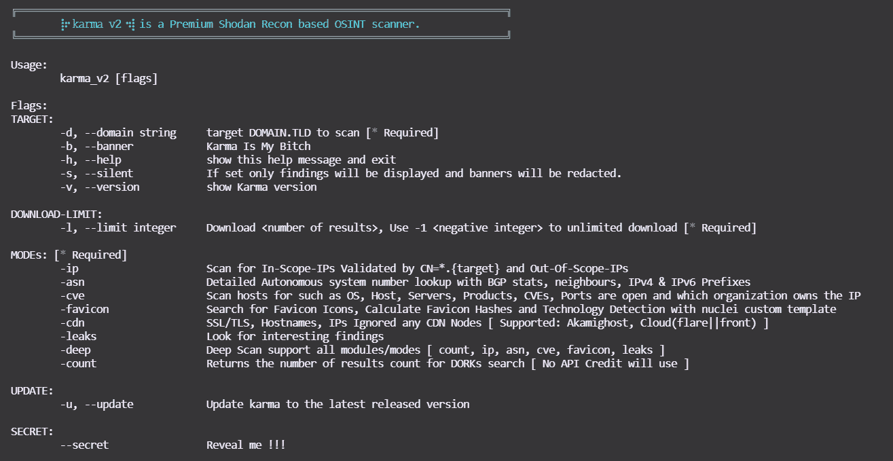

# Karma_V2:被动开源情报(OSINT)自动侦察(框架)

> 原文：<https://kalilinuxtutorials.com/karma_v2/>

[](https://blogger.googleusercontent.com/img/a/AVvXsEgjM5cfdq_qCAVs1jg9YuVOxY4K76QVym0MxwyDvkDTSIBf0xkjVAbaCUAZfS87A-e2XBtx-LL2_OeAWHQd3-NONk3thTUICVSykFLb7lumQM5RhEktL11qGc1fnje-cP2sFPp43Z-Z9loJ9qtHreK2oLvIJ2jpSIImQhFXbfsXHsa_bG_CK_zhx1dh=s509)

信息安全研究人员、渗透测试人员、漏洞猎人可以使用 Karma_V2 来查找深层信息、更多资产、WAF/CDN 绕过的 IPs、内部/外部基础设施、公开暴露的漏洞以及更多关于他们目标的信息。使用这个自动化需要 Shodan Premium API 密钥。𝚔𝚊𝚛𝚖𝚊 𝚟𝟸的输出显示在屏幕上，并保存到文件/目录中。

ℹ关于优质 Shodan API，请参阅 Shodan 网站了解更多信息。

Shodan 网站:Shodan 网站 API:开发者 API

**特色**

*   强大和灵活的结果通过 Shodan 呆子
*   SSL SHA1 校验和/指纹搜索
*   仅命中范围内的 IP
*   用 SSL/TLS 证书颁发者匹配正则表达式验证每个 IP
*   提供范围外的 IP
*   找出所有端口，包括众所周知的/不常见的/动态的
*   抓取所有与 CVEs 相关的目标漏洞
*   每个 IP、产品、操作系统、服务和组织等的横幅广告。
*   抓取收藏夹图标
*   使用 python3 mmh3 模块生成 Favicon 散列
*   使用 nuclei 自定义模板的 Favicon 技术检测
*   ASN 扫描
*   BGP 邻居
*   ASN 的 IPv4 和 IPv6 配置文件
*   **有趣的漏洞，如索引、NDMP、SMB、登录、注册、OAuth、SSO、状态 401/403/500、VPN、Citrix、Jfrog、仪表盘、OpenFire、控制面板、WordPress、Laravel、Jetty、S3 桶、Cloudfront、Jenkins、Kubernetes、节点导出、Grafana、RabbitMQ、容器、GitLab、MongoDB、Elastic、FTP 匿名、Memcached、DNS 递归、Kibana、Prometheus、默认密码、受保护对象、Moodle、Spring Boot、Django、吉拉**

**安装**

**克隆回购**

**# git 克隆 https://githu**b.com/Dheerajmadhukar/karma_v2.git

**安装庄丹& mmh3 python 模块**

**# python3 -m pip 安装 shodan mmh3**

**安装 JSON 解析器【JQ】**

**#安装 jq -y**

**安装 httprobe @ tomnomnom 来探测请求**

**# go 111 模块= on go get-v github . com/tomnom/http robe**

**将 Interlace @codingo 安装到 mult**I thread[遵循 codingo interlace repo 说明]

```
# git clone https://github.com/codingo/Interlace.git & install accordingly. 

```

**安装 nucleus @ project discovery**

```
# GO111MODULE=on go get -v github.com/projectdiscovery/nuclei/v2/cmd/nuclei
```

**安装 lolcat**

```
# apt install lolcat -y
```

。**重新安装**

```
# GO111MODULE=on go get -u github.com/tomnomnom/anew
```

**用途**

您可以使用此命令查看帮助:

```
$ bash karma_v2 -h
```



**模式**

| **模式** | **例题** |
| --- | --- |
| **-ip** | `**bash karma_v2 -d <DOMAIN.TLD> -l <INTEGER> -ip**` |
| **-提前装运通知** | `**bash karma_v2 -d <DOMAIN.TLD> -l <INTEGER> -asn**` |
| **-cve** | `**bash karma_v2 -d <DOMAIN.TLD> -l <INTEGER> -cve**` |
| **-收藏夹图标** | `**bash karma_v2 -d <DOMAIN.TLD> -l <INTEGER> -favicon**` |
| **-泄漏** | `**bash karma_v2 -d <DOMAIN.TLD> -l <INTEGER> -leaks**` |
| **-深度** | `**bash karma_v2 -d <DOMAIN.TLD> -l <INTEGER> -deep**` |
| **-计数** | `**bash karma_v2 -d <DOMAIN.TLD> -l <INTEGER> -count**` |

**输出**

**输出/错误群组. com-YYYY-MM-DD/
。
asns _ detailed _ bugcrowd . com . txt
收集
host _ domain _ domain . TLD . JSON . gz
SSL _ sha 1 _ 12289 至 814…【83029 f 8944 b 6088d 60204 至 92e_domain.tld.json.gz】。。
【IP _ vuns】
【104 . x . x . x . JSON . gz】
【107 . x . x . x . JSON . gz】
【107 . x . x . x . JSON . gz】
【99 . x . x . x .】。。
favicons _ domain . TLD . txt
host _ enum _ domain . TLD . txt
IPS _ inscope _ domain . TLD . txt
main _ domain . TLD . data
。。。**

**karma_v2 新增庄丹呆瓜**

*   索纳库贝
*   Apache hadoop 节点
*   目录列表
*   Oracle 商业智能
*   oracle weblogic
*   坞站 Exec
*   阿帕奇状态
*   阿帕奇-郊狼/1.1 雄猫-5.5
*   Swagger UI
*   h 球
*   Splunk
*   JBoss
*   phpinfo
*   id _ vc
*   汇合
*   提布科-贾斯珀软件公司
*   船厂 _ 码头 _ 管理
*   Symfony PHP 信息 AWS 信用
*   被 CDNs 忽略
*   姜戈 _ 暴露
*   集群节点 etcd
*   SAP _ NetWeaver _ 应用程序

**𝚔𝚊𝚛𝚖𝚊 𝚟𝟸支持庄丹市井小民**

| **呆瓜** | **呆瓜** | **呆瓜** |
| --- | --- | --- |
| **T2`ssl.cert.fingerprint`** | **T2`http.status:"302" oauth`** | **T2`"Server: Jetty"`** |
| **T2`ssl`** | **T2`http.status:"302" sso`** | **T2`X-Amz-Bucket-Region`** |
| **T2`org`** | **T2`title:"401 Authorization Required"`** | **T2`"development" org:"Amazon.com"`** |
| **T2`hostname`** | **T2`http.html:"403 Forbidden"`** | **T2`"X-Jenkins" "Set-Cookie: JSESSIONID" http.title:"Jenkins [Jenkins]"`** |
| **T2`ssl.cert.issuer.cn`** | **T2`http.html:"500 Internal Server Error"`** | **T2`http.favicon.hash:81586312 200`** |
| **T2`ssl.cert.subject.cn`** | **T2`ssl.cert.subject.cn:*vpn*`** | **T2`product:"Kubernetes" port:"10250, 2379"`** |
| **T2`ssl.cert.expired:true`** | **T2`title:"citrix gateway"`** | **T2`port:"9100" http.title:"Node Exporter"`** |
| **T2`ssl.cert.subject.commonName`** | **T2`http.html:"JFrog"`** | **T2`http.title:"Grafana"`** |
| **T2`http.title:"Index of /"`** | **T2`"X-Jfrog"`** | **T2`http.title:"RabbitMQ"`** |
| **T2`ftp port:"10000"`** | **T2`http.title:"dashboard"`** | **T2`HTTP/1.1 307 Temporary Redirect "Location: /containers"`** |
| **T2`"Authentication: disabled" port:445 product:"Samba"`** | **T2`http.title:"Openfire Admin Console"`** | **T2`http.favicon.hash:1278323681`** |
| **T2`title:"Login - Adminer"`** | **T2`http.title:"control panel"`** | **T2`"MongoDB Server Information" port:27017 -authentication`** |
| **T2`http.title:"sign up"`** | **T2`http.html:"* The wp-config.php creation script uses this file"`** | **T2`port:"9200" all:"elastic indices"`** |
| **T2`http.title:"LogIn"`** | **T2`clockwork`** | **T2`"220" "230 Login successful." port:21`** |
| **T2`port:"11211" product:"Memcached"`** | **T2`"port: 53" Recursion: Enabled`** | **T2`title:"kibana"`** |
| **T2`port:9090 http.title:"Prometheus Time Series Collection and Processing Server"`** | **T2`"default password"`** | **T2`title:protected`** |
| **T2`http.component:Moodle`** | **T2`http.favicon.hash:116323821`** | **T2`html:"/login/?next=" title:"Django"`** |
| **T2`html:"/admin/login/?next=" title:"Django"`** | **T2`title:"system dashboard" html:jira`** | **T2`http.component:ruby port:3000`** |
| **T2`html:"secret_key_base"`** | **T2`I will add more soon`** | **T2`. . .`** |

**𝚔𝚊𝚛𝚖𝚊 𝚟𝟸新加入的庄丹呆瓜**

| **呆瓜** | **呆瓜** | **呆瓜** |
| --- | --- | --- |
| **T2`"netweaver"`** | **T2`port:"2379" product:"etcd"`** | **T2`http.title:"DisallowedHost"`** |
| **T2`ssl:"${target}" "-AkamaiGHost" "-GHost"`** | **T2`ssl:"${target}" "-Cloudflare"`** | **T2`ssl:"${target}" "-Cloudfront"`** |
| **T2`"X-Debug-Token-Link" port:443`** | **T2`http.title:"shipyard" HTTP/1.1 200 OK Accept-Ranges: bytes Content-Length: 5664`** | **T2`http.title:"TIBCO Jaspersoft:" port:"443" "1970"`** |
| **T2`"Confluence"`** | **T2`http.title:"SonarQube"`** | **T2`html:"jmx?qry=Hadoop:*"`** |
| **T2`http.title:"Directory Listing"`** | **T2`http.title:"H-SPHERE"`** | **T2`http.title:"Swagger UI - "`** |
| **T2`Server: Apache-Coyote/1.1 Tomcat-5.5"`** | **T2`port:2375 product:"Docker"`** | **T2`http.title:"phpinfo()"`** |
| **T2`http.title:"ID_VC_Welcome"`** | **T2`"x-powered-by" "jboss"`** | **T2`jboss http.favicon.hash:-656811182`** |
| **T2`http.title:"Welcome to JBoss"`** | **T2`port:"8089, 8000" "splunkd"`** | **T2`http.favicon.hash:-316785925`** |
| **T2`title:"splunkd" org:"Amazon.com"`** | **T2`http.title:"oracle business intelligence sign in"`** | **T2`http.title:"Oracle WebLogic Server Administration Console"`** |
| **T2`http.title:"Apache Status"`** | **T2`I will add more soon`** | **T2`. . .`** |

[**Download**](https://github.com/Dheerajmadhukar/karma_v2)