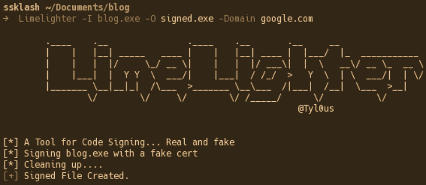
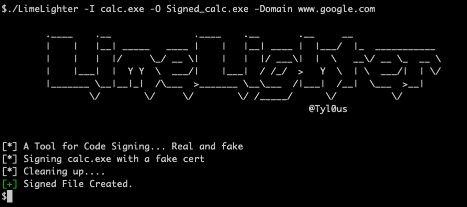
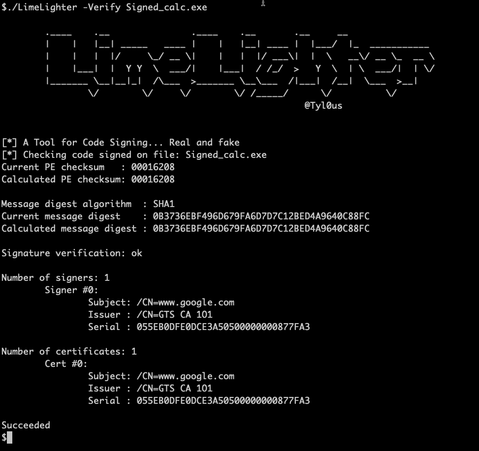
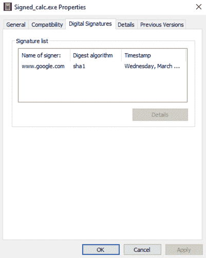

# Limelighter:一个生成假代码签名证书或签名真证书的工具

> 原文：<https://kalilinuxtutorials.com/limelighter/>

**Limelighter** 是一款创建欺骗代码签名证书和签名二进制文件和 DLL 文件的工具，有助于规避 EDR 产品，避免 MSS 和 sock scruitney。LimeLighter 也可以使用有效的代码签名证书来签名文件。Limelighter 可以使用完全限定的域名，如 **`acme.com`。**

**特约**

石灰打火机是在戈朗开发的。

确保您的操作系统上安装了以下软件

**OpenSSL
oslsigncode**

一如既往，第一步是克隆回购协议。在编译 LimeLighter 之前，您需要安装依赖项。要安装它们，请运行以下命令

去找 github.com/fatih/color

那就建造它

去建造石灰打火机吧

**用途**

**。/LimeLighter -h
。 *_。_ .*。 *_。_**_ | | | |*| | | |*_ | |*/| _/_
| | | |/_/*_ | | | | |/*| \ \/_ _*\
| | |*| | |【Y \*/|*|//*/>\\ */| | \/| _**_ _ | |*|/_ _*|/_ _>*_*_ _ _ _ _ _/|*|/| _>| \/\/\/*/\/\/
@ Tyl0us
[*]一款代码签名的工具…真假
用法。 /lime lighter:
-域字符串
你要为
创建一个假的代码签名的域-I 字符串
未签名的文件名
-O 字符串
已签名的文件名
-密码字符串
真实证书的密码
-真实字符串
一个有效的路径。pfx 证书文件
-验证字符串
验证文件的代码签名证书
-调试
打印调试语句**

要签署一个文件，你可以使用命令选项`**Domain**`来生成一个伪造的代码签署证书

要使用有效的代码签名证书对文件进行签名，请使用 **`Real`** 和`**Password**`使用有效的代码签名证书对文件进行签名。

使用`**verify**`命令验证签名文件。

[**Download**](https://github.com/Tylous/Limelighter)