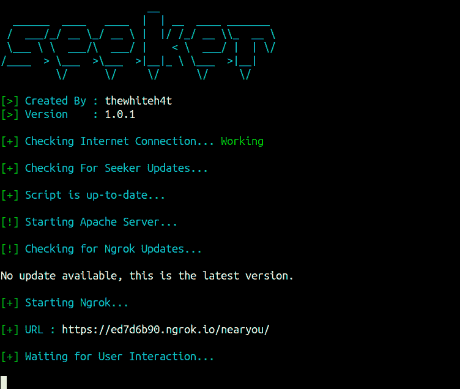
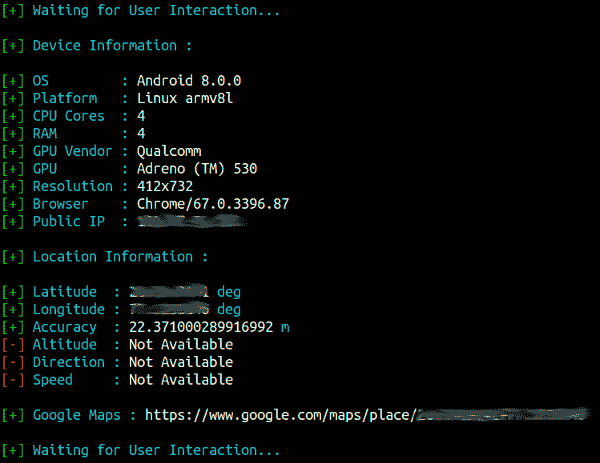

# 搜索者-高精度地查找设备信息和地理位置

> 原文：<https://kalilinuxtutorials.com/seeker-device-information-geo-location/>

导引头利用 **HTML5、Javascript、JQuery 和 PHP** 高精度抓取**设备信息**和**地理位置**。*当无法直接[地理定位 IP 地址](https://www.abstractapi.com/ip-geolocation-api)时，Seeker 是最佳选择。*

Seeker 在 **Apache 服务器**上托管一个假网站，并使用 **Ngrok** 生成一个 SSL 链接，请求位置许可，如果用户允许，我们可以获得:

*   经度
*   纬度
*   准确(性)
*   海拔——并不总是可用
*   方向–仅在用户移动时可用
*   速度–仅在用户移动时可用

**亦读[Camelishing——社会工程工具](https://kalilinuxtutorials.com/camelishing/)**

除了位置信息，我们还可以获得**设备信息**而无需任何许可:

*   操作系统
*   平台
*   CPU 核心的数量
*   RAM 的数量–近似结果
*   屏幕分辨率
*   GPU 信息
*   浏览器名称和版本
*   公共 IP 地址

**该工具纯粹是概念验证，仅用于教育目的，Seeker 展示了恶意网站可以收集哪些关于您和您的设备的数据，以及为什么您不应该点击随机链接并允许位置等关键权限。**

*   其他工具和服务提供的 IP 地理位置不是很准确，不能给出用户的位置。
*   一般来说，如果用户接受定位许可，接收到的信息的精度是**精确到大约 30 米**。

**注**:由于某些原因，iPhone 上的定位精度约为 65 米。

## **导引头安装**

```
git clone https://github.com/thewhiteh4t/seeker.git
cd seeker/
chmod 777 install.sh
./install.sh

#After Installation just type seeker in console
```

## **截图**

 

## **PoC** 

[https://www.youtube.com/embed/ggUGPq4cjSM?feature=oembed](https://www.youtube.com/embed/ggUGPq4cjSM?feature=oembed)

[](https://github.com/thewhiteh4t/seeker)