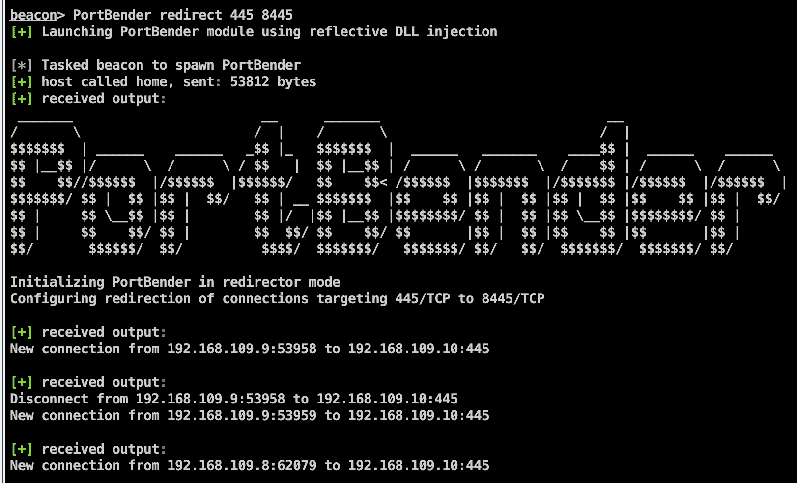
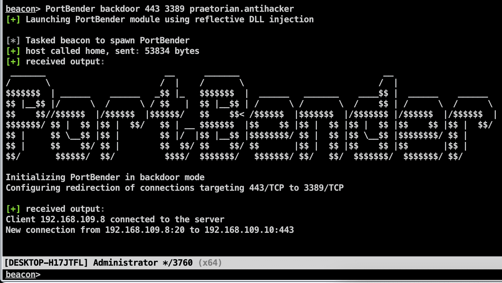

# PortBender : TCP 端口重定向实用程序

> 原文：<https://kalilinuxtutorials.com/portbender/>

**PortBender** 是一个 TCP 端口重定向实用程序，允许 red team 操作员将目的地为一个 TCP 端口(例如，445/TCP)的入站流量重定向到另一个 TCP 端口(例如，8445/TCP)。PortBender 包括一个攻击者脚本，操作员可以利用它将工具与 Cobalt Strike 集成。然而，因为该工具是作为反射 DLL 实现的，所以它可以通过“ReflectiveLoader”接口与任何支持加载模块的 C2 框架集成[1]。该工具还允许运营商模拟 Duqu 2.0 威胁参与者使用的“PortServ.sys”功能中利用的后门/持久性机制。

**设计**

PortBender 利用 WinDivert 库，通过 Windows 过滤平台(WFP)拦截网络流量。PortBender 的设计深受 DivertTCPConn 实用程序的影响，该实用程序也利用了 WinDivert 库[1]。

**用法**

PortBender 有两种操作模式。第一种是“重定向器模式”，第二种是“后门模式”在“重定向器模式”中，到目标目的端口(例如，445/TCP)的任何连接都被重定向到替代端口(例如，8445/TCP)。在“后门模式”中，只有当攻击者向目标端口(例如 443/TCP)发送特殊格式的 TCP 数据包时，我们才会重定向流量。然后，PortBender 将该客户端 IP 地址添加到后门客户端列表中，并将该目标端口的所有流量重定向到另一个端口(例如，3389/TCP)。操作员可以利用这种机制来模仿 Duqu 2.0 威胁参与者在危及卡巴斯基安全时使用的持续技术。

要执行 PortBender，我们必须首先将“PortBender.cna”脚本导入到 Cobalt Strike 中，并将“PortBender.zip”中包含的 WinDivert32.sys 或 WinDivert64.sys 二进制文件上传到目标主机，具体取决于操作系统架构。PortBender 的帮助菜单及示例用法如下所示:

**beacon >帮助 PortBender
重定向用法:PortBender 重定向 FakeDstPort RedirectedPort
后门用法:PortBender 后门 FakeDstPort RedirectedPort 密码
示例:**P**ortBender 重定向 445 8445
PortBender 后门 443 3389 praetorian . anti hacker**

**示例用法**

例如，我们可能希望在重定向器模式下执行 PortBender，以便从受损的 Windows 系统执行 SMB 中继攻击。为此，我们可以指示 PortBender 将 445/TCP 的所有流量重定向到运行攻击者 SMB 服务的备用端口 8445/TCP。在这个例子中，我们运行命令“PortBender redirect 445 8445”来完成这个任务。预期输出如下:

在本例中，我们希望在一个受到威胁的面向 Internet 的 IIS web 服务器上部署隐蔽的持久性机制。在这里，我们运行“PortBender back door 443 3389 praetorian.antihacker ”,指示后门服务从提供了指定的“praetorian . anti hacker”关键字的任何 IP 地址，将受损主机上任何到 443/TCP 的连接重定向到 3389/TCP。预期输出如下所示:

[**Download**](https://github.com/praetorian-inc/PortBender)