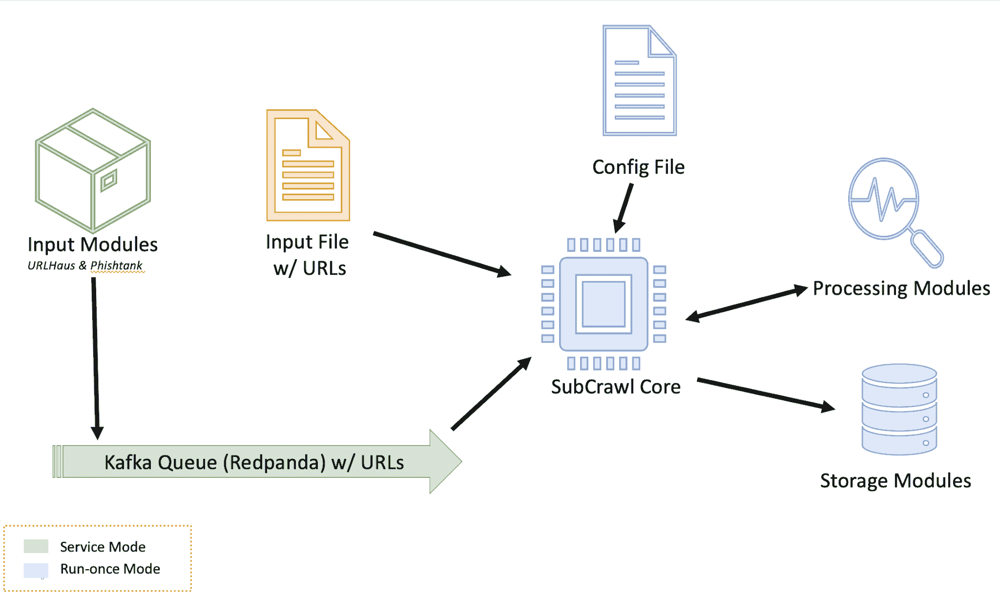
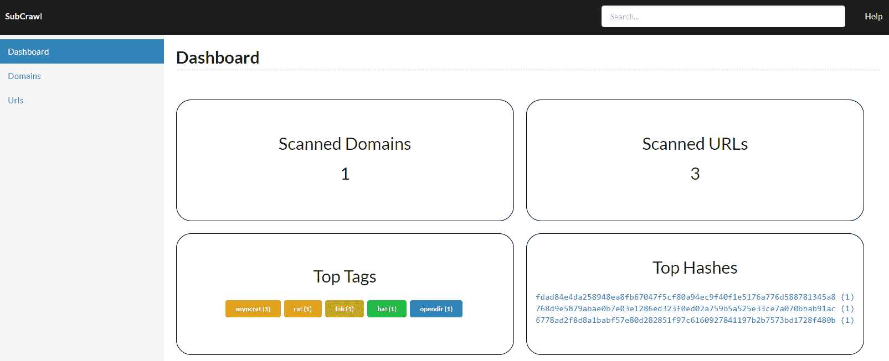
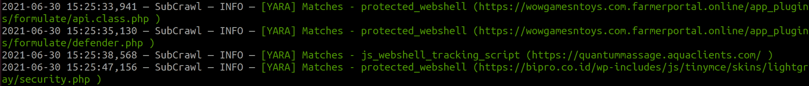
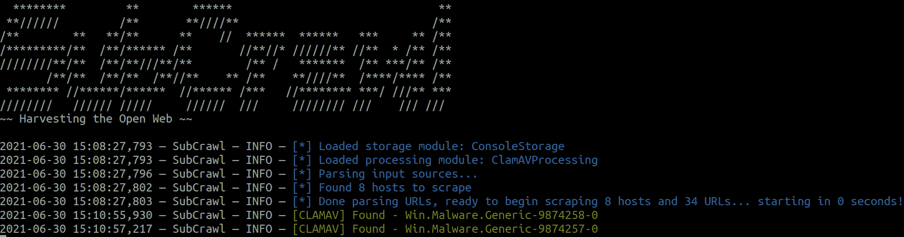
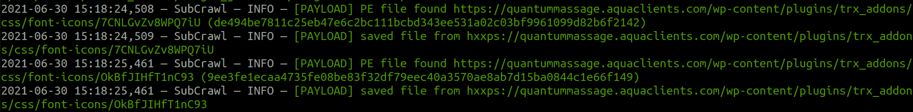
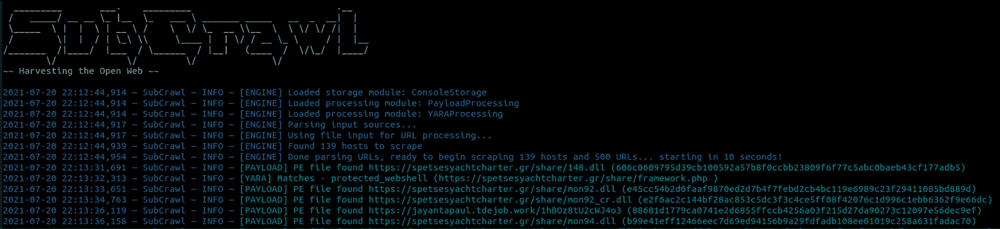
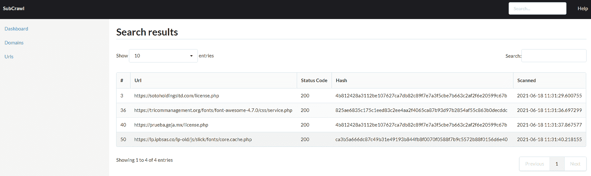
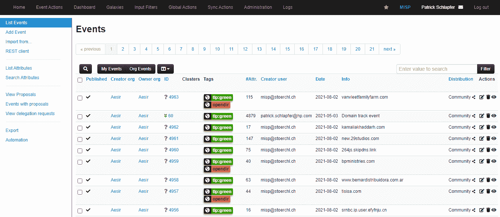

# SubCrawl:一个模块化框架，用于发现开放目录，通过签名识别独特的内容，并用可选的输出模块(如 MISP)组织数据

> 原文：<https://kalilinuxtutorials.com/subcrawl/>

**SubCrawl** 是由惠普公司威胁研究团队的 Patrick Schlä pfer、Josh Stroschein 和 Alex Holland 开发的一个框架。SubCrawl 旨在查找、扫描和分析打开的目录。该框架是模块化的，由四个部分组成:输入模块、处理模块、输出模块和核心爬行引擎。URL 是主要的输入值，框架在抓取它们之前对其进行解析并添加到排队系统中。URL 的解析是重要的第一步，因为这需要一个提交的 URL，并通过删除子目录来生成额外的 URL，一次一个，直到没有子目录。此过程确保对 web 服务器进行更全面的扫描尝试，并可能发现其他内容。值得注意的是，SubCrawl 不使用暴力方法来发现 URL。所有扫描的内容都来自输入的 URL、解析 URL 的过程以及爬行过程中的发现。当发现一个开放目录时，爬行引擎从该目录中提取链接进行评估。爬行引擎确定该链接是另一个目录还是一个文件。目录被添加到爬行队列，而文件由处理模块进行额外的分析。如果找到了打开的目录，或者与 YARA 规则匹配，则为每个扫描的 URL 生成并存储结果，例如 SHA256 和内容的模糊散列。最后，根据一个或多个输出模块处理结果数据，目前有三个输出模块。第一个提供了与 MISP 的集成，第二个只是将数据打印到控制台，第三个将数据存储在 SQLite 数据库中。由于该框架是模块化的，因此不仅易于配置所需的输入、处理和输出模块，而且易于开发新模块。

*Figure 1 – SubCrawl architecture*

子抓取支持两种不同的操作模式。首先，子抓取可以在运行一次模式下启动。在这种模式下，用户在一个文件中提供要扫描的 URL，其中每个输入值由换行符分隔。第二种操作模式是服务模式。在这种模式下，SubCrawl 在后台运行，并依赖输入模块来提供要扫描的 URL。图 1 显示了 SubCrawl 架构的概况。在两种操作模式下使用的部件为蓝色，运行一次模式部件为黄色，维修模式部件为绿色。

**要求**

根据所选择的运行模式，必须满足其他先决条件。

**运行一次模式要求**

SubCrawl 是用 Python3 写的。此外，在运行 SubCrawl 之前还需要几个包。以下命令可用于在运行 SubCrawl 之前安装所有必需的软件包。从 *crawler* 目录中，运行以下命令:

**$ sudo apt install built**d-e**ssentia**l
$ pip 3 install-r requirements . txt

**服务模式要求**

如果在服务模式下启动 SubCrawl，可以使用 Docker 来完成。因此，需要安装 Docker 和 Docker Compose。良好的安装说明可以直接在 Docker.com 网站上找到。

*   安装 Docker 引擎
*   安装 Docker 合成

**求助**

SubCrawl 通过*-h/–help*参数或通过不带任何参数的简单执行脚本来内置帮助。

*** * *
/////////////* *
/* * */* */* */
/*////*////*//////
////////////////////////*///*///////* */
/////////// */////// /// /// ///
~~收割打开的 Web~~
用法:sub crawl . py[-h][-f FILE _ PATH][-k][-p PROCESSING _ MODULES][-s STORAGE _ MODULES]
可选参数:
-h，–help 显示此帮助消息并退出
-f FILE_PATH，–FILE _ PATH
输入 URL 文件的路径
-k，–kaff
-s 存储模块，–存储存储模块
要执行的存储模块，以逗号分隔。
可用处理模块:
clamav processing
jarm processing
payload processing
TLSHProcessing
yara processing
可用存储模块:
console storage
misp storage
SQLite storage***

**运行一次模式**

如果您想快速扫描可管理数量的域，这种模式是合适的。为此，要扫描的 URL 必须保存在一个文件中，然后作为爬虫的输入。下面是一个在运行一次模式下执行的例子，没有使用带有文件路径的 *-f* 参数。

**python 3 sub crawl . py-f URLs . txt-p yara processing，payload processing-s console storage**

**服务模式**

使用服务模式，可以扫描更多的域并保存结果。基于选定的存储模块，可以对数据进行更详细的分析和评估。为了让用户尽可能容易地运行服务模式，我们将所有功能都构建到 Docker 映像中。在服务模式下，通过输入模块获得要扫描的域。默认情况下，会从 URLhaus 和 PhishTank 下载新的恶意软件和网络钓鱼 URL，并排队等待扫描。可以在`**config.yml**`中直接输入所需的处理和存储模块。默认情况下，利用 SQLite 存储激活以下处理模块:

*   clamav 处理
*   JARMProcessing
*   TLSHProcessing
*   yara 处理

除了 SQLite 存储模块，还开发了一个简单的 web UI，允许查看和管理扫描的域和 URL。

然而，如果该 UI 不足以进行后续的数据评估，则可以替代地或附加地激活 MISP 存储模块。必须在`MISP`部分的`config.yml`中进行相应的设置。

以下两个命令足以克隆 GIT 存储库，创建 Docker 容器并直接启动它。然后可以通过`https://localhost:8000/`地址进入网络界面。请注意，一旦容器启动，输入模块将开始向处理队列添加 URL，引擎将开始抓取主机。

**git 克隆 https://github.com/hpthreatresearch/subcrawl.git
docker-compose up-build**

**子牵引模块**

**输入模块**

输入模块仅在维修模式下使用。如果 SubCrawl 使用运行一次模式启动，则必须提供包含要扫描的 URL 的文件。已经实现了以下两个输入模块。

**【尖叫屋】**

URLhaus 是一个追踪恶意网址的著名网络服务。web 服务还提供包含新检测到的 URL 的导出。这些恶意网址为我们的爬虫提供了完美的输入，因为我们主要想分析恶意域名。检索最近提交的 URL，并且搜索结果不通过 API 请求(即，通过标签或其他可用参数)来提炼。可以修改在这个输入模块中向 URLHaus API 发出的 HTTP 请求，以进一步细化所获得的结果。

**网上银行**

PhishTank 是一个收集钓鱼网址的网站。用户有可能提交新发现的钓鱼网页。可以通过 API 从该 web 服务生成并下载带有活动网络钓鱼 URL 的导出。所以这也是我们爬虫的理想收藏。

**处理模块** s

SubCrawl 附带了几个处理模块。处理模块在如何将结果返回给核心引擎方面都遵循相似的行为。如果找到匹配，结果将返回到核心引擎，并在以后提供给存储模块。以下是处理模块列表。

**SDHash**

SDHash 处理模块用于计算 HTTP 响应的相似性哈希。内容的最小大小必须是 512 字节，以便能够成功计算哈希。这可能是要安装的最复杂的处理模块，因为它需要 Protobuf，并且根据目标主机的不同，它必须重新编译。因此，该处理模块在默认情况下被禁用。已经编译的版本可以在 crawler/processing/minisdhash/中找到，它需要 protobuf-2.5.0 和 python3.6。这些二进制文件是在 Ubuntu 18.04.5 LTS x64 上编译的。遵循安装说明:

Protobuf 安装

**apt-get 更新
apt-get -y 安装 libssl-dev libevent-pthreads-2.1-6 libomp-dev g++
apt-get-y 安装 autoconf automake libtool curl make g++ unzip
wget https://github . com/protocol buffers/proto buf/releases/download/v 2 . 5 . 0/proto buf-2 . 5 . 0 . zip
unzip proto buf-2 . 5 . 0 . zip
CD proto buf/configure
make
sudo make install
python 3.6 installation
apt-get install python 3.6-dev
sudo LD config
SD hash installation
git clone https://github.com/sdhash/sdhash.git
CD SD hash
make
make install
LD config**

**码**码

JARM 是 Salesforce 开发的一款采集 TLS 连接指纹的工具。JARM 处理模块对域执行扫描，并将带有域的 JARM 散列返回给核心引擎。根据 web 服务器的配置，TLS 握手具有不同的属性。通过计算这个握手的属性的散列，这些差异可以用于跟踪 web 服务器配置。

**【tlsh】**

TLSH 处理模块类似于用于计算相似性散列的 SDHash 处理模块。TLSH 的优点是，安装简单得多，最小输入量为 50 字节。由于大多数 webshell 登录都很小，并且是我们研究的重点，我们默认激活了这个处理模块。

伤

YARA 处理模块用于根据 YARA 规则扫描 HTTP 响应内容。要调用这个处理模块，提供值 *YARAProcessing* 作为处理模块参数。例如，以下命令将加载 YARA 处理模块，并通过 ConsoleStorage 存储模块向控制台生成输出。

**python 3 sub crawl . py-p yara processing-s console storage**

目前，YARA 处理模块用于识别 webshell 登录和各种其他有趣的内容。本项目包含的 YARA 规则:

*   protected_webshell:标识受密码保护的 webshell 的登录页面
*   js_webshell_tracking_script:识别后门插件/主题，这些插件/主题使用 JavaScript 在 webshell 激活时通知攻击者
*   open_webshell:标识开放的 webshell(即不通过登录保护的 web shell)
*   php_webshell_backend:识别攻击者使用的 PHP webshell 后端

样本输出:

要添加其他 YARA 规则，您可以添加。YAR 文件到 *yara-rules* 文件夹，然后通过添加一个 *include* 语句到 *combined-rules.yar* 来包含规则文件。

**叫**

ClamAV 处理模块用于在使用 ClamAV 扫描时扫描 HTTP 响应内容。如果找到匹配，则将其提供给各种输出模块。要调用此处理模块，请提供值*clamavcompating*作为处理模块参数。例如，以下命令将加载 ClamAV 处理模块，并通过 ConsoleStorage 存储模块向控制台生成输出。

**python 3 sub crawl . py-p clamav processing-s console storage**

样本输出:

要使用该模块，必须安装 ClamAV。从终端，使用 APT 软件包管理器安装 ClamAV:

**$ sudo apt-get 安装 clamav-守护程序 clamav-fresh clam clamav-unofficial-sigs**

安装后，ClamAV 更新服务应该已经在运行。但是，如果您想要使用 *freshclam* 手动更新，请确保该服务已停止:

**sudo system CTL stop clamav-fresh clam . service**

然后手动运行 *freshclam* :

**$ sudo fresh hclam**

最后，检查 ClamAV 服务的状态:

**$ sudo 系统状态 clamav-daemon.service**

如果服务没有运行，您可以使用 *systemctl* 来启动它:

**$ sudo system CTL start clamav-daemon . service**

**有效载荷**

有效负载处理模块用于使用 *libmagic* 库识别 HTTP 响应内容。此外，子抓取可以配置为保存感兴趣的内容，如 PE 文件或归档。为了调用这个处理模块，提供值 *PayloadProcessing* 作为处理模块参数。例如，以下命令将加载有效负载处理模块，并向控制台生成输出:

**python 3 sub crawl . py-p payload processing-s console storage**

此模块没有其他依赖项。

样本输出:

**存储模块**

在扫描完队列中的所有 URL 后，子抓取引擎会调用存储模块。它们的设计有两个目标。首先，在完成扫描队列后立即获得扫描结果，其次，支持长期存储和分析。因此，我们不仅实现了 ConsoleStorage 模块，还集成了 MISP 和 SQLite 存储模块。

**控制台**

为了在扫描 URL 后直接快速分析结果，一个格式良好的输出被打印到控制台。此输出最适合在一次性运行模式下使用子抓取。虽然这种方法对于扫描单个域或生成快速输出很有效，但对于长期研究和分析来说却不实用。

**SQLite**

由于 MISP 的安装和配置非常耗时，我们实现了另一个模块，将数据存储在 SQLite 数据库中。为了尽可能简单明了地向用户展示数据，我们还开发了一个简单的 web GUI。使用这个 web 应用程序，可以查看和搜索扫描的域和 URL 及其所有属性。因为这只是一个早期版本，还没有实现复杂的比较特性。

**MISP**

MISP 是一个开源的威胁情报平台，具有灵活的数据模型和 API 来存储和分析威胁数据。SubCrawl 将已爬网数据存储在 MISP 事件中，为每个域发布一个事件，并添加任何已识别的开放目录作为属性。MISP 还允许用户为事件和属性定义标签。这有助于事件比较和链接分析。因为这是我们的主要研究目标之一，所以在将 SubCrawl 的输出导出到 MISP 时，我们丰富了来自 URLHaus 的数据。URLHaus 使用标签注释其数据，这些标签可用于识别与 URL 相关联的恶意软件家族或威胁参与者。对于每个 open directory URL，该模块查询本地存储的 URLHaus 数据，如果匹配，则将 URLHaus 标签添加到 MISP 事件中。为了避免为每个 MISP 事件收集不相关的属性，我们为扫描的 url 创建了一个新的 MISP 对象，称为 opendir-url。这确保了相关属性保持在一起，从而更容易获得数据的概观。

**构建自己的模块**

处理和存储模块的模板作为框架的一部分提供。

**处理模块**

处理模块可在`**crawler->processing**`下找到，样本模块文件`**example_processing.py**`可在该目录下找到。模板提供了必要的继承和导入，以确保框架的执行。 *init* 函数提供模块初始化，并接收记录器实例和全局配置。记录器用于提供来自处理模块以及整个框架的日志记录信息。

实现*进程*函数来处理每个 HTTP 响应。为此，它接收 URL 和原始响应内容。这是实现模块工作的地方。该函数应返回包含以下字段的字典:

*   哈希:内容的 sha256
*   url:从中检索内容的 URL
*   matches:模块中的任何匹配结果，例如，libmagic 或 YARA 结果。

必须定义一个唯一的类名，当通过 *-p* 参数包含该模块或作为配置文件中的默认处理模块时，该类名用于定义该模块。

最后，使用您的类名在`**__init__.py**`中添加一个导入语句:

**从。_ 加工进口加工**

**存储模块**

存储模块可以在`**crawler->storage**`下找到，样本模块文件`**example_storage.py**`可以在这个目录中找到。与处理模块类似， *init* 函数提供模块初始化，并接收记录器实例和全局配置。 *store_results* 函数按照配置文件中批处理大小定义的时间间隔从引擎接收结构化数据。

必须定义一个唯一的类名，当通过 *-s* 参数或作为配置文件中的默认处理模块包含模块时，该类名用于加载模块。

[**Download**](https://github.com/hpthreatresearch/subcrawl)