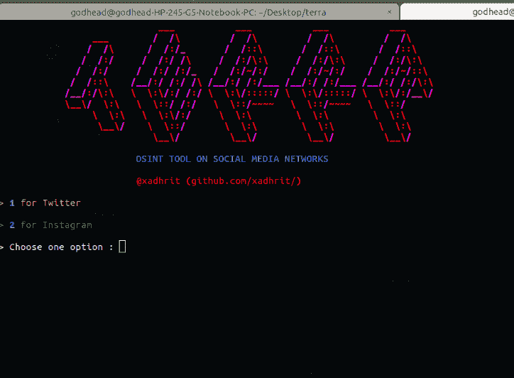

# terra:Twitter 和 Instagram 上的 OSINT 工具

> 原文：<https://kalilinuxtutorials.com/terra/>

**Terra** 是 Twitter 和 Instagram 上的 OSINT 工具。

**安装**

克隆 github repo

**$ git 克隆 https://github.com/xadhrit/terra.git**

更改目录

**$ cd terra**

**要求**

对于需求，运行以下命令:

**$ python 3-m pip install-r requirements . txt**

**注**

对于`**Twitter**`凭证:

要使用 terra，您需要在 creds 文件夹的 twitter.yml 文件中列出的凭据。

您可以在 Twitter 的开发者门户上找到更多关于 Twitter Api 和访问令牌的信息

对于`**Instagram**`credentials:

把你的 Instagram 的用户名和密码放在`**creds/insta.yml**`文件里。你可以走了。

**用途**

**基本用法**

**~/terra＄python 3 terra . py
help:-j 用于将结果保存在 JSON 文件中
-f 用于文本文件**

**推特侦察命令**

l **s:显示所有 Terra 命令
help:求助
quit:退出程序
clear:清理您的终端屏幕
exit:退出 Terra
reset target:在命令行中重置新目标
tweets:获取目标发布的最新 tweets
fav tweets:获取目标喜爱的最新 tweets
followers:获取目标的追随者列表
following:获取目标的以下列表
info:获取关于目标的概述和信息
个人资料图片:下载目标的个人资料图片
横幅:下载目标的个人资料横幅
标签:获取目标使用的标签**

**Instgram Recon 命令**

**ls:显示 Terra 命令，
help:寻求帮助，
clear:清空你的屏幕，
quit:退出，
exit:退出 Terra，
locations:获取目标的锁定位置，
captions:收集目标的标题，
reset target:重置 Terra 中的目标，
comments:获取目标的追随者列表，
关注:获取目标
关注者邮件列表
关注者邮件:
关注者邮件:
关注者电话:获取目标关注者电话号码，
关注者电话:获取目标关注者电话号码，
标签:获取目标使用的标签，
时间线:查看目标账户，
喜欢:获取目标的总喜欢数，
媒体类型:获取目标的照片和视频信息，
photos:用于收集目标照片描述，
photos:用于下载目标的照片，
profile pic:用于下载目标的个人资料图片，
stories:用于下载目标的故事，
tagged ':用于列出被目标标记的用户，
commenter ':用于获取对目标的帖子进行评论的所有用户
ttag:用于在他们的 po** sts 中列出用户标记的目标

[**Download**](https://github.com/xadhrit/terra)