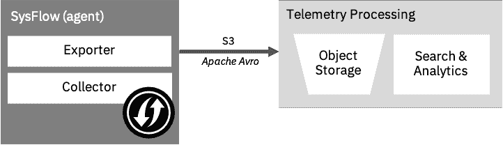
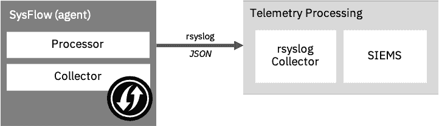
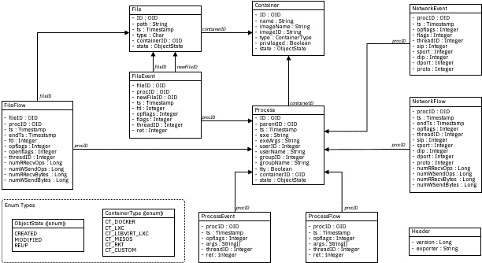

# SysFlow:云-原生系统遥测管道

> 原文：<https://kalilinuxtutorials.com/sysflow/>

[](https://blogger.googleusercontent.com/img/a/AVvXsEgFek-CmKH7swtVikomjF9xGYgKXTgUf5Sy7e0Bl6TUl40e9EKSjTN5fLqfVmdI8nlrLuFG9L59q2dMwCpXnSaveh7tRczE119gnZzoSwDs-jCM2Eyc1QeC_w18WY2gzzRYM53rDEmz-f1uAIYbuADsI_iNGo15ZhEbW1ZGMaRWKsK1ypk2yTY04ZVX=s728)

**SysFlow** 遥测管道是一个监控云和企业工作负载的框架。该框架构建了系统遥测所需的管道，以便用户可以专注于在可扩展的公共开源平台上编写和共享分析。

遥测管道的主干是一种新的数据格式，它将原始系统事件信息提升为一种抽象，描述过程行为及其与容器、文件和网络活动的关系。这种对象关系格式非常紧凑，但它提供了对遗留端点和容器云的广泛可见性。

该平台被设计为可插拔的边缘处理架构，包括接受声明性策略的策略引擎，该声明性策略支持对系统流的边缘过滤、标记和警报。它还提供了几个 API，允许用户用他们喜欢的工具包处理 SysFlow。

可以使用 Docker、Kubernetes、OpenShift 和 bare metal/VMs 部署管道。可以将 SysFlow 代理配置为边缘分析管道，以通过 rsyslog 传输 SysFlow 记录，或者将其配置为将原始 SysFlow 跟踪批量导出到 S3 兼容的对象存储。

一个集成的 Jupyter [](https://sysflow.readthedocs.io/en/latest/quick.html#analyzing-collected-traces)环境使得在收集的踪迹上执行日志搜索变得容易。还有用于 SysFlow 的 Apache Avro 模式文件，以便用户可以为其他编程语言生成 API。可以使用 C++、Python 和 Golang APIs，允许用户以编程方式与 SysFlow 跟踪进行交互。

**快速启动**

我们鼓励您首先检查文档，但是这里有一些快速开始的提示。

**启动收集探测器**

运行 SysFlow 收集器最简单的方法是从 Docker 容器运行，并为输出跟踪文件装载主机。以下命令显示了如何在主机上将跟踪文件导出到`**/mnt/data**`的情况下运行 sf-collector。

**docker run-d–privileged–name SF-collector \
-v/var/run/docker . sock:/host/var/run/docker . sock \
-v/dev:/host/dev-v/proc:ro \
-v/boot:/host/boot:ro-v/lib/modules:/host/lib/modules:ro \
-v/usr:/host/usr:ro-v/mnt/data://mnt= SF-收集器和容器. name！= SF-exporter " \
–RM sysflow 遥测/SF-收集器**

其中，INTERVAL 表示生成新跟踪文件之前的时间(秒)，EXPORTER_ID 设置导出器名称，OUTPUT 是写入跟踪文件的目录，FILTER 是用于过滤收集的事件的过滤器表达式。注意:将`**container.type!=host**`追加到过滤表达式中以过滤主机事件。

**部署选项**

SysFlow 代理可以部署在 S3(批处理)或 rsyslog(边缘处理)导出配置中。在批处理配置中，SysFlow 将收集的遥测数据作为跟踪文件(SysFlow 记录的批处理)导出到任何符合 S3 标准的对象存储服务。



在边缘处理配置中，SysFlow 将收集的遥测数据作为事件流导出到 rsyslog 收集器。这种部署支持创建定制的边缘管道，并提供内置的策略引擎来过滤、丰富和警告 SysFlow 记录。



完整 SysFlow 堆栈的`**Docker Compo**se`、`H**elm**`和`**OpenShift**`部署说明可在此处获得。

**检查收集到的痕迹**

提供了一个命令行实用程序，用于检查收集的跟踪或将跟踪从 SysFlow 的压缩二进制格式转换为人类可读的 JSON 或 CSV 格式。

**docker run–RM-v/mnt/data:/mnt/data sysflow telemetry/sys print/mnt/dat**a/

其中`trace`是`/mnt/data`中跟踪文件的名称。如果为空，则处理`/mnt/data`中的所有文件。默认情况下，跟踪被打印到带有一组默认 SysFlow 属性的标准输出中。有关选项的完整列表，请运行:

```
docker run --rm -v /mnt/data:/mnt/data sysflowtelemetry/sysprint  -h
```

**分析收集到的痕迹**

Jupyter 环境也可用于检查和实施收集的 SysFlow 数据的分析笔记本。它包括使用 Pandas 数据框架和本地查询语言(`**sfql**`)进行数据操作的 API 和宏支持。要使用示例笔记本在本地启动它，请运行:

**git 克隆 https://github.com/sysflow-telemetry/sf-apis.git&&CD SF-API
docker run–RM-d–name sfnb–user $(id-u):$(id-g)-group-add users-v $(pwd)/pynb:/home/jovyan/work-p 8888:8888 sysflow telemetry/sfnb**

然后，打开 web 浏览器，指向`**http://localhost:8888**`(或者，笔记本所在的远程服务器名称或 IP)。要获得笔记本认证令牌，运行`**docker logs sfnb**`。

**SysFlow 规范**

SysFlow 是系统事件级遥测的开放规范。SysFlow 的主要目标是为计算工作负载的安全性和性能分析创建一种标准且可扩展的数据格式。一个开放的标准将使研究人员和从业人员能够更容易地使用一种通用的数据格式，并专注于使用开源软件进行分析。

SysFlow 的主要目标是将原始系统调用数据提升到更具语义的流程行为中，这有助于显著减少数据，以便对数据进行长期取证存储，这对于安全分析至关重要。通过实体、事件和流的对象关系模型，我们使 SysFlow 用户能够配置所需的数据收集和过滤粒度，以促进大数据框架中的大多数类型的分析。

**概述**

SysFlow 是实体、事件和流的对象关系模型，它描述了系统上进程的行为，并将它们编码成开放格式。SysFlow exporter 旨在监控工作负载的系统事件，将它们转换为 SysFlow 对象，并在二进制输出文件中输出它们。我们设想在每台主机(或虚拟机)上部署一个导出器，并在特定时间段内输出一个二进制文件。图 1 显示了 SysFlow 导出器将导出的对象的详细视图。

实体代表系统中我们感兴趣监控的组件。在这个版本的 SysFlow 中，我们支持三种类型的实体:容器、流程和文件。如图 1 所示，容器包含进程和文件，这三者通过对象标识符链接在一起(稍后将详细介绍)。

实体行为被建模为事件或流。事件代表一个实体的重要的个体行为，这些行为由于其重要性、稀有性或者因为维持操作秩序的重要性而被单独爆发。事件的一个例子是流程克隆或执行，或者文件的删除或重命名。相比之下，流表示多个事件的集合，这些事件自然地组合在一起以描述特定的行为。例如，我们可以将一个进程和一个远程主机的网络交互建模为一个由几个事件组成的双向流，包括连接、读取、写入和关闭。

SysFlow 背后的想法是让用户能够根据资源限制和数据分析要求配置所需的系统级数据的粒度。以这种方式，行为可以被分解成单独的事件或者组合成更小的聚集体积流。该规范的当前版本描述了三个关键行为领域中的事件和流:文件、网络和进程。图 1 显示了这些事件和流程，以及它们的属性和与实体的关系，这些将在下面的章节中详细描述



**实体**

如上所述，实体是系统中我们感兴趣监控的组件。这些包括容器、进程和文件。我们还支持一个称为 Header 的特殊实体对象，它存储有关 SysFlow 版本的信息，以及一个唯一的 ID，表示由 SysFlow 导出器监控的主机或虚拟机。标题总是出现在 SysFlow 文件中的第一条记录。所有其他实体包含时间戳、对象 ID 和状态。时间戳用于指示实体导出到 SysFlow 文件的时间。

**对象 ID**

对象 id 允许事件和流引用实体，而无需在每个记录中存储重复的信息。不要求对象 id 在空间和时间上是全局唯一的。事实上，对惟一性的唯一要求是，由 SysFlow 导出器管理的两个对象不能同时拥有相同的 ID。实体总是在任何事件之前被写入二进制输出文件，并且与它们相关联的流被导出。因为首先导出实体，所以每个事件和流都与文件中离它最近的实体(具有相同的 id)相匹配。此外，每个二进制输出文件必须是自包含的，这意味着流/事件引用的所有实体必须出现在生成的每个 SysFlow 文件中。

**状态**状态

状态是一个枚举，它指示实体被写入磁盘的原因。状态目前可以是以下三个值之一:

| 状态 | 描述 |
| --- | --- |
| 创造 | 表示该实体是最近在主机/虚拟机上创建的。例如，流程克隆。 |
| 修改 | 指示实体的某些属性自上次导出后已被修改。 |
| 瑞普 | 指示实体已经存在，但正在被再次导出，以便输出文件可以是独立的。 |

下面定义了每个实体，并根据 SysFlow exporter 的当前实现中使用的内容，给出了对象标识符的使用建议。

**表头**

头实体是出现在每个二进制 SysFlow 文件开头的对象。它包含文件中支持的 SysFlow 的当前版本，以及导出器 ID。

| 属性 | 类型 | 描述 | 自(模式版本) |
| --- | --- | --- | --- |
| 版本 | 长的 | 当前系统流版本。 | one |
| 出口商 | 线 | 代表由 SysFlow 监控的主机的全局唯一 id。 | one |
| 互联网协议（Internet Protocol 的缩写） | 线 | 以点符号表示的 IP 地址代表受监控的主机。 | Two |

**集装箱**

容器实体代表系统或应用程序容器，如 docker 或 LXC。它包含关于容器的重要信息，包括它的 id、名称以及它是否有特权。

| 属性 | 类型 | 描述 | 自(模式版本) |
| --- | --- | --- | --- |
| 身份证明（identification） | 线 | 由 docker、LXC 等提供的代表容器对象的唯一字符串。 | one |
| **状态** | 列举型别 | 流程的状态(创建、修改、重复使用)。 | 未实施 |
| **时间戳(ts)** | int64 | 导出容器对象时的时间戳(纳秒)。 | 未实施 |
| 名字 | 线 | 码头工人、LXC 等提供的集装箱名称。 | one |
| 图像 | 线 | 由 docker、LXC 等公司提供的与容器相关的图像名称。 | one |
| imageID | 线 | 由 docker、LXC 等提供的与容器相关联的图像 ID。 | one |
| 类型 | 列举型别 | 可以是下列之一:CT_DOCKER、CT_LXC、CT_LIBVIRT_LXC、CT_MESOS、CT_RKT、CT_CUSTOM | one |
| 特许的 | 布尔型 | 如果为真，容器将以 root 权限运行 | one |

**流程**

进程实体代表系统上正在运行的进程。它包含关于进程的重要信息，包括其主机 pid、创建时间、oid id 以及对其父 id 的引用。将流程实体导出到 SysFlow 文件时，其所有父流程以及流程的容器实体都应在流程之前导出。如果导出了与进程或其任何线程相关联的事件或流，则进程仅被导出到 SysFlow 文件。线程不会在流程对象中显式导出，而是通过线程 id 字段在事件和流程中表示。最后，流程实体只需要被导出到一个文件中一次，除非它被事件或流修改过。

**注意:**在当前的实现中，创建时间戳是进程被克隆的时间。如果在开始捕获之前克隆了进程，则该值为 0。当使用相对路径启动进程时，当前的实现在获取 exe 的绝对路径方面也存在问题。

| 属性 | 类型 | 描述 | 自(模式版本) |
| --- | --- | --- | --- |
| 状态 | 列举型别 | 流程的状态(创建、修改、重新处理) | one |
| **OID:**
*主机 pid*
*创建 ts* | **结构**
*int 64*
*int 64* | 进程 OID 包含项目的主机 pid 和创建时间戳。 | one |
| **POID:**
*父主机 pid*
*父创建 ts* | **结构**
*int 64*
*int 64* | 如果父流程不可用或者是根流程，则父流程的 OID 可以为空。 | one |
| 时间戳(ts) | int64 | 导出过程对象时的时间戳(纳秒)。 | one |
| 可执行程序的扩展名 | 线 | 流程启动中使用的可执行文件的完整路径(如果有)；否则就是 exe 的名字。 | one |
| exeArgs | 线 | 进程启动时传递的串联参数列表。 | one |
| 用户界面设计（User Interface Design 的缩写） | int32 | 运行进程时使用的用户 ID。 | one |
| 用户名 | 线 | 运行进程时使用的用户名。 | one |
| 眩倒病 | int32 | 运行流程时使用的组 ID | one |
| 群组名称 | 线 | 运行流程的组名 | one |
| 电传打字机 | 布尔型 | 如果为真，则该进程被绑定到一个 shell | one |
| 集装箱 Id | 线 | 代表进程所在的容器对象的唯一字符串。如果进程不在容器中，它可以为空。 | one |
| 进入 | 布尔型 | 如果为真，则该进程是容器或系统入口点(即虚拟 pid = 1)。 | Two |

**文件**

文件实体代表系统上基于文件的资源，包括文件、目录、unix 套接字和管道。

**注意:**当前实现无法访问与 inode 相关的值，这将极大地改善对象 id。此外，在监视使用相对路径的操作时，当前的实现在绝对路径方面存在一些问题。

| 属性 | 类型 | 描述 | 自(模式版本) |
| --- | --- | --- | --- |
| **状态** | 列举型别 | 文件的状态(创建、修改、重复使用) | one |
| **FOID:** | 字符串(128 位) | 文件标识符是路径+容器 ID 串联的 SHA1 散列 | one |
| 时间戳(ts) | int64 | 导出文件对象时的时间戳(纳秒)。 | one |
| restype | 列举型别 | 指示资源类型。目前支持:SF_FILE、SF_DIR、SF_UNIX (unix socket)、SF_PIPE、SF_UNKNOWN | one |
| 小路 | 线 | 文件/目录的完整路径，或管道的唯一标识符，unix 套接字 | one |
| 集装箱 Id | 线 | 代表文件所在的容器对象的唯一字符串。如果文件不在容器中，则可以为空。 | one |

**事件**

事件代表一个实体的重要的个体行为，这些行为由于其重要性、稀有性或者因为维持操作秩序的重要性而被单独爆发。为了管理事件及其不同的属性，我们将它们分为三个不同的类别:进程、文件和网络事件。这些将在后面更详细地描述。

每个事件和流都包含一个流程对象 id、一个时间戳、一个线程 id 和一组操作标志。流程对象 id 表示发生事件的流程实体，而线程 id 表示哪个流程线程与该事件相关联。

**操作标志**

操作标志描述了与事件(或流程)相关的实际行为。这些标志在单个位图中表示，这使得多个行为可以很容易地组合成一个流。一个事件只有一个有效位，而一个流可能有几个有效位。当前支持的标志如下:

| 操作 | 数字 ID | 描述 | 系统调用 | 支持的 Evts 流 | 自(模式版本) |
| --- | --- | --- | --- | --- | --- |
| OP _ 克隆 | (1 << 0) | 进程或线程被克隆。 | 克隆() | 流程事件 | one |
| 在 _EXEC 上 | (1 << 1) | 文件的执行 | execve() | 流程事件 | one |
| OP _ 退出 | (1 << 2) | 进程或线程退出。 | 退出() | 流程事件 | one |
| 在 _SETUID 上 | (1 << 3) | 进程的 UID 已更改 | setuid()，setresuid | 流程事件 | one |
| OP_SETNS | (1 << 4) | 进程进入命名空间 | 设置() | 文件流 | one |
| OP _ 接受 | (1 << 5) | 接受网络连接的进程 | 接受()，选择() | 网络流 | one |
| OP _ 连接 | (1 << 6) | 进程连接到远程主机或进程 | 连接() | 网络流 | one |
| OP_OPEN | (1 << 7) | 打开文件/资源的过程 | open()，openat()，create() | 文件流 | one |
| 操作 _ 读取 _ 接收 | (1 << 8) | 进程从文件中读取，接收网络数据 | read()，pread()，recv()，recvfrom()，recvmsg() | 网络流，文件流 | one |
| 写发送 | (1 << 9) | 进程写入文件，发送网络数据 | write()，pwrite()，send()，sendto()，sendmsg() | 网络流，文件流 | one |
| OP _ 关闭 | (1 << 10) | 处理关闭资源 | close()，socketshutdown | 网络流，文件流 | one |
| OP_TRUNCATE | (1 << 11) | 由于出口关闭导致流程提前关闭 | 不适用的 | 网络流，文件流 | one |
| OP _ 关机 | (1 << 12) | 关闭全部或部分全双工套接字连接 | 关机() | 网络流 | one |
| 上的 _MMAP | (1 << 13) | 文件的内存映射。 | mmap() | 文件流 | one |
| OP_DIGEST | (1 << 14) | 长时间运行的流的摘要流信息 | 不适用的 | 网络流，文件流 | one |
| 上的 _MKDIR | (1 << 15) | 制作目录 | mkdir(), mkdirat() | 火灾事件 | one |
| 上的 _ RM | (1 << 16) | 删除目录 | RM 格式() | 火灾事件 | one |
| OP_LINK | (1 << 17) | 流程创建了到现有文件的硬链接 | link()链接() | 火灾事件 | one |
| OP_UNLINK | (1 << 18) | 进程删除文件 | unlink()，取消链接() | 火灾事件 | one |
| 在 _SYMLINK 上 | (1 << 19) | 进程创建到现有文件的符号链接 | symlink(), symlinkat() | 火灾事件 | one |
| OP _ 重命名 | (1 << 20) | 文件已重命名 | 重命名()，重命名肉() | 火灾事件 | one |

**流程事件**

流程事件是以某种方式创建或修改流程的事件。目前，我们支持四个流程事件(称为操作)，它们在 SysFlow 中的行为描述如下。

| 操作 | 行为 |
| --- | --- |
| OP _ 克隆 | 克隆新进程或线程时导出。在导出新流程的克隆操作之前，应导出新的流程实体。 |
| 在 _EXEC 上 | 当进程调用 exec syscall 时导出。此事件将修改现有流程，并且应伴随有修改的流程实体。 |
| OP _ 退出 | 在进程或线程退出时导出。 |
| 在 _SETUID 上 | 当进程的 UID 更改时导出。此事件将修改现有流程，并且应伴随有修改的流程实体。 |

流程事件的属性列表如下:

| 属性 | 类型 | 描述 | 自(模式版本) |
| --- | --- | --- | --- |
| **OID:**
*主机 pid*
*创建 ts* | **结构**
*int 64*
*int 64* | 发生事件的流程的 OID。 | one |
| 时间戳(ts) | int64 | 事件发生时的时间戳(纳秒)。 | one |
| 每日三次 | int64 | 与 ProcessEvent 关联的线程的 id。如果正在运行的进程是单线程的 tid == pid | one |
| opFlags | int64 | 与事件关联的系统调用的 id。有关详细信息，请参见操作标志列表。 | one |
| 一个参数名 | 字符串[] | 为 syscall 编码为字符串的参数数组。 | 谨慎实施。目前只与 setuid 一起使用。 |
| 浸水使柔软 | int64 | Syscall 返回值。 | one |

**文件事件**

文件事件是创建、删除或修改文件实体的事件。目前，我们支持六种文件事件(称为操作)，它们在 SysFlow 中的行为描述如下。

| 操作 | 行为 |
| --- | --- |
| 上的 _MKDIR | 创建新目录时导出。应该伴随着一个代表目录的新文件实体 |
| 上的 _ RM | 删除目录时导出。 |
| OP_LINK | 当进程创建指向现有文件的硬链接时导出。应该伴随着表示新链接的新文件实体。 |
| OP_UNLINK | 当进程删除文件时导出。 |
| 在 _SYMLINK 上 | 当进程创建指向现有文件的符号链接时导出。应该伴随着表示新链接的新文件实体。 |
| OP _ 重命名 | 当进程创建重命名现有文件时导出。应该伴随着表示重命名文件的新文件实体。 |

**注意:**我们也想支持 **chmod** 和 **chown** ，但是 sysdig 并不完全支持这两个操作。我们也想支持**卸载**和**装载**，但是这些操作没有实现。我们期望在未来的版本中支持这些。

文件事件的属性列表如下:

| 属性 | 类型 | 描述 | 自(模式版本) |
| --- | --- | --- | --- |
| **OID:**
*主机 pid*
*创建 ts* | **结构**
*int 64*
*int 64* | 发生事件的流程的 OID。 | one |
| 时间戳(ts) | int64 | 事件发生时的时间戳(纳秒)。 | one |
| 每日三次 | int64 | 与 FileEvent 关联的线程的 id。如果正在运行的进程是单线程的 tid == pid | one |
| opFlags | int64 | 与事件关联的系统调用的 id。有关详细信息，请参见操作标志列表。 | one |
| 浸水使柔软 | int64 | Syscall 返回值。 | one |
| **FOID:** | 字符串(128 位) | 调用系统调用的文件的 id。文件标识符是路径+容器 ID 串联的 SHA1 散列。 | one |
| **新信息:** | 字符串(128 位) | 一些系统调用(link、symlink 等。)将一个文件转换成需要两个文件的另一个文件。这个 id 是调用系统调用的辅助文件或新文件的 id。文件标识符是路径+容器 ID 串联的 SHA1 散列。可以为空。 | one |

**网络事件**

目前，尚未实施。

**流向**

流表示多个事件的集合，这些事件自然地组合在一起描述特定的行为。它们旨在减少数据和收集统计数据。流的示例包括应用程序读取或写入文件，或者从另一个进程或主机发送和接收数据。流表示一段时间内发生的许多事件，因此每个流都有一组操作(编码在位图中)、开始时间和结束时间。可以通过解码操作标志来确定流程中的操作。

流可以由任何支持的操作启动，并以两种方式之一导出。首先，它们在表示连接、文件交互或进程结束的退出或关闭事件时导出。第二，在预先配置的时间段之后，导出长时间运行的流。导出长时间运行的流后，其计数器和标志将被重置。但是，如果在预配置的时间段内流上没有活动，则不再导出该流。

在本节中，我们将描述三类流:进程流、文件流和网络流。

**工艺流程**

进程流表示一段时间内创建和销毁的线程数量的汇总。进程流在收集器中部分实现，并将在以后的版本中完全实现。从模式版本 2 开始。目前我们支持以下操作:

| 操作 | 行为 |
| --- | --- |
| OP _ 克隆 | 克隆新线程时记录。 |
| OP _ 退出 | 在线程退出时记录。 |

流程流的属性列表如下:

| 属性 | 类型 | 描述 | 自(模式版本) |
| --- | --- | --- | --- |
| **OID:**
*主机 pid*
*创建 ts* | **结构**
*int 64*
*int 64* | 发生流程的流程的 OID。 | Two |
| 时间戳(ts) | int64 | 流程开始时的时间戳(纳秒)。 | Two |
| numThreadsCloned | int64 | 在流程持续期间克隆的线程数。 | Two |
| opFlags | int64(位图) | 与进程流关联的一个或多个系统调用的 id。有关详细信息，请参见操作标志列表。 | Two |
| endTs | int64 | 导出流程流时的时间戳(纳秒)。 | Two |
| numThreadsExited | int64 | 在流持续期间退出的线程数。 | Two |
| numCloneErrors | int64 | 流程持续期间发生的克隆错误数。 | Two |

**文件流**

文件流表示对文件的操作的集合。目前我们支持以下操作:

| 操作 | 行为 |
| --- | --- |
| OP_SETNS | 在与引用文件实体相关的已装入文件中输入命名空间条目的过程 |
| OP_OPEN | 打开文件/资源的过程。 |
| 操作 _ 读取 _ 接收 | 进程从文件/资源中读取。 |
| 写发送 | 处理写入文件。 |
| 上的 _MMAP | 处理内存映射文件。 |
| OP _ 关闭 | 处理关闭资源。此操作将关闭相应的文件流。 |
| OP_TRUNCATE | 表示由于导出器关闭而提前关闭流程。 |
| OP_DIGEST | 长时间运行的流的摘要流信息(未实现)。 |

文件流的属性列表如下:

| 属性 | 类型 | 描述 | 自(模式版本) |
| --- | --- | --- | --- |
| **OID:**
*主机 pid*
*创建 ts* | **结构**
*int 64*
*int 64* | 发生流程的流程的 OID。 | one |
| 时间戳(ts) | int64 | 流程开始时的时间戳(纳秒)。 | one |
| 每日三次 | int64 | 与流关联的线程的 id。如果正在运行的进程是单线程的 tid == pid | one |
| opFlags | int64(位图) | 与文件流关联的一个或多个系统调用的 id。有关详细信息，请参见操作标志列表。 | one |
| openFlags | int64 | 与打开的系统调用相关联的标志(如果存在)。 | one |
| endTs | int64 | 导出文件流时的时间戳(纳秒)。 | one |
| **FOID:** | 字符串(128 位) | 调用系统调用的文件的 id。文件标识符是路径+容器 ID 串联的 SHA1 散列。 | one |
| 软驱 | int32 | 与流相关联的文件描述符。 | one |
| numRRecvOps | int64 | 流持续期间执行的读取操作的数量。 | one |
| numWSendOps | int64 | 流持续期间执行的写操作的数量。 | one |
| numRRecvBytes | int64 | 流持续期间读取的字节数。 | one |
| numWSendBytes | int64 | 流持续期间写入的字节数。 | one |

**网络流量**

网络流代表网络连接上的操作集合。目前我们支持以下操作:

| 操作 | 行为 |
| --- | --- |
| OP _ 接受 | 进程接受了一个新的网络连接。 |
| OP _ 连接 | 连接到远程主机或进程的进程。 |
| 操作 _ 读取 _ 接收 | 从远程主机或进程接收数据的进程。 |
| 写发送 | 向远程主机或进程发送数据的进程。 |
| OP _ 关机 | 过程关闭全双工或单双工连接。 |
| OP _ 关闭 | 进程关闭网络连接。此操作将关闭相应的网络流。 |
| OP_TRUNCATE | 表示由于导出器关闭而提前关闭流程。 |
| OP_DIGEST | 长时间运行的流的摘要流信息(未实现)。 |

网络流的属性列表如下:

| 属性 | 类型 | 描述 | 自(模式版本) |
| --- | --- | --- | --- |
| **OID:**
*主机 pid*
*创建 ts* | **结构**
*int 64*
*int 64* | 发生流程的流程的 OID。 | one |
| 时间戳(ts) | int64 | 流程开始时的时间戳(纳秒)。 | one |
| 每日三次 | int64 | 与流关联的线程的 id。如果正在运行的进程是单线程的 tid == pid | one |
| opFlags | int64(位图) | 与该流关联的一个或多个系统调用的 id。有关详细信息，请参见操作标志列表。 | one |
| endTs | int64 | 导出流时的时间戳(纳秒)。 | one |
| 啜饮 | int32 | 源 IP 地址。 | one |
| 运动 | int16 | 源端口。 | one |
| 倾斜 | int32 | 目标 IP 地址。 | one |
| 运动 | int16 | 目的港。 | one |
| 样机 | 列举型别 | 流的网络协议。可以是:TCP、UDP、ICMP、RAW | one |
| numRRecvOps | int64 | 在流持续期间执行的接收操作的数量。 | one |
| numWSendOps | int64 | 流程持续期间执行的发送操作数。 | one |
| numRRecvBytes | int64 | 在流持续期间接收的字节数。 | one |
| numWSendBytes | int64 | 在流持续期间发送的字节数。 |

**SysFlow 收集器(sf-collector repo)**

SysFlow 收集器监视和收集来自主机的系统调用和事件信息，并使用 Apache Avro 对象序列化将它们以 SysFlow 格式导出。SysFlow 将系统调用信息提升到更高阶的对象关系形式，该形式模拟容器、进程和文件如何通过进程控制流、文件和网络操作与它们的环境交互。在 SysFlow 规范文档中了解有关 SysFlow 的更多信息。

SysFlow 收集器目前构建在 Sysdig 核心之上，需要 Sysdig 探测器被动地收集系统事件并将它们转换成 SysFlow。因此，收集器支持 Sysdig 强大的过滤功能。请参阅安装收集器的构建和安装说明。

**安装和使用**

**安装收集器**

**克隆来源**

sf-collector 项目主要在 Ubuntu 16.04 和 18.04 上测试。这个项目将来会在其他版本的 UNIX 上进行测试。本文描述了如何在 docker 容器中和 linux 主机上构建和运行应用程序。在 docker 容器中构建和运行应用程序是最简单的开始方式。为了方便起见，跳过构建步骤，直接从 Docker Hub 获取预构建的映像。

要构建项目，首先拉下源代码，子模块如下:

**git 克隆–递归 https://github.com/sysflow-telemetry/sf-collector.git**

要签出已克隆的存储库中的子模块，请执行以下操作:

```
git submodule update --init --recursive

```

**作为码头集装箱的建筑**

要构建为 docker 容器:

**cd sf-collector
make -C 模块 init
docker 构建–目标运行时-t sf-collector。**

容器是分阶段构建的，可以缓存构建的中间步骤并减小最终图像的大小。

**直接建在主机上**

首先，安装所需的依赖项:

**apt install patch base-files binutils bzip2 libdpkg-perl make xz-utils libncurses 5-dev libncurses 5-dev cmake libboost-all-dev g++ flex bison wget libelf-dev liblog 4 cxx-dev libprl 1 libsparehsh-dev libsnappy-dev libgoogle-glog-dev libjsoncpp-dev**

要构建收集器，请执行以下操作:

**CD SF-collector
make install**

运行收集器

### 从命令行运行收集器

收集器有以下选项:

**用法:sysporter【选项】-w
选项:
-h 显示此帮助信息并退出
-w file name/dir(必选)sysflow 记录写入的文件或目录。如果指定了目录(使用尾随斜杠)，文件名将是一个纪元时间戳。如果指定了-G，那么指定的文件名将附加一个 epoch 时间戳
-e exporterID 一个全局唯一的 ID，代表被监视的主机或虚拟机，存储在 sysflow 转储文件头中。如果未设置-e，则使用当前机器的主机名，这对于读取离线 scap 文件可能不准确
-G interval(以秒为单位)每隔间隔秒循环一次-w 中指定的转储文件，并将 epoch 时间戳附加到文件名中
-r scap file 要读取的 scap 文件，并以 sysflow 格式转储到-w 指定的文件中。如果未指定此选项，则假定进行实时捕获
-s 模式文件 sysflow avro 模式文件(。avsc)用于模式验证(默认:/usr/local/sys flow/conf/sys flow . avsc)
-f filter sys dig 样式过滤字符串过滤 scap。必须用引号括起来
-c 简单、快速的过滤器，只允许转储与容器相关的事件
-p cri-o 路径 cri-o 域套接字的路径
-t cri-o 超时等待 cri-o 套接字响应的时间(毫秒)
-u 域套接字文件将 SysFlow 输出到 unix 域套接字而不是文件
-v 打印版本信息并退出**

### 用法示例

将 Sysdig scap 文件转换为具有导出 id 的 SysFlow 文件。输出将被写入`output.sf`。请注意，收集器必须以 root 权限运行:

**sys porter-r input . scap-w ./output . SF-e 主机**

实时跟踪系统，并将 SysFlow 输出到每 30 秒轮换一次的目录中的文件。文件名将是文件最初被写入时的纪元时间戳。注意结尾斜线*必须出现在*中。示例过滤器确保只生成来自容器的 SysFlow。

**sys porter-G 30-w ./output/-e host-f " container . type！=主机和容器. type=docker"**

### 从 Docker 容器运行收集器

运行 SysFlow 收集器最简单的方法是从 Docker 容器运行，并为输出跟踪文件装载主机。以下命令显示了如何在主机上将跟踪文件导出到`/mnt/data`的情况下运行 sf-collector。

**docker run-d–privileged–name SF-collector \
-v/var/run/docker . sock:/host/var/run/docker . sock \
-v/dev:/host/dev-v/proc:ro \
-v/boot:/host/boot:ro-v/lib/modules:/host/lib/modules:ro \
-v/usr:/host/usr:ro-v/mnt/data://mnt= SF-收集器和容器. name！= SF-exporter " \
–RM sysflow 遥测/SF-收集器**

其中，INTERVAL 表示生成新跟踪文件之前的时间(秒)，EXPORTER_ID 设置导出器名称，OUTPUT 是写入跟踪文件的目录，FILTER 是用于过滤收集的事件的过滤器表达式。注意:将`container.type!=host`追加到过滤表达式中以过滤主机事件。

### CRI-O 支持

sf-collector 项目目前支持 docker 和 kubernetes 部署(使用 sf-deployments 中提供的舵图)。基于 CRI-O 的容器运行时计划用于收集器的未来版本。

# SysFlow 处理器(sf 处理器报告)

SysFlow 处理器是一个轻量级边缘分析管道，可以处理和丰富 SysFlow 数据。该处理器是用 golang 编写的，允许用户使用一组内置和自定义的插件和驱动程序来构建和配置各种管道。管道插件是生产者-消费者对象，遵循一个接口，并在多线程环境中通过预定义的通道相互传递数据。相比之下，驱动程序代表一个数据源，它将数据推送到插件。该处理器目前支持两个内置驱动程序，其中一个从文件中读取 sysflow，另一个通过域套接字读取流 sysflow。插件和驱动程序是使用 JSON 文件配置的。

核心内置插件是一个策略引擎，它可以应用逻辑规则来过滤、警告或语义标记 sysflow 记录，使用基于 [Falco 规则语法](https://falco.org/docs/rules/)的声明性语言，并添加一些扩展(稍后将详细介绍)。

自定义插件和驱动程序可以实现为动态库，以根据特定用户需求定制分析。

管道配置的端点是一个导出器插件，它将处理后的数据发送到目标。该处理器支持针对各种不同目标的各种类型的导出插件。

## 先决条件

该处理器已经在 Ubuntu/RHEL 发行版上进行了测试，但是应该可以在任何 Linux 系统上运行。

*   Golang 版本 1.14+和 make(如果从源代码构建)
*   坞站，坞站-组合(如果使用坞站构建)

## 构建

克隆处理器存储库

git 克隆 https://github.com/sysflow-tele metry/SF-processor . git

根据资源在本地构建

**cd sf 处理器
制造制造**

用 docker 构建

**cd sf 处理器
make docker-build**

## 用法

有关用法信息，请键入:

```
cd driver/
./sfprocessor -help
```

这将产生以下用法声明:

**用法:SF processor[[-version]|[-driver][-log][-driver dir][-plug dir]Path]
位置参数:
路径字符串
输入路径
参数:
-配置字符串
管道配置文件的路径(默认为“pipeline . JSON”)
-cpu profile 文件
写入 CPU 配置文件以 fil**e
-驱动程序字符串
Dri**ver name { file | socket | }(文件|套接字../resources/drivers ")
-日志字符串
日志级别{trace|info|warn|error}(默认“info”)
-mem profile 文件
将内存配置文件写入文件
-plugdir 字符串
动态插件目录(默认“../resources/plugins)
-测试
测试管道配置
-traceprofile 文件
将 traceprofile 写入文件
-版本
输出版本信息**

四个最重要的标志是`config`、`driverdir`、`plugdir`和`driver`。`config`标志指向一个管道配置文件，它描述了整个管道和插件的单独设置。`driverdir`和`plugdir`标志指定处理器在运行时应该加载的任何动态驱动程序和插件共享库所在的位置。`driver`标志接受预配置驱动程序(内置或自定义)的标签，该驱动程序将用作管道的数据源。目前，管道一次只支持一个驱动程序，但我们预计将来可以处理多个驱动程序。有两个内置驱动程序:

*   *文件*:加载从`path`读取的 sysflow 文件读取驱动。
*   *socket* :处理器加载 sysflow 流驱动。驱动程序创建一个名为`path`的域套接字，并作为一个服务器等待 SysFlow 收集器附加和发送 sysflow 数据。

## 管道配置

下面的管道配置显示了如何配置管道，该管道将读取 sysflow 流并将记录推送到策略引擎，该引擎将使用存储在`yaml`文件中的一组运行时策略来触发警报。具有这种配置的示例管道如下所示:

**{
"管道":【
{
【处理器】:" sysflowreader "、
【处理器】:" flattener "、
【in】:" sysflow sysflowcan "、
【out】:" flattennercan "
}、
{
【处理器】:" policyengine "、
【in】:" flattennercan "、
【out】:" evt event chan "、
。../resources/policies/runtime integrity "
}、
{
" processor ":" exporter "、
"in": "evt eventchan "、
"export": "syslog "、
"proto": "tcp "、
"tag": "sysflow "、
"host": "localhost "、
" port ":" 514 "
}
]
}**

注意:这种配置可以在:`sf-collector/resources/pipelines/pipeline.syslog.json`中找到

该管道指定了三个内置插件:

*   [sysflowreader](https://github.com/sysflow-telemetry/sf-processor/blob/master/core/processor/processor.go) :是一个通用的阅读器插件，它从驱动程序中获取系统流，缓存实体，并将系统流对象呈现给处理程序对象(即实现[处理程序接口](https://github.com/sysflow-telemetry/sf-apis/blob/master/go/plugins/handler.go)的对象)进行处理。在这种情况下，我们使用的是[拼合器](https://github.com/sysflow-telemetry/sf-processor/blob/master/core/flattener/flattener.go)处理程序，但是自定义处理程序也是可能的。
*   [policyengine](https://github.com/sysflow-telemetry/sf-processor/blob/master/core/policyengine/policyengine.go) :是策略引擎，它将[展平的](https://github.com/sysflow-telemetry/sf-apis/blob/master/go/sfgo/flatrecord.go)(面向行的)SysFlow 记录作为输入，输出[记录](https://github.com/sysflow-telemetry/sf-processor/blob/master/core/policyengine/engine/types.go)，这些记录表示警报，或者根据策略引擎的*模式*过滤掉的 sysflow 记录(稍后将详细介绍)。
*   [导出器](https://github.com/sysflow-telemetry/sf-processor/blob/master/core/exporter/exporter.go):从策略引擎获取记录，并以 JSON 格式或弹性公共模式(ECS)格式将它们导出到 ElasticSearch、syslog、file 或 terminal。请注意，可以创建自定义导出插件来导出到其他序列化格式和传输协议。

每个插件都有一组在所有插件中都存在的通用属性，以及一组为特定插件定制的属性。有关本例中特定属性的更多详细信息，请参见管道配置[模板](https://github.com/sysflow-telemetry/sf-processor/blob/master/driver/pipeline.template.json)

一般属性如下:

*   *处理器*(必选):要加载的处理器插件的名称。处理器必须实现 [SFProcessor](https://github.com/sysflow-telemetry/sf-apis/blob/master/go/plugins/processor.go) 接口；该名称是处理器对象中定义的必须从`GetName()`函数返回的值。
*   *handler* (可选):用于处理器的 handler 对象的名称。处理程序必须实现 [SFHandler](https://github.com/sysflow-telemetry/sf-apis/blob/master/go/plugins/handler.go) 接口。
*   中的*(必选):传递给插件的对象的输入通道(即 golang 通道)。*
*   *out* (可选):输出通道(即 golang 通道)，用于将对象推出插件，并进入管道序列中的下一个插件。

通道被建模为通道对象，这些对象具有代表对象的某个 golang 通道的`In`属性。参见 [SFChannel](https://github.com/sysflow-telemetry/sf-apis/blob/master/go/plugins/processor.go) 的示例。管道中通道的语法是`[channel name] [channel type]`。其中，channel type 是插件注册时给 channel type 的标签(稍后将详细介绍)，channel name 是当前 channel 实例的唯一标识符。一个插件中的输出通道的名称和类型必须与管道序列中下一个插件的输入通道的名称和类型相匹配。

一个插件有一个输入通道，但是它可以指定多个输出通道。这允许管道定义将数据扇出到多个接收器插件，类似于 Unix `tee`命令。虽然必须始终有一个系统流读取器作为管道的入口点，但是管道配置可以指定将数据传递给不同导出器的策略引擎，或者将数据传递给不同策略引擎的系统流读取器。通常，管道形成一棵树，而不是线性结构。

### 策略引擎配置

策略引擎(`"processor": "policyengine"`)插件由一组规则驱动。这些规则是在一个 YAML 中指定的，它采用了与[法尔科]([https://falco.org/docs/rules](https://falco.org/docs/rules))项目的规则相同的语法。策略引擎插件规范需要以下属性:

*   *policies* (必需):YAML 规则规范文件的路径。关于规则的更多信息可以在[规则](https://sysflow.readthedocs.io/en/latest/Rules.md)部分找到。
*   *模式*(可选):策略引擎的模式。允许的值有:`alert`用于生成基于规则的警报，`filter`用于基于规则的系统流事件过滤，`bypasss`用于原始系统流事件的未更改传递。默认值 ist `alert`。如果*模式*是`bypass`，则*策略引擎*属性可以省略。

### 导出器配置

exporter ( `"processor": "exporter"`)插件由两个模块组成，一个是将数据转换成合适格式的编码器，一个是将数据发送到目标的传输模块。编码器目标特定，即对于特定的导出目标，可以使用特定的编码器集合。在导出器配置中，传输模块通过*导出*参数指定(必需)。通过*格式*参数(可选)选择编码器。默认格式是`json`。

下表列出了当前支持的导出器模块和相应的编码器。如果需要，可以实现附加的编码器和传输模块。如果您计划[贡献](https://sysflow.readthedocs.io/en/CONTIRBUTING.md)或想要参与讨论，请加入 SysFlow 社区。

其中一些组合需要额外的配置，如以下章节所述。`null`用于调试处理器，不导出任何数据。

#### 导出到文件

如果*导出*设置为`file`，一个附加参数 *file.path* 允许指定目标文件。

#### 导出到系统日志

如果*输出*参数设置为`syslog`，则系统日志输出被启用，并使用以下附加参数:

*   *syslog.proto* (可选):用于与 syslog 服务器通信的协议。允许值有`tcp`、`tls`和`udp`。默认为`tcp`。
*   *syslog.tag* (可选):用于 syslog 中每个 Sysflow 记录的标签。默认为`SysFlow`。
*   *syslog.source* (可选):如果设置，将主机名添加到 syslog 头中。
*   *syslog.host* (可选):sysflow 服务器的主机名。默认为`localhost`。
*   *syslog.port* (可选):syslow 服务器的端口。默认为`514`。

#### 导出到弹性搜索

通过将配置参数*导出*设置为`es`，可以导出到 ElasticSearch。唯一支持导出到 ElasticSearch 的*格式*是`ecs`。

数据导出是通过批量接收完成的。摄取可由选择`es`输出目标时读取的一些附加参数控制。必需的参数指定 ES 目标、索引和凭据。可选参数控制批量摄取行为的某些方面，并可能对性能产生影响。您可能需要调整它们的值，以便在您的环境中获得最佳性能。

*   *es.addresses* (必需):以逗号分隔的 es 端点列表。
*   *es.index* (必选):要摄取到的 es 索引的名称。
*   *es.username* (必选):es 用户名。
*   *es.password* (必选):指定 es 用户的密码。
*   *buffer* (可选)作为一次要摄取的记录数量的批量大小。默认值为`0`，但是`0`的值表示逐个记录的摄取，这可能非常低效。
*   *es.bulk.numWorkers* (可选):并行使用的摄取工人数量。默认值是`0`,这意味着导出器使用的工人数与机器中的核心数一样多。
*   *es.bulk.flashBuffer* (可选):用于接收的刷新缓冲区的大小，以字节为单位。它应该足够大以容纳一个批量(在*缓冲区*中指定的记录数量)，否则批量将被分成更小的块。默认为`5e+6`。
*   *es.bulk.flushTimeout* (可选):刷新缓冲时间阈值。有效值是 golang 持续时间字符串。默认为`30s`。

弹性导出器不对 *es.index* 中指定的指数的存在或配置做任何假设。如果索引不存在，Elastic 将自动创建它并应用默认的动态映射。对弹性导出器生成的 ECS 数据使用显式映射可能是有益的。为了方便起见，我们提供了一个[显式映射](https://sysflow.readthedocs.io/en/latest/resources/mappings/ecs_mapping.json)来创建一个新的定制的弹性指数。更多信息请参考[弹性映射](https://www.elastic.co/guide/en/elasticsearch/reference/current/mapping.html)参考。

#### 导出 IBM 调查结果 API (IBM 云安全与合规中心)

导出到 IBM 发现 API 允许将定制的发现添加到 IBM 云安全&遵从中心(SCC)。通过设置配置参数*输出*至`findings`启用该模式。在这种情况下，*格式*参数必须设置为`occurence`。对于导出到 IBM 调查结果，使用以下参数:

*   *findings.apikey* (必需):用于顾问服务实例的 API 键。
*   *findings.url* (必需):顾问服务实例的 url。
*   *findings.accountid* (必需):用于顾问服务实例的帐户 id。
*   *结果提供者*(必填):票据提供者的唯一标识
*   *findings.region* (必选):Advisor 服务实例的云区域。
*   *findings . sqlqueryrl*(必选):
*   *findings.sqlquerycrn* (必填):
*   *调查结果. S3 区域*(必填):
*   *findings.s3bucket* (必填):
*   *调查结果.路径*(必填):
*   *发现池容量*(可选):发现池的容量，默认为`250`。
*   *findings . pool . maxage*(w 可选):池中安全发现的最长期限，以分钟为单位。默认为`1440`。

有关将定制结果插入 IBM SCC 的更多信息，请参考 IBM Cloud Security Advisor 的[定制结果](https://cloud.ibm.com/docs/security-advisor?topic=security-advisor-setup_custom)部分。

## 用环境变量覆盖插件配置属性

使用环境变量可以覆盖插件的任何自定义属性。这在将处理器作为容器来操作时特别有用，在这种情况下，您可能必须将处理器部署到多个节点，并且每个节点的属性都会发生变化。如果设置了环境变量，它将覆盖配置文件中的设置。环境变量必须遵循以下结构:

*   环境变量必须遵循命名模式`<PLUGIN NAME>_<CONFIG ATTRIBUTE NAME>`
*   管道配置文件中的插件名称必须全部小写。

例如，要在策略引擎中设置警报模式，需要设置以下环境变量:

**导出策略 ENGINE_MODE=alert**

要为导出程序设置 syslog 值，请执行以下操作:

**EXPORT EXPORTER _ TYPE = telemetry
EXPORT EXPORTER _ SOURCE = $ { HOSTNAME }
EXPORT EXPORTER _ EXPORT = syslog
EXPORT EXPORTER _ HOST = 192 . 168 . 2 . 10
EXPORT EXPORTER _ PORT = 514**

如果作为 docker 容器运行，可以使用 docker run 命令传递环境变量:

**docker run
-e EXPORTER _ TYPE =遥测\
-e EXPORTER _ SOURCE = $ { HOSTNAME } \
-e EXPORTER _ EXPORT = syslog \
-e EXPORTER _ HOST = 192 . 168 . 2 . 10 \
-e EXPORTER _ PORT = 514
…**

## 编写运行时策略

策略引擎采用并扩展了 Falco 规则定义语法。在阅读本节的其余部分之前，请通读 [Falco 规则](https://falco.org/docs/rules/)文档，以熟悉*规则*、*宏*和*列表*语法，所有这些在我们的策略引擎中都受支持。策略写在一个或多个`yaml`文件中，并存储在策略引擎插件的`policies`属性下的管道配置文件中指定的目录中。

*规则*包含以下字段:

*   *规则*:规则的名称
*   *描述*:规则的文本描述
*   *条件*:一组可以引用列表和宏的逻辑操作，当评估为*真*时，可以触发警报(当处理器处于警报模式时)，或者过滤 sysflow 记录(当处理器处于过滤模式时)
*   *动作*:当规则评估为*真*时发生的动作列表。操作可以是以下任何一项(注意:将来会添加新的操作):
    *   警报:处理器输出警报
    *   tag:用`tags`字段中的标签丰富或标记 sysflow 记录。例如，这对于用 TTP 对记录进行语义标记很有用。
*   *优先级*:表示警报严重性的标签可以是:(1)低、中或高，或者(2)紧急、警报、关键、错误、警告、通知、信息、调试。
*   *标签*(可选):追加到警告的标签集(默认:空)。
*   *预过滤*(可选):在应用规则条件之前将记录类型列表(`sf.type`)加入白名单(默认:空)。
*   *启用*(可选):表示规则是否启用(默认为真)。

*宏*是命名条件，包含以下字段:

*   *宏*:宏的名称
*   *条件*:一组可以引用列表和宏的逻辑运算，其结果为*真*或*假*

*列表*是命名集合，包含以下字段:

*   *列表*:列表的名称
*   *条目*:值或列表的集合

*过滤*符合条件的黑名单记录:

*   *过滤器*:过滤器的名称
*   *条件*:一组可以引用列表和宏的逻辑运算，其结果为*真*或*假*

例如，下面的规则指定匹配记录是流程事件(`sf.type = PE`)，表示流程匹配宏`package_installers`的`EXEC`操作(`sf.opflags = EXEC`)。此外，global filter`containers`预先从处理流中删除不在容器环境中运行的进程的任何记录。

# **列表
–list:rpm _ binaries
项:[dnf，rpm，rpmkey，yum，' " 75-system-updat " '，rhsmcertd-worke，subscription-ma，
repoquery，rpmkeys，rpmq，yum-cron，yum-config-mana，yum-debug-dump，
abrt-action-sav，rpmdb_stat，microdnf，rhn_check，yum db]
–list:deb _ binaries chef-client]
# macros
–macro:Package _ installers
condition:SF . proc . name p match(Package _ mgmt _ binaries)
# global filters(黑名单)
–filter:containers
condition:SF . container . type = host
# rule definitions
–rule:检测到软件包安装程序
desc:检测到软件包安装程序的使用
condition: sf.opflags = EXEC 和 Package _ installers
action:[action**

下表显示了策略引擎支持的属性名称的详细列表，以及它们的类型和比较 Falco 属性名称。我们的策略引擎支持 SysFlow 和 Falco 属性命名约定，以支持跨两个框架重用策略。

| 属性 | 描述 | 价值观念 | 法尔科属性 |
| --- | --- | --- | --- |
| sf.type | 留档活字 | PE、PF、NF、FF、FE | 不适用的 |
| sf.opflags | 操作标志 | [操作标志列表](https://sysflow.readthedocs.io/en/latest/spec.html#operation-flags):去掉`OP_`前缀 | evt.type(重新映射为 falco 事件类型) |
| 对，对 | 返回代码 | （同 Internationalorganizations）国际组织 | 好吧 |
| sf.ts | 开始时间戳(ns) | int64 | 好的，好的 |
| sf.endts | 结束时间戳(ns) | int64 | 不适用的 |
| sf.proc.pid | 过程 PID | int64 | 为什么是 pid |
| sf.proc 时间 | 线程 PID | int64 | 线程. tid |
| sf.proc.uid | 流程用户 ID | （同 Internationalorganizations）国际组织 | user.uid |
| sf.proc.user | 流程用户名 | 线 | user.name |
| sf.proc.gid | 过程组 ID | （同 Internationalorganizations）国际组织 | group.gid |
| sf.proc.group | 过程组名称 | 线 | group.name |
| sf.proc.apid | 过程祖先 PID(qo) | int64 | 过程 apid |
| sf.proc.aname | 进程和事务名称(qo)(排除路径) | 线 | proc.aname |
| sf.proc.exe | 处理命令/文件名(带路径) | 线 | proc.exe |
| sf .过程参数 | 处理命令参数 | 线 | 过程参数 |
| sf.proc.name | 进程名称(qo)(排除路径) | 线 | proc.name |
| sf.proc.cmdline | 进程命令行(qo) | 线 | proc.cmdline |
| sf.proc.tty | 处理 TTY 状态 | 布尔型 | 过程 tty |
| sf.proc.entry | 流程容器入口点 | 弯曲件 | proc.vpid == 1 |
| sf.proc.createts | 进程创建时间戳(ns) | int64 | 不适用的 |
| sf.pproc.pid | 父进程 ID | int64 | 过程 ppid |
| sf.pproc.gid | 父进程组 ID | int64 | 不适用的 |
| sf.pproc.uid | 父流程用户 ID | int64 | 不适用的 |
| sf.pproc.group | 父进程组名称 | 线 | 不适用的 |
| sf.pproc.tty | 父流程 TTY 状态 | 弯曲件 | 不适用的 |
| sf.pproc .条目 | 父流程容器条目 | 弯曲件 | 不适用的 |
| sf.pproc.user | 父流程用户名 | 线 | 不适用的 |
| sf.pproc.exe | 父进程命令/文件名 | 线 | 不适用的 |
| sf.pproc.args | 父进程命令参数 | 线 | 不适用的 |
| sf.pproc.name | 父进程名称(qo)(无路径) | 线 | 过程名称 |
| sf.pproc.cmdline | 父进程命令行(qo) | 线 | proc.pcmdline |
| sf.pproc.createts | 父进程创建时间戳 | int64 | 不适用的 |
| sf.file.fd | 文件描述符号 | （同 Internationalorganizations）国际组织 | fd.num |
| sf.file.path | 文件路径 | 线 | fd.name |
| sf.file.newpath | 新文件路径(在某些文件事件中使用) | 线 | 不适用的 |
| sf.file.name | 文件名(qo) | 线 | fd .文件名 |
| sf.file.directory | 文件目录(qo) | 线 | fd.directory |
| sf.file.type | 文件类型 | char 'f': file，4: IPv4，6: IPv6，' u': unix socket，' p': pipe，' e': eventfd，' s': signalfd，' l': eventpoll，' i': inotify，' o': unknown。 | 前 typeescher |
| sf.file.is_open_write | 用写标志打开文件(qo) | 弯曲件 | evt.is_open_write |
| sf.file.is_open_read | 用读取标志打开文件(qo) | 弯曲件 | evt.is_open_read |
| sf.file.openflags | 文件打开标志 | （同 Internationalorganizations）国际组织 | 事件参数 |
| sf.net.proto | 网络协议 | （同 Internationalorganizations）国际组织 | FD . l4 协议 |
| 顺丰网体育 | 源端口 | （同 Internationalorganizations）国际组织 | fd .运动 |
| sf.net.dport | 目的港 | （同 Internationalorganizations）国际组织 | fd.dport |
| sf.net.port | Src 或 Dst 端口(qo) | （同 Internationalorganizations）国际组织 | fd.port |
| sf.net.sip | 源 IP | （同 Internationalorganizations）国际组织 | fd.sip |
| sf.net.dip | 目标 IP | （同 Internationalorganizations）国际组织 | fd.dip |
| sf.net.ip | Src 或 dst IP (qo) | （同 Internationalorganizations）国际组织 | fd.ip |
| sf.res | 文件或网络资源 | 线 | fd.name |
| sf.flow.rbytes | 读取/接收的流字节 | int64 | 好吧 |
| sf.flow.rops | 读取/接收的流程操作 | int64 | 不适用的 |
| sf.flow.wbytes | 写入/发送的流字节数 | int64 | 好吧 |
| sf.flow.wops | 写入/发送的流字节数 | int64 | 不适用的 |
| sf.container.id | 容器 ID | 线 | container.id |
| sf.container.name | 容器名称 | 线 | container.name |
| sf.container.image.id | 容器图像 ID | 线 | container.image.id |
| sf .容器.图像 | 容器图像名称 | 线 | 容器.图像 |
| sf .容器.类型 | 集装箱类型 | ct _ docker、CT_LXC、ct _ libvirt _ lxc、ct _ mesos、CT_RKT、CT_CUSTOM、CT_CRI、CT_CONTAINERD、CT_CRIO、CT_BPM | 容器.类型 |
| 特许的 | 容器特权状态 | 弯曲件 | 容器.特权 |
| sf.node.id | 节点标识符 | 线 | 不适用的 |
| sf.node.ip | 节点 IP 地址 | 线 | 不适用的 |
| sf.schema .版本 | 系统流模式版本 | 线 | 不适用的 |
| sf .版本 | SysFlow JSON 模式版本 | （同 Internationalorganizations）国际组织 | 不适用的 |

策略语言支持以下操作:

| 操作 | 描述 | 例子 |
| --- | --- | --- |
| a 和 B | 如果两个语句都为真，则返回真 | sf.pproc.name=bash，sf.pproc.cmdline 包含 echo |
| a 还是 B | 如果其中一个语句为真，则返回真 | sf.file.path = "/etc/passwd "或 sf.file.path = "/etc/shadow " |
| 一个也不 | 如果该语句不为真，则返回 true | 不是 sf.pproc.exe =/usr/local/sbin/runc |
| A = B | 如果 A 与 B 完全匹配，则返回 true。注意，如果 B 是一个列表，则 A 只需与列表中的一个元素完全匹配。如果 B 是一个列表，它必须是显式的。它不能是变量。如果 B 是一个变量，使用`in`代替。 | sf.file.path = ["/etc/passwd "，"/etc/shadow"] |
| 答！= B | 如果 A 不等于 B，则返回 true。注意，如果 B 是一个列表，则 A 只需不等于列表中的一个元素。如果 B 是一个列表，它必须是显式的。它不能是变量。 | sf.file.path！= "/etc/passwd " |
| A < B | 如果 A 小于 B，则返回 true。注意，如果 B 是一个列表，则 A 只需小于列表中的一个元素。如果 B 是一个列表，它必须是显式的。它不能是变量。 | sf.flow.wops < 1000 |
| A <= B | 如果 A 小于或等于 B，则返回 true。注意，如果 B 是一个列表，则 A 只需小于或等于列表中的一个元素。如果 B 是一个列表，它必须是显式的。它不能是变量。 | sf.flow.wops <= 1000 |
| A > B | 如果 A 大于 B，则返回 true。注意，如果 B 是一个列表，则 A 只需大于列表中的一个元素。如果 B 是一个列表，它必须是显式的。它不能是变量。 | sf.flow.wops > 1000 |
| A >= B | 如果 A 大于或等于 B，则返回 true。注意，如果 B 是一个列表，则 A 只需大于或等于列表中的一个元素。如果 B 是一个列表，它必须是显式的。它不能是变量。 | sf.flow.wops >= 1000 |
| B 中的 a | 如果值 A 与列表 B 中的某个元素完全匹配，则返回 true。注意:B 必须是列表。注意: ()可以用在 B 上，将多个列表对象合并成一个列表。 | sf.proc.exe 输入(二进制文件，二进制文件) |
| a 从 B 开始 | 如果字符串 A 以字符串 B 开头，则返回 true | sf.file.path 以“/home”开头 |
| A endswith B | 如果字符串 A 以字符串 B 结尾，则返回 true | ' sf.file.path endswith '。json ' |
| a 包含 B | 如果字符串 A 包含字符串 B，则返回 true | sf.pproc.name=java，sf.pproc.cmdline 包含 org.apache.hadoop |
| a 图标包含 B | 如果字符串 A 包含忽略大小写的字符串 B，则返回 true | sf.pproc.name=java 和 SF . pproc . cmdline I contains org . Apache . Hadoop |
| A pmatch B | 如果字符串 A 部分匹配 B 中的一个元素，则返回 true，注意:B 必须是一个列表。注意: ()可以用在 B 上，将多个列表对象合并成一个列表。 | sf.proc.name pmatch(修改 _ 密码 _ 二进制文件，验证 _ 密码 _ 二进制文件，用户 _ 实用程序 _ 二进制文件) |
| 存在一个 | 检查 A 是否不是零值(例如，0 代表 int，""代表 string) | exists sf.file.path |

参见 [github](https://github.com/sysflow-telemetry/sf-processor/tree/master/resources/policies) 中的 resources policies 目录中的例子。您可以通过 github pull 请求贡献新的有趣的规则。

## 写一个简单的处理插件

除了其核心插件之外，该处理器还支持定制插件，这些插件可以通过使用 [golang 插件包](https://golang.org/pkg/plugin/)编译的 golang 共享库动态加载到处理器中。定制插件可以轻松扩展处理器，并创建针对特定用例定制的定制管道。

在 [github](https://github.com/sysflow-telemetry/sf-processor/tree/master/plugins/example) 中提供了一个动态插件示例。该插件的核心是构建一个实现 [SFProcessor 接口](https://github.com/sysflow-telemetry/sf-apis/blob/master/go/plugins/processor.go)的对象。这样的实现如下所示:

**package main
import(
【sync】
【github . com/sys flow-telemetry/SF-APIs/go/logger】
【github . com/sys flow-telemetry/SF-APIs/go/plugins】
【github . com/sys flow-telemetry/SF-processor/core/flattener】
)
const(
Plugin name string = " example "
)
//Plugin 为该插件导出一个符号。
var 插件示例
//示例定义一个示例插件。
type Example struct { }
//new Example 创建新的插件实例。
func NewExample()插件。SF processor {
return new(Example)
}
//GetName 返回插件名称。
func(s * Example)GetName()string {
return plugin name
}
//Init 用配置图初始化插件。
func(s * Example)Init(conf map[string]string)error {
return nil
}
//将插件注册到插件缓存中。
func (s *Example)注册(pc 插件。SFPluginCache) {
pc。AddProcessor(pluginName，NewExample)
}
//进程实现插件的主接口。
func(s *示例)进程(ch 接口{}，wg *同步。WaitGroup) { cha := ch。(*奉承者。FlatChannel)
记录:= cha。在
记录器中。Trace.Println("示例通道容量:"，cap(record))
defer wg。Done()
记录器。trace . Println(" Starting Example ")
for {
fc，ok:=<-记录
if！好的{
记录器。Trace.Println("通道关闭。正在关闭。)
打破
}
记录者。Info.Println(fc)
}
记录器。trace . Println(" Exiting Example ")
}
//SetOutChan 设置插件的输出通道。
func(s * Example)SetOutChan(ch interface { }){ }
//清理拆除插件资源。
func(s * Example)clean up(){ }
//当模块作为插件使用时，该函数不运行。
func main() {}**

对象必须实现以下接口:

*   `GetName()`–返回代表插件标签的小写字符串。这个标签很重要，因为它标识了`pipeline.json`文件中的插件，使处理器能够加载插件。在上面的对象中，这个插件叫做`example`。请注意，标签必须是唯一的。
*   `Init(config map[string]string) error`–用于初始化插件。传递给该函数的配置映射将插件定义中定义的所有配置信息存储在`pipeline.json`中(稍后将详细介绍)。
*   `Register(pc plugins.SFPluginCache)`–向处理器的插件缓存注册插件。
    *   `pc.AddProcessor(pluginName, <plugin constructor function>)`(必需)–向处理器注册名为`example`的插件。您必须使用用于实例化插件的约定`New<PluginName>`定义一个构造函数，并将其作为`SFProcessor`接口返回——参见`NewExample`中的示例。
    *   `pc.AddChannel(channelName, <output channel constructor function>)`(可选)–如果您的插件正在使用对象的自定义输出通道(即，用于将输出对象从这个插件传递到管道中的下一个插件的通道)，它应该包含在这个插件中。
        *   `channelName`应该是定义频道类型的小写唯一标签。
        *   构造函数应该返回一个 golang `interface{}`来表示一个对象，作为`chan <ObjectToBePassed>`类型的`In`属性。我们称这个对象为包装通道对象。例如，传递 sysflow 对象的通道对象称为 SFChannel，在这里定义为
        *   关于定义输出通道的完整示例，参见[展平器](https://github.com/sysflow-telemetry/sf-processor/blob/master/core/flattener/flattener.go)中的`NewFlattenerChan`以及`Register`功能。这里的`FlatChannel`定义为
*   `Process(ch interface{}, wg *sync.WaitGroup)`–该函数由处理器作为 go 线程启动，是主插件处理发生的地方。它接受一个包装的通道对象，该对象充当插件的输入数据源(即，这是在 pipeline.json 中配置为插件的输入通道的通道)。它也需要同步。WaitGroup 对象，用于在插件完成运行时向处理器发送信号(参见代码中的`defer wg.Done()`)。处理器必须在输入通道上循环，并对每个输入记录进行分析。在这种情况下，示例插件读取平面记录并将它们打印到屏幕上。
*   `SetOutChan(ch interface{})`–设置将作为插件输出通道的包装通道。输出通道由处理器实例化，处理器还负责将插件缝合在一起。如果插件是链中的最后一个，那么这个函数可以留空。查看[展平器](https://github.com/sysflow-telemetry/sf-processor/blob/master/core/flattener/flattener.go)中的`SetOutputChan`功能，了解输出通道是如何实现的。
*   `Cleanup()`–用于清理任何资源。该函数在插件`Process`函数退出后被处理器调用。在`Cleanup`功能中需要关闭的关键项目之一是使用 golang `close()` [功能](https://gobyexample.com/closing-channels)的输出通道。关闭输出通道可以使管道优雅地按顺序拆除。
*   `main(){}`–插件或处理器不使用这个主方法。golang 需要它来作为共享对象进行编译。

要编译示例插件，请使用提供的 Makefile:

**cd 插件/示例
制作**

这将构建插件并将其复制到`resources/plugins/`中。

要使用新插件，请使用 [github](https://github.com/sysflow-telemetry/sf-processor/tree/master/plugins/example) 中提供的配置，它定义了以下管道:

{
**"流水线":[
{
【处理器】:" sysflowreader "，
【handler】:" flattener "，
【in】:" sysflow sysflowcan "，
【out】:" flattennercan "
}，
{
【处理器】:" example "，
【in】:" flattennercan "
}
]
}**

该管道包含两个插件:

*   内置的`sysflowReader`插件，带有扁平化处理程序，它接受原始的 sysflow 对象，并将其扁平化为整数和字符串数组，以便在某些插件(如策略引擎)中更容易处理。
*   `example`插件，它从 sysflowreader 插件中获取展平的输出，并将其打印到屏幕上。

需要注意的关键点是`sysflowreader`的输出通道(即`out`)与示例插件的输入通道(即`in`)相匹配。这确保了插件将被正确地缝合在一起。

要运行示例管道，请执行以下操作:

```
cd driver
./sfprocessor -config ../plugins/example/pipeline.example.json -plugdir ../resources/plugins/  ../resources/traces/mon.1531776712.sf
```

## 使用 docker 部署收集器和处理器

下面的 docker-compose 文件说明了如何将处理器和收集器部署为容器。

**版本:【3.5】
服务:
SF-处理器:
容器 _ 名称:SF-处理器
镜像:sysflow 遥测/SF-处理器:最新
特权:假
卷:
–socket-vol:/sock/
环境:
驱动:sock
INPUT _ PATH:/sock/sysflow . sock
policy engine _ MODE:alert
EXPORTER _ TYPE:遥测
EXPORTER _ SOURCE:syss/resources/traces:/tests/traces
环境:
EXPORTER _ ID:$ { HOSTNAME }
NODE _ IP:
FILTER:" container . name！= SF-收集器和容器. name！=sf-processor"
间隔:300
SOCK _ FILE:/SOCK/sys flow . SOCK
volumes:
socket-vol:**

### 设置收集器环境

文件收集器部分的关键设置是`FILTER`变量。因为收集器构建在 sysdig 核心之上，所以它使用这里描述的[sysdig 过滤机制，并且可以支持这里描述的所有 sysdig 属性，以防您想要过滤特定的容器、进程、操作等。一个更强大的过滤器是`container.type!=host`过滤器，它将收集仅限于容器监控。如果您想监控整个主机，只需从过滤器中删除`container.type`操作。](https://github.com/draios/sysdig/wiki/Sysdig-User-Guide#user-content-filtering)

### 设置处理器环境

如前一节所述，所有自定义插件属性都可以使用以下格式设置:`<PLUGIN NAME>_<CONFIG ATTRIBUTE NAME>`。注意，docker 合成文件设置了几个属性，包括`EXPORTER_TYPE`、`EXPORTER_HOST`和`EXPORTER_PORT`。注意，`EXPORTER_SOURCE`被设置为 bash 环境变量`${HOSTNAME}`。`HOSTNAME`必须在启动 docker compose 之前显式导出，以便被拾取。

```
export HOSTNAME
docker-compose up
```

以下是管道配置和插件目录的默认位置:

*   pipeline . JSON-`/usr/local/sysflow/conf/pipeline.json`
*   plugins dir –  `/usr/local/sysflow/resources/plugins`

我们可以使用 docker-compose.yaml 中 sf 处理器的 volumes 部分设置一个虚拟挂载，将主机目录/文件映射到容器中，从而用主机上的文件/目录覆盖 docker 容器中的这些特定文件/目录。

**sf 处理器:
container_name: sf 处理器
image: sysflowtelemetry/sf 处理器:最新
特权:真
卷:
–/var/run/docker . sock:/var/run/docker . sock
–socket-vol:/sock/
–/resources/pipelines/pipeline . runtime integrity . JSON:/usr/local/sys flow/conf/pipeline . JSON
–/resources/plugins:/usr/local/sys flow/resources/plugins**

如果使用策略引擎，策略文件夹默认位于容器中的以下位置:

`/usr/local/sysflow/resources/policies/`

该位置可以通过设置`POLICYENGINE_POLICIES`环境变量来覆盖。

docker 容器使用默认的`filter.yaml`策略，在 json 中输出 sysflow 记录。通过将策略目录装入容器，您可以从主机使用自己的策略文件，如下所示:

**sf 处理器:
container_name: sf 处理器
image: sysflowtelemetry/sf 处理器:最新
特权:真
卷:
–/var/run/docker . sock:/var/run/docker . sock
–socket-vol:/sock/
–/resources/policies/runtime integrity/:/usr/local/sys flow/resources/policies/**

# sys flow Exporter(SF-Exporter repo)

系统流导出器，用于将系统流跟踪导出到符合 S3 标准的对象存储。

注意:对于远程系统日志和其他导出格式和连接器，请检查 [SysFlow 处理器](https://github.com/sysflow-telemetry/sf-processor)项目。

## 构建

本文描述了如何在 docker 容器中和 Linux 主机上构建和运行应用程序。在 docker 容器中构建和运行应用程序是最简单的开始方式。为了方便起见，跳过构建步骤，直接从 Docker Hub 获取预构建的映像。

要构建项目，首先克隆源代码，使用子模块:

**git clone–recursive git @ github . com:sys flow-telemetry/SF-exporter . git**

要签出已克隆的存储库中的子模块，请执行以下操作:

**git 子模块更新–初始化–递归**

要在本地为导出器构建 docker 映像，请运行:

**码头建造-t sf 出口。**

## 码头用途〔t0〕

运行 SysFlow 导出器最简单的方法是从 Docker 容器中导出，并为要导出的跟踪文件装载主机。以下命令显示了如何使用主机上位于`/mnt/data`中的跟踪文件运行 sf-exporter。

**docker run-d–RM–name SF-exporter \
-e S3 _ 端点= \
-e S3 _ BUCKET = \
-e S3 _ ACCESS _ KEY = \
-e S3 _ SECRET _ KEY = \
-e NODE _ IP = $ HOSTNAME \
-e INTERVAL = 150
-v/mnt/data:/mnt/data \
sysflow telemetry/SF-exporter**

导出器通常作为 pod 或 docker-compose 服务与 SysFlow 收集器一起执行。导出器会自动从其监控的本地文件系统中删除导出的文件。有关更多信息，请参见 [SysFlow 部署](https://github.com/sysflow-telemetry/sf-deployments)包。

## 发展

要在本地构建导出器，请运行:

**CD src&pip 3 install-r requirements . txt
CD modules/sys flow/py3&sudo python 3 setup . py install**

从命令行运行导出器:

**。/exporter.py -h
用法:exporter . py[-h][–export type { S3，local }][–S3 endpoint S3 endpoint]
[–S3 port S3 port][–S3 access key S3 access key]
[–S3 secretkey S3 secretkey][–S3 bucket]
[–S3 location S3 location][–S3 prefix S3 prefix]
[–SECURE[SECURE]][–scan interval scan interval]
可选参数:
-h， –帮助显示此帮助消息并退出
–导出类型{s3，local}
导出类型
–s3 端点 s3 端点
s3 服务器地址
–s3 端口 s3 服务器端口
–S3 访问密钥 S3 访问密钥
s3 访问密钥
–S3 加密密钥 S3 加密密钥
s3 密钥
–S3 bucket S3 bucket 目标数据 bucket
–S3 location S3 location 指示是否 SSL 连接
–scan interval scan interval
扫描之间的时间间隔
–超时超时连接超时
–管理在
重复超时的情况下要保留的跟踪分钟数
–目录数据目录
–目录数据目录
–节点名节点名导出者的节点名
–节点 ip 节点 IP 导出者的节点 IP
–pod name 导出者的 pod 名
–PODIP PODIP**

[Download](https://github.com/sysflow-telemetry/sysflow)