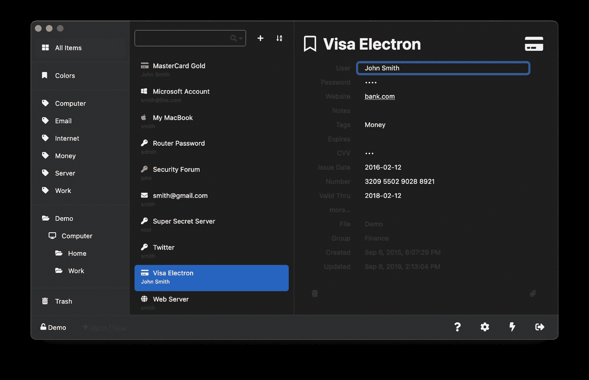

# Keeweb:与 KeePass 兼容的免费跨平台密码管理器

> 原文：<https://kalilinuxtutorials.com/keeweb/>

**Keeweb** webapp 是一款兼容 KeePass 数据库的浏览器和桌面密码管理器。它不需要任何服务器或额外资源。该应用程序可以在浏览器中运行，也可以作为桌面应用程序运行。

**快速链接**

应用:网络、桌面
时间轴:发布说明、一页待办事项
功能、常见问题
网站:keeweb.info
推特:kee_web
捐赠:OpenCollective、GitHub

**状态**

app 现在挺稳定的。基本的东西，以及更高级的操作，应该是相当可靠的。

**自主持**

在您的服务器上托管此应用程序所需的一切就是任何静态文件服务器。该应用程序是一个单一的 HTML 文件+一个服务工作者(可选；用于离线访问)。您可以从 gh-pages 分支下载最新的发行版文件。

如果您使用 Docker:

*   将您的 dh.pem、cert.pem、key.pem 放入/etc/nginx/external/
*   运行此脚本:

**docker run–name kee web-d-p 443:443-p 80:80-v＄EXT _ DIR:/etc/nginx/external/antelle/kee**web

**大楼**

克隆所有 KeeWeb 回购的最简单方法是:

**curl https://raw . githubusercontent . com/kee web/kee web/develop/dev-env . sh | bash—**

app 可以用 grunt: `**grunt**` (html 文件会在`**dist/**`里)。
桌面应用是用`**grunt desktop**`构建的。这需要一些魔法，目前只对 CI 有效，你可以在 GitHub 动作工作流程中找到更多细节。

要在不构建安装程序的情况下运行桌面(电子)应用程序，请使用`**grunt**`构建应用程序，并按以下方式启动:

**npm 运行开发
npm 运行电子**

对于调试版本:

*   运行`**npm run dev**`
*   打开`**http://localhost:8085**`

要构建桌面应用，使用这些目标，结果可以在`**tmp**`中找到:

**npm 运行开发桌面-macos
npm 运行开发桌面-windows
npm 运行开发桌面-linux**

[**Download**](https://github.com/keeweb/keeweb)