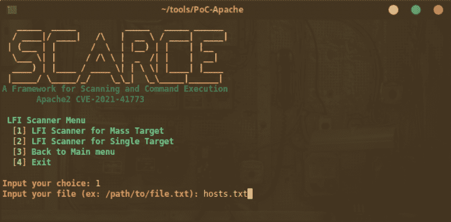
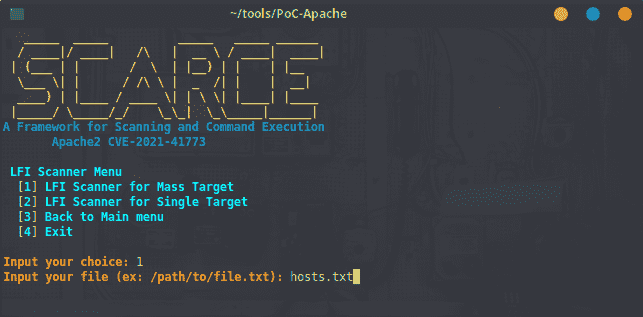

# 稀缺-Apache2:一个框架，用于针对公开存在 CVE-2021-41773 漏洞的网站进行漏洞搜索或测试

> 原文：<https://kalilinuxtutorials.com/scarce-apache2/>

**稀缺-Apache2** 工具可以扫描具有 CVE-2021-41773 漏洞的网站，这些漏洞会影响 Apache 2 web 服务器，稀缺也可以运行，以便在通过扫描方法找到的 web 服务器上执行远程命令注入(仅当在目标 web 服务器上启用了 **MOD_CGI** )。该工具使用文件列表中提供的单个目标或质量目标。此工具仅用于 **`Bug Hunting` / `Pentesting Purposes`** 。

**安装**

*   **git 克隆 https://github.com/HightechSec/scarce-apache2**
*   **cd 稀缺-apache2**
*   **bash 稀缺. sh**

或者你可以像这样在你的系统中安装

*   **git 克隆 https://github.com/HightechSec/scarce-apache2**
*   **cd 稀缺-apache2**
*   **sudo cp 稀缺. sh/usr/bin/稀缺&sudo chmod+x/usr/bin/稀缺**
*   **$稀缺**

**用途**

*   菜单的
    *   菜单`**1**`用于从提供的包含`**list of the target url**`或提供的 **`single target url`的文件中扫描 LFI 漏洞。**
    *   菜单`**2**`用于从提供的包含`**list of the target url**`或提供的 **`single target url`的文件中扫描 RCE 漏洞。**
    *   菜单`**3**`用于从提供的`**single target url**`执行 RCE。这对`**Maybe Vuln**`结果有效，有时对`**500** Error Response`也有效。
*   URL 格式
    *   使用`**http://**`如`**http://example.com**`或`**https://**`如`**https://example.com**`用于单一目标用途的 url 格式化
    *   对于从`**List**`、**提供的 URL 或 IP，不要使用**的 Url 格式，例如:
        *   https://target.com
        *   http://hackerone.com
        *   https://bugcrowd.com

**要求**

*   卷曲
*   尝试
*   饭桶

[**Download**](https://github.com/HightechSec/scarce-apache2)