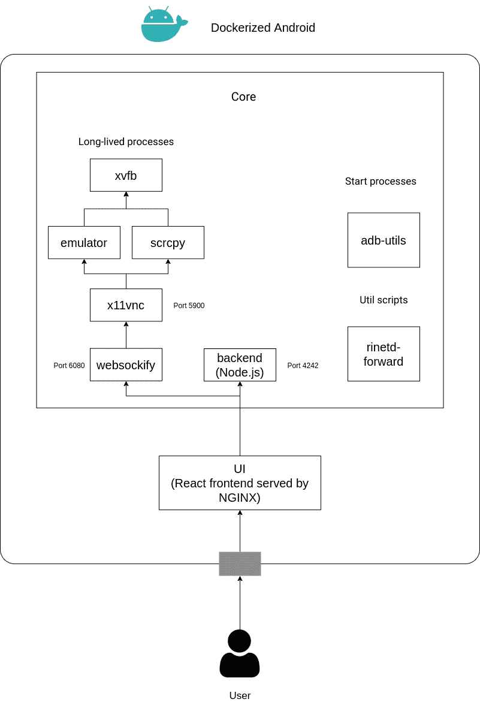

# Dockerized-Android:一个基于容器的框架，支持在安全培训平台中集成移动组件

> 原文：<https://kalilinuxtutorials.com/dockerized-android/>

Docker 化的 Android 是一个基于容器的框架，允许在 Docker 内部执行 Android 模拟器，并通过浏览器控制它。开发这个项目是为了提供一个将移动安全组件集成到网络范围的起点，但它可以用于任何目的。无论如何，为了开发和测试的目的，该项目建议是 docker-android。

**简介**

如上面简要描述中所述，创建该项目的目的是为将移动安全组件引入网络范围提供一个起点。因此，已经开发的功能和将要添加到功能中的功能将帮助用户更容易地设置真实的模拟(例如用于安全培训)。这篇自述文件很长，也许你只想跳到*“如何运行”*部分。

**特性**

以下功能目前可用:

*   在 Docker 中运行一个 Android 模拟器
*   通过网络浏览器控制设备
*   安装应用程序
*   启用端口转发
*   重启设备
*   模拟短信
*   从 web 浏览器使用终端
*   还连接一个物理设备
*   自定义启动行为(参见配置部分)
*   轻松管理多个实例

| 初始设置 | 实例管理器设置 | 手动设置 |
| --- | --- | --- |
| [初始设置](https://github.com/cybersecsi/dockerized-android/blob/main/docs/initial-setup.png) | [实例-管理器-设置](https://github.com/cybersecsi/dockerized-android/blob/main/docs/instance-manager-setup.png) | [手动设置](https://github.com/cybersecsi/dockerized-android/blob/main/docs/manual-setup.png) |

| 工具箱功能 | 实例开关 |
| --- | --- |
| [工具箱](https://github.com/cybersecsi/dockerized-android/blob/main/docs/toolbox.png) | [实例-开关](https://github.com/cybersecsi/dockerized-android/blob/main/docs/instance-switch.png) |

**建筑**

该项目由三个主要部分组成:

*   dockered Android**内核**
*   Dockerized Android **UI**
*   Dockerized Android **实例管理器**(可选)下图概述了这两个强制组件的实际架构

**核心组件**

核心组件是在 Docker 容器中执行运行 Android 组件(仿真的或真实的)所需的所有过程的组件，还向外部展示一些功能。毫无疑问，这是最复杂的部分，因为它必须管理不同的流程才能提供一系列功能。上图显示了长期流程、启动流程和 util 脚本之间的明显区别。此外，该图显示有 6 个长期流程，这是为了提供核心组件的概述而添加的一点不准确之处，实际上有两种不同类型的核心组件:

*   仿真器核心
*   真实设备核心主要的架构差异是关于长寿命进程的:模拟器核心运行长寿命**模拟器**进程，而真实设备核心运行长寿命 **scrcpy** 进程来显示和控制物理设备。其他部分非常相似，只是基于核心组件的类型遵循不同的行为逻辑。

**UI 组件**

UI 组件提供了一种简单的方式来使用后端公开的所有功能，还增加了显示和控制设备的能力。用户必须手动插入核心组件的地址和相应的端口(后端暴露的端口和 websockify 暴露的端口)；通过这种手动设置，可以更改默认端口(后端端口为 4242，websockify 端口为 6080)。

**实例管理器组件**

实例管理器组件的任务是通过一个 REST API 提供关于正在运行的内核的所有信息(即地址和端口)。这是通过编写一个简单的 JSON 配置文件来完成的，该文件包含所有关于出现在 *docker-compose* 中的内核的信息，以避免手动逐个添加的痛苦工作。JSON 配置文件的结构如下:

**{
" instances ":[
{
" name ":[标识设备的通用字符串]，
" Address ":[组件地址]，
" core _ Port ":[后端端口]，
" VNC _ Port ":[VNC 端口]
}
]
}**

**Docker 图像列表**

| 安卓版本 | 应用程序接口 | 图像 |
| --- | --- | --- |
| 5.0.1 | Twenty-one | secsi/dockerized-Android-core-emulator-5 . 0 . 1 |
| 5.1.1 | Twenty-two | secsi/dockerized-Android-core-emulator-5 . 1 . 1 |
| Six | Twenty-three | secsi/dockerized-Android-core-emulator-6.0 |
| Seven | Twenty-four | secsi/dockerized-Android-core-emulator-7.0 |
| 7.1.1 | Twenty-five | secsi/dockerized-Android-core-emulator-7 . 1 . 1 |
| Eight | Twenty-six | secsi/dockerized-Android-core-emulator-8.0 |
| Eight point one | Twenty-seven | secsi/dockerized-Android-core-emulator-8.1 |
| Nine | Twenty-eight | secsi/dockerized-Android-core-emulator-9.0 |
| Ten | Twenty-nine | secsi/dockerized-Android-core-emulator-10.0 |
| Eleven | Thirty | secsi/dockerized-Android-core-emulator-11.0 |
| – | – | secsi/dockerized-Android-core-bare |
| – | – | secsi/docker-Android-核心-真实设备 |

secsi/dockerized-Android-core-bare 不下载任何系统映像，您可以将该文件夹挂载到您的主机上，那里有所有的 SDK 文件夹

**怎么跑**

为了查看如何运行平台的完整示例，您可以查看根目录中的 *docker-compose* 。这个设置包含两个不同的内核和可选的**实例管理器组件。一旦你理解了它的工作原理，你就可以改变它来满足你的任何需求。**

**先决条件**

Docker 和 Docker Compose 必须安装在您的机器上。

**操作系统兼容性**

该平台根据主机操作系统以不同的方式运行，下表总结了当前的兼容性:

|  | Linux 操作系统 | Windows 操作系统 | OS X |
| --- | --- | --- | --- |
| 仿真器核心 | 全兼容性 | 不支持(尚不支持) | 不支持 |
| 真实设备的核心 | 全兼容性 | 全兼容性 | 工作区 |

对于 Windows 和 OS X，您必须使用带有嵌套虚拟化的 Linux 虚拟机。

要检查您的 Linux 机器是否支持嵌套虚拟化，您可以运行以下命令:

安装 cpu 检查器
kvm-ok

**真实设备的 OS X 工作区**

要在 OS X 上使用真实设备的核心，您可以:

*   使用主机的 adb
*   使用无线连接

对于无线连接，谷歌提供了一个简单的教程。要从容器内部连接到主机 adb，您必须手动进入容器内部并运行:

**adb -H 主机. docker .内部设备**

**运行一行命令**

开始使用带有两个内核和一个实例管理器的框架的命令很简单:

**坞站-合成**

**建造**

您也可以通过放置在 *utils* 文件夹中的脚本自己构建图像

**配置**

您可以通过 ENV 变量配置一些功能来定制设置，下表提供了所有这些功能的列表:

| 成分 | 环境名称 | 缺省值 | 描述 |
| --- | --- | --- | --- |
| 核心 | 目标港口 | Six thousand and eighty | Websockify 端口 |
| 核心 | 自定义应用默认端口 | Four thousand two hundred and forty-two | Node.js 后端端口 |
| 核心 | 设备信息 | 未设置，但表现得像真的一样 | 启用/禁用设备信息功能 |
| 核心 | 末端的 | 未设置，但表现得像真的一样 | 启用/禁用终端功能 |
| 核心 | APK | 未设置，但表现得像真的一样 | 启用/禁用安装 APK 功能 |
| 核心 | 向前 | 未设置，但表现得像真的一样 | 启用/禁用端口转发功能 |
| 核心 | 短信 | 未设置，但表现得像真的一样 | 启用/禁用 SMS 仿真功能 |
| 核心 | 重新启动 | 未设置，但表现得像真的一样 | 启用/禁用重新启动功能 |
| 核心 | 启动时安装 | 错误的 | 启用/禁用允许安装位于/root/dockerized-android/apk 文件夹中的所有 apk 的功能 |
| 核心 | 启用未知来源 | 错误的 | 允许从未知来源安装 |
| 核心 | 真实设备序列 | 复原 | 如果连接了多个物理设备，则该值必须设置为必须控制的设备的序列号，否则所有其他功能都将不起作用 |
| 实例管理器 | 默认 _ 端口 | Seven thousand three hundred and seventy-three | REST API 的端口 |

如果连接了一个以上的物理设备，则**真实设备序列**变量是**基本变量**,因为如果缺失，什么都不会起作用。最后是每个组件的公开端口列表:

| 成分 | 端口# | 描述 |
| --- | --- | --- |
| 核心 | Five thousand five hundred and fifty-five | 亚行港口 |
| 核心 | Four thousand two hundred and forty-two | Node.js 后端 |
| 核心 | Six thousand and eighty | Websockify(用于 noVNC) |
| 用户界面 | Eighty | 前端 |
| 实例管理器 | Seven thousand three hundred and seventy-three | REST API |

[**Download**](https://github.com/cybersecsi/dockerized-android)