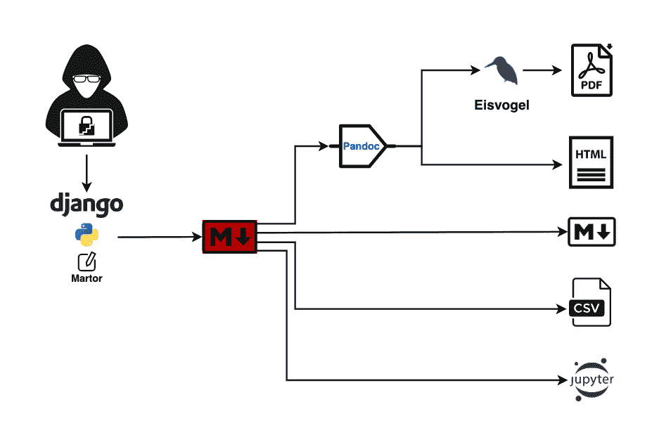
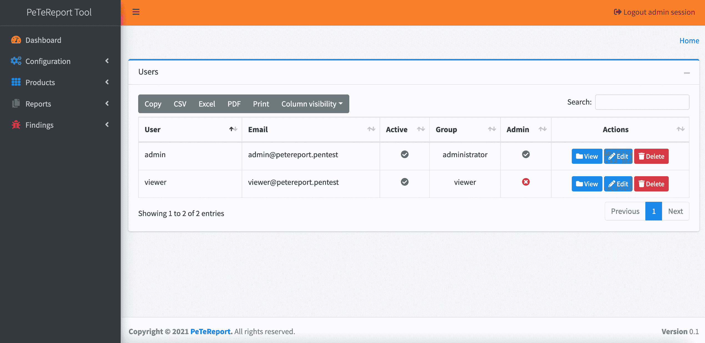
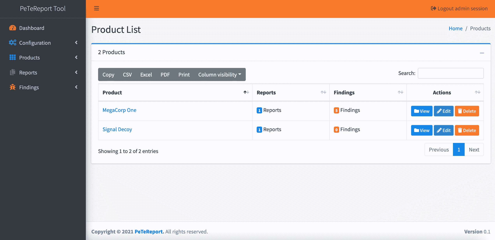
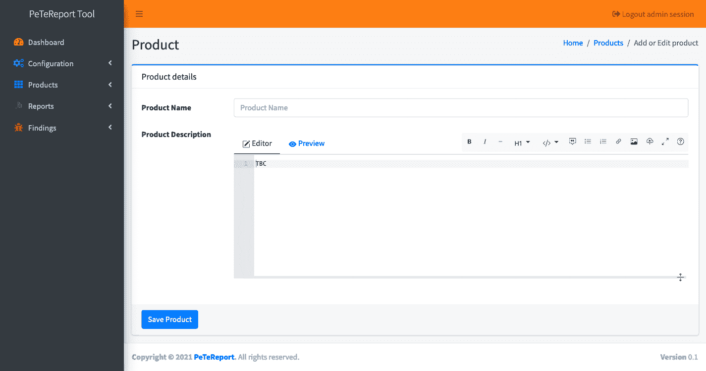
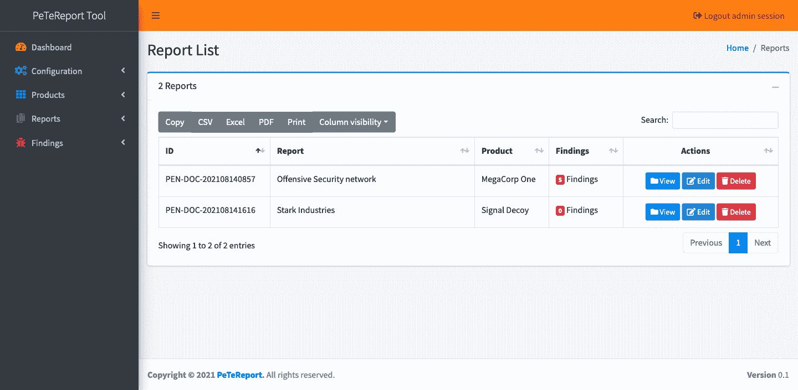
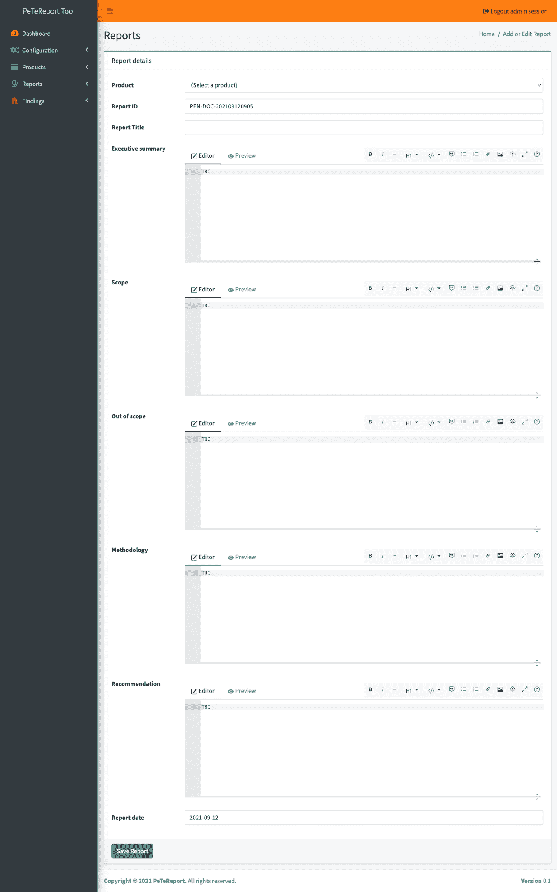
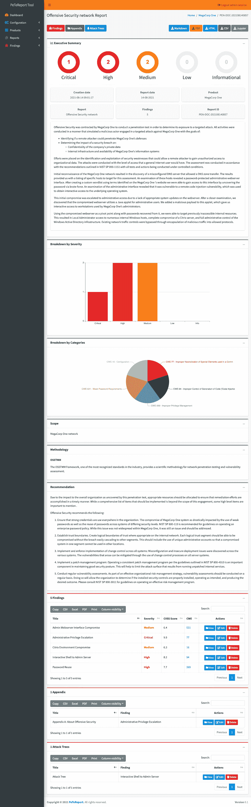
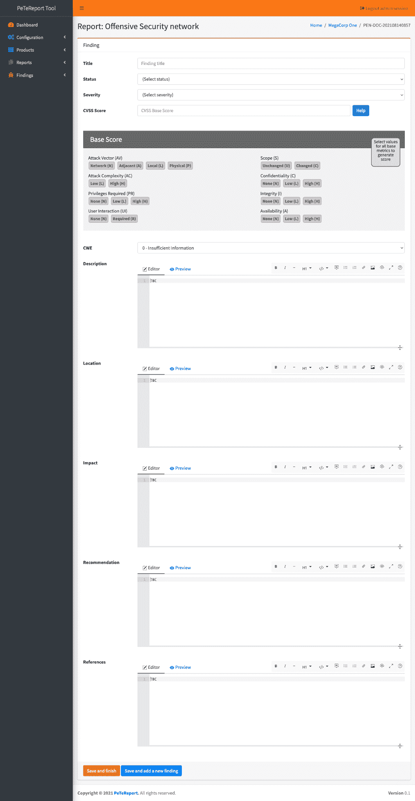
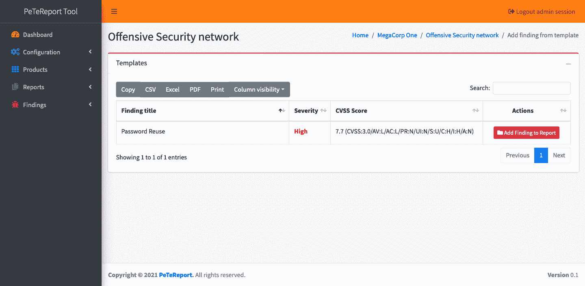
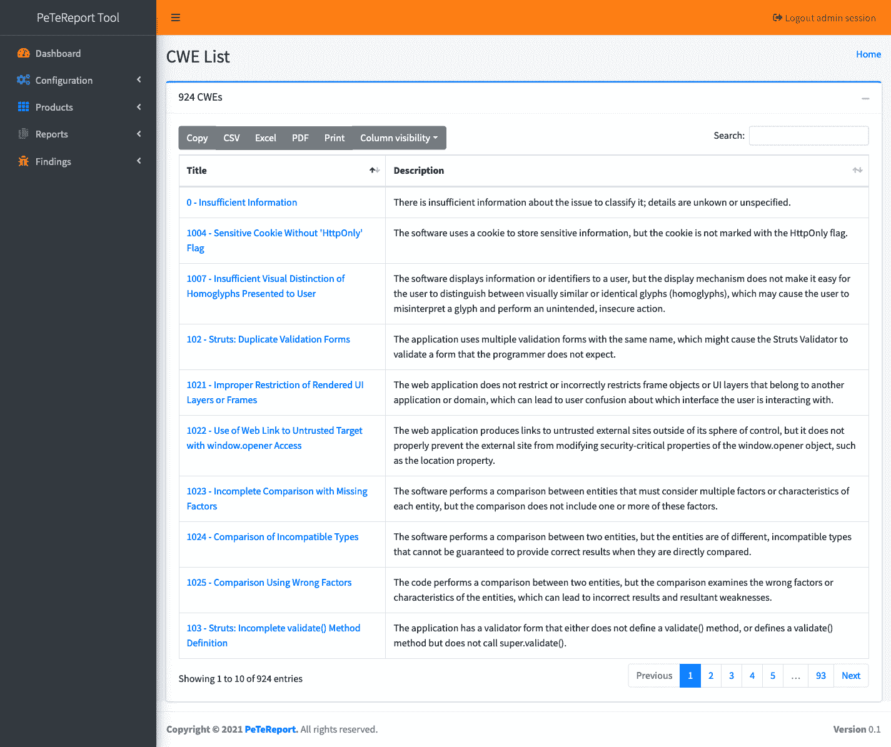

# PeTeReport:一个开源的应用程序漏洞报告工具

> 原文：<https://kalilinuxtutorials.com/petereport/>

**Pete Report**(**Pe**n**Te**ST**Report**)是一款开源的应用漏洞报告工具，旨在通过简化报告的编写和生成任务来帮助测试/重组工作。

该工具专注于产品安全，可帮助安全研究人员和测试人员提供详细的调查结果、附录、攻击路径，并管理调查结果模板数据库，以避免在报告阶段浪费时间。

Pete Report(**Pe**n**Te**ST**Report**)是用 Django 和 Python 3 编写的，目的是帮助 pentesters 管理一个发现知识库，编写报告(在 Markdown 中)并生成不同格式的报告(HTML、CSV、PDF、Jupyter 和 Markdown)。

**架构**

**特性**

*   可定制的报告输出
*   可定制的报告模板
*   调查结果模板数据库
*   在调查结果中增加附录的可能性
*   增加攻击落叶树木的可能性
*   HTML 输出格式
*   CSV 输出格式
*   PDF 输出格式
*   Jupyter 笔记本输出格式
*   降价输出格式
*   CVSS 3.1 分
*   码头设备
*   DefectDojo 集成
*   用户管理

**安装和部署**

**码头工人**

**环境**

**$ sudo apt install docker . io docker-合成**

**部署**

*   克隆存储库

**$ cd /opt $ git 克隆 https://github.com/1modm/petereport $ CD 彼得报告**

*   在`**app/config/petereport_config.py**`中自定义报告和配置
*   构建环境

**$ docker-合成 up–构建**

*   转到 https://127.0.0.1/
*   使用创建的任何用户 **admin/P3t3r3p0rt** (管理员)和 **viewer/v13w3r** (查看器)或配置文件中配置的用户凭证登录
*   更加努力
*   创建报告

Django 装置

**先决条件**

PeTeReport 要求 Python ≥ 3.8。推荐安装需要`**pip**`。作为基本要求，需要以下软件包:

*   Ubuntu/Debian: `**$ sudo apt-get install python3-pip python3-venv build-essential**`
*   OpenSuse: `**$ sudo zypper install python3-devel gcc**`
*   CentOS: `**$ sudo yum install python3-devel gcc**`

**环境**

强烈建议在虚拟环境(Pipenv)中设置安装:

**Pipenv**

*   **Linux:**
*   **皮普:** `**$ python3 -m pip install pipenv**`
*   **MAC:**

**依赖关系**

**Linux(Ubuntu)中最简单的方法:** `**$ sudo bash scripts/ubuntu_environment_install.sh**`

**乳胶**

**Linux:**

**$ sudo apt-get install tex live-full**

**Mac:**

**$ brew remove basictex $ brew 木桶安装 mactex**

**Pandoc**

**Linux:**

**$ sudo apt-get 安装 pandoc $ sudo apt-get 安装 python3-pypandoc**

**Mac:**

**$ brew 安装 pandoc $ brew 安装 pandoc-citeproc**

冰鸟

**$ python3 -m pip 安装 pandoc-latex-environment**

1.  从发布页面下载最新版本的 Eisvogel 模板。
2.  解压缩下载的 ZIP 存档并打开文件夹。
3.  将模板 eisvogel.tex 移动到您的 pandoc templates 文件夹，并将该文件重命名为 EIS Vogel . latex。templates 文件夹的位置取决于您的操作系统:`**/Users/$USER/.pandoc/templates/eisvogel.latex**`或`**/home/$USER/.pandoc/templates**`

**PeTeReport**

*   将项目和光盘克隆到 PeTeReport: `**cd petereport/**`
*   创建新的虚拟环境并安装依赖项:`**pipenv install**`
*   运行虚拟环境:`**pipenv shell**`
*   前往 Django PeTeReport 应用:`**cd app/**`
*   创建数据库:`**python manage.py migrate**`
*   进行最新的数据库更改:`**python manage.py makemigrations**`
*   将创建超级用户**admin/p 3 T3 r p0rt**，但是您可以创建新的超级用户:`**python manage.py createsuperuser**`
*   填充 CWE 数据`**python manage.py loaddata config/cwe-list.json**`

**启动服务器**

1.  运行虚拟环境:`**pipenv shell**`
2.  前往 Django PeTeReport 应用:`**cd app/**`
3.  启动 django 服务器:`**python manage.py runserver**`或`**python manage.py runserver 0.0.0.0:8000**`
4.  请访问 http://127.0.0.1:8000/
5.  使用创建的任何用户 **admin/P3t3r3p0rt** (管理员)和 **viewer/v13w3r** (查看器)或配置文件中配置的用户凭证登录
6.  更加努力
7.  创建报告
8.  关闭并停止服务器:`**Ctrl + C**`

**升级 PeTeReport**

1.  停止正在运行的服务器:`**Ctrl + C**`
2.  通过 git: `**git pull**`拉最新的代码库或者下载源码，替换文件。
3.  设置任何附加依赖项:`**pipenv install**`
4.  运行虚拟环境:`**pipenv shell**`
5.  进行最新的数据库更改:`**python manage.py makemigrations**`
6.  进行最新的数据库更改:`**python manage.py migrate**`
7.  启动服务器:`**python manage.py runserver**`
8.  再努力一次

**清洁斑点报告**

*   停止正在运行的服务器:`**Ctrl + C**`
*   运行虚拟环境:`**pipenv shell**`
*   前往 Django PeTeReport 应用:`**cd app/**`
*   运行清洗器:`**python clean.py**`
*   进行最新的数据库更改:`**python manage.py makemigrations**`
*   进行最新的数据库更改:`**python manage.py migrate**`
*   启动服务器:`**python manage.py runserver**`
*   再努力一次

**配置**

1.  停止正在运行的服务器:`**Ctrl + C**`
2.  在`**app/config/petereport_config.py**`中自定义报告和配置
3.  启动 django 服务器:`**python manage.py runserver**`或`**python manage.py runserver 0.0.0.0:8000**`

**默认凭证**

*   管理员:admin/P3t3r3p0rt
*   查看器:查看器/v13w3r

**用户管理**

用户模块便于管理应用程序中的用户和角色。有两个内置角色:管理员和查看者。

*   管理员角色具有完全权限访问
*   查看者角色
    *   项目:视图
    *   报告:查看，生成输出
    *   调查结果:查看
    *   查找模板:查看

**用户和角色列表**

**创建新用户**

**产品**

产品模块方便了产品的管理。产品的定义是:

*   产品名称
*   产品说明

**产品清单**

**创造新产品**

**报告**

报表模块方便了产品的管理。报告的定义如下:

*   产品
*   报告 ID
*   报告标题
*   行动纲要
*   范围
*   超出范围
*   方法学
*   建议
*   报告日期

**报告列表**

**创建新报告**

**报告详情**

**调查结果**

调查结果模块有助于管理报告中的调查结果。调查结果的定义如下:

*   标题
*   状态
*   严重
*   CVSS 分数
*   CWE
*   描述
*   位置
*   影响
*   建议
*   参考
*   附录
*   攻击路径

**调查结果列表**

**创造新的发现**

**添加来自模板的发现**

可以将先前创建的模板列表中的调查结果添加到报告中。

**从 DefectDojo 导入结果**

我们可以从 DefectDojo 导入结果，首先我们需要编辑配置文件，以便添加 DefectDojo 部署的 API 端点和 API 键。

在`**app/config/petereport_config.py**`中编辑配置

**defect Dojo _ CONFIG = { ' defect dojourl ':' https:*//demo . defect Dojo . org '，*' API Key ':' Token Key ' # Format Tok**en Key }

**从 CSV 导入结果**

可以按照以下格式从 CSV 调查结果中导入:

**//逗号分隔值(CSV)文件格式
"ID "、"状态"、"标题"、"严重性"、" CVSS 基本分数"、" CVSS 分数"、" CWE "、"描述"、"位置"、"影响"、"建议"、"参考资料"、"附录"、"附录描述"
" 2834 Q345-b24e-4g HF-r86d-ftue 38 af 5480 "、"打开"、"发现 1 "、"低"、" 3.7(CVSS:3.0/AV:N/AC:H/PR:N/UI:N/S:U/C:L**

**CWE 清单**

创建调查结果时，必须选择一个 CWE，以便创建调查结果类别，因为已从 Mitre 的下一个 CWE 列表中填充了参考:

*   软件开发
*   硬件设计
*   研究概念

[**Download**](https://github.com/1modm/petereport)