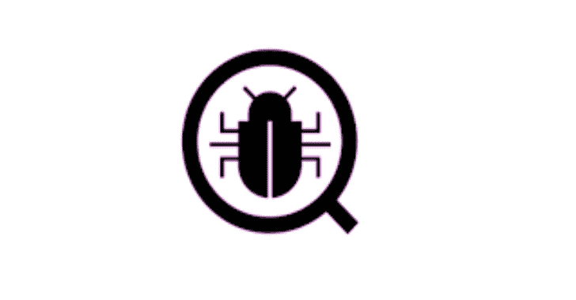

# TIWAP:完全不安全的 Web 应用项目

> 原文：<https://kalilinuxtutorials.com/tiwap/>

TIWAP 是一个使用 Flask 开发的网络安全测试实验室，供初露头角的安全爱好者学习各种网络漏洞。受 DVWA 的启发，贡献者们竭尽全力再生各种网络漏洞

该应用程序仅用于教育目的，并在法律环境中学习网络黑客。

**设置和安装**

为了便于安装和设置，我们已经为您配置好了一切。你所需要的只是你系统上的 Docker。

完成 docker 安装后，运行以下命令。

git 克隆 https://github . com/tomstonghost/tiwap
CD tiwap
坞站-合成 up

**注意:目前它只能在 Linux 上运行，windows 兼容性正在开发中**

实验开始后，您可以使用默认凭据登录。
用户名:`**admin**`
密码:`**admin**`

**科技栈**

前端:HTML、CSS 和 JavaScript
后端:Python–Flask
数据库:SQLite3 和 MongoDB

**漏洞**

目前，我们实验室有 20 个漏洞。所有列表如下:

*   SQL 注入
*   盲目 SQL 注入
*   NoSQL 注射液
*   命令注入
*   业务逻辑缺陷
*   敏感数据暴露
*   XML 外部实体
*   安全错误配置
*   反映了 XSS
*   存储的 XSS
*   基于 DOM 的 XSS
*   HTML 注入
*   证书验证不正确
*   铁杆凭证
*   不安全的文件上传
*   蛮力
*   目录遍历
*   跨站点请求伪造(CSRF)
*   服务器端请求伪造(SSRF)
*   服务器端模板注入(SSTI)

每个漏洞有 3 个难度级别，即低、中、难。这些级别可以从设置页面进行设置。

[**Download**](https://github.com/tombstoneghost/TIWAP)