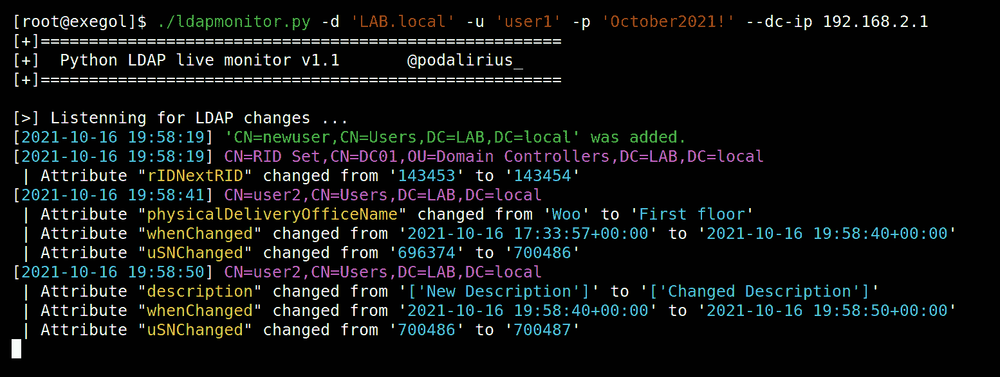
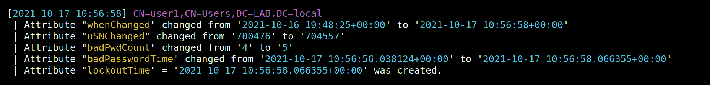
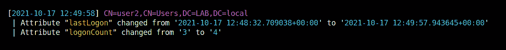
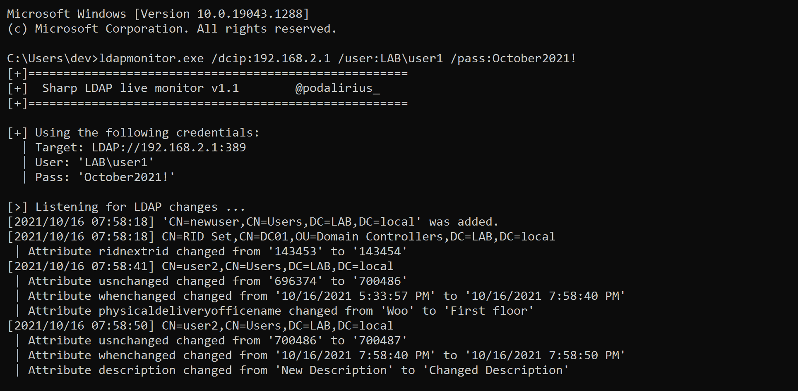
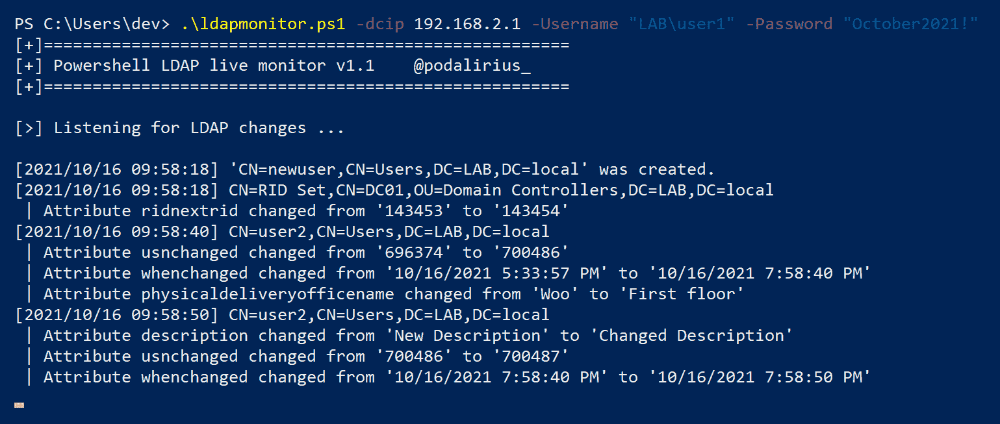

# LDAPmonitor:在您的 Pentest 或系统管理期间实时监控 LDAP 对象的创建、删除和更改！

> 原文：<https://kalilinuxtutorials.com/ldapmonitor/>

LDAPmonitor 是一个在您的 pentest 或系统管理期间对 LDAP 对象进行实时创建、删除和更改的监视器！

使用这个工具，您可以快速查看您的攻击是否有效，以及它是否改变了目标对象的 LDAP 属性。

**特性**

| 特征 | [Python(。py)](https://github.com/p0dalirius/LDAPmonitor/blob/master/python) | CSharp(。exe) | [Powershell (.ps1)](https://github.com/p0dalirius/LDAPmonitor/blob/master/powershell) |
| --- | --- | --- | --- |
| LDAPS 支持 | ✔️ | ✔️ | ✔️ |
| 查询之间的随机延迟(秒) | ✔️ | ✔️ | ✔️ |
| 查询之间的自定义延迟(秒) | ✔️ | ✔️ | ✔️ |
| 将输出保存到日志文件 | ✔️ | ✔️ | ✔️ |
| 使用`**--no-colors**`的有色或无色输出 | ✔️ | -好的 | -好的 |
| 分页查询的自定义页面大小 | ✔️ | ✔️ | ✔️ |
| 使用用户和密码进行验证 | ✔️ | ✔️ | ✔️ |
| 作为当前 shell 用户进行身份验证 | -好的 | ✔️ | ✔️ |
| 使用 LM:NT 哈希进行身份验证 | ✔️ | -好的 | -好的 |
| 使用 kerberos 票证进行身份验证 | ✔️ | -好的 | -好的 |
| 忽略用户登录事件的选项 | ✔️ | ✔️ | ✔️ |

**典型用例**

以下是该工具有用的一些使用案例:

*   实时检测帐户锁定

*   检查您的权限提升是否有效(使用 ntlmrelay 的`--escalate-user`选项)
*   检测用户何时登录，以了解何时开始网络中毒。

**跨平台**

**在 Python(。py)**

**在 CSharp(。exe)**

**在 Powershell 中(. ps1)**

[**Download**](https://github.com/p0dalirius/LDAPmonitor)