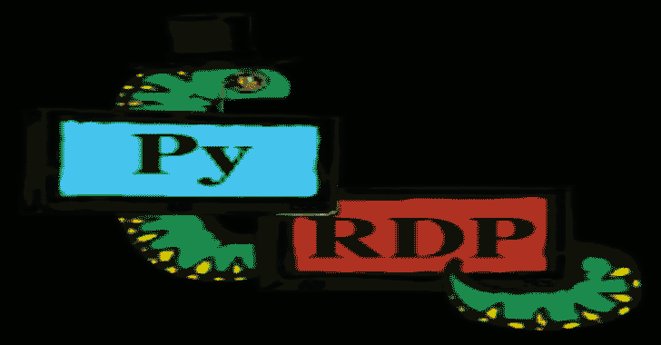
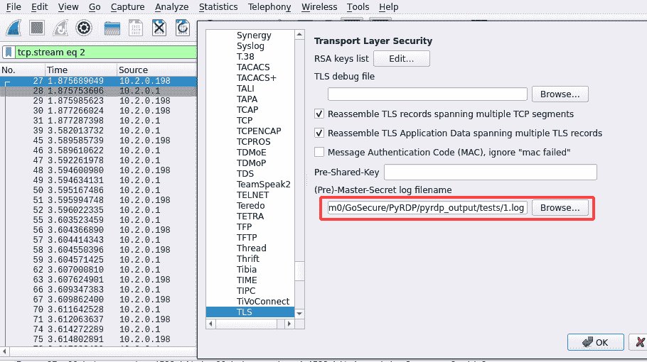
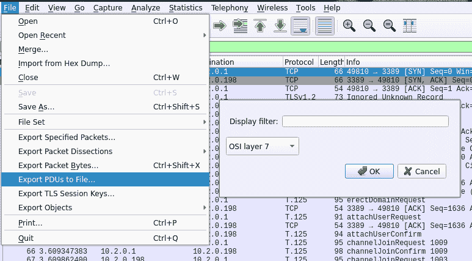
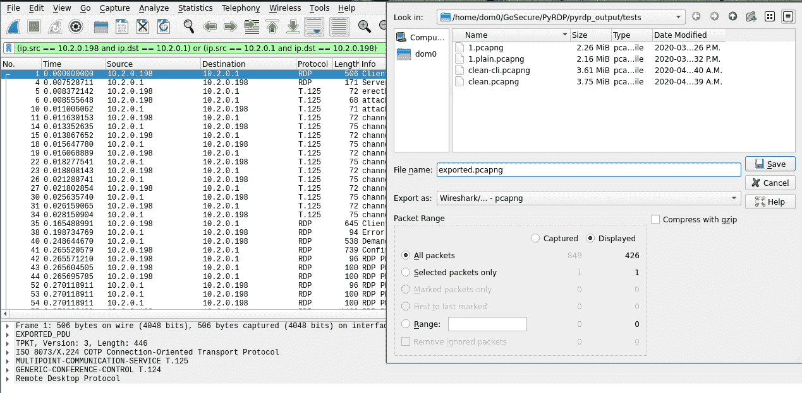

# PyRDP : RDP 中间件(Mitm)和 Python 库，能够实时或事后观察连接

> 原文：<https://kalilinuxtutorials.com/pyrdp/>

PyRDP 是一个 Python 远程桌面协议(RDP)中间怪物(MITM)工具和库。

它有几个工具:

*   RDP 中间的怪物
    *   记录连接时使用的凭据
    *   窃取复制到剪贴板的数据
    *   保存通过网络传输的文件的副本
    *   在后台对共享驱动器进行爬网并将其保存在本地
    *   保存连接的重播，以便以后查看
    *   在新连接上自动运行控制台命令或 PowerShell 有效负载
*   RDP 玩家:
    *   观看来自 MITM 的现场 RDP 连线
    *   查看 RDP 连接的重播
    *   控制活跃的 RDP 会议，同时隐藏您的行动
    *   列出客户端映射的驱动器，并在活动会话期间从这些驱动器下载文件
*   RDP 证书克隆者:
    *   使用与 RDP 服务器证书相同的字段创建自签名 X509 证书

PyRDP 于 2018 年推出，我们在其中展示了我们可以在行动中抓住真正的威胁行为者。该工具的开发考虑到了 pentest 和恶意软件研究用例。

**支持的系统**

PyRDP 应该可以在 Python 3.6 以及 x86-64、ARM 和 ARM64 平台上运行。

该工具已经过测试，可以在 Linux (Ubuntu 18.04)、Raspberry Pi 和 Windows 上运行 Python 3.6(参见在  Windows 上安装一节)。它还没有在 macOS 上测试过。

**安装**

**使用 Docker 图像**

如果你已经安装了 docker，这是最简单的安装方法。

**docker pull gosecure/pyrdp:最新**

作为替代方案，我们有一个没有 GUI 和 ffmpeg 依赖的更小的图像。这是 ARM 平台上唯一提供的图像。

**docker pull gosecure/pyrdp:latest-slim**

您可以在 gosecure/pyrdp DockerHub 页面上找到我们所有 Docker 图片的列表。

**来自 Git 来源**

我们建议在虚拟环境中安装 PyRDP，以避免依赖性问题。

首先，确保安装必备包(在 Ubuntu 上)。我们提供两种类型的安装:完整安装和精简安装。根据您的使用情况安装依赖项。

# **完全安装(GUI，转码为 MP4)
sudo apt 安装 python 3 python 3-pip python 3-dev python 3-setup tools python 3-venv \
build-essential python 3-dev git OpenSSL \
libdbus-1-dev libdbus-gli b-1-dev libgl 1-mesa-glx \
notify-OSD dbus-X11 libxkbcommon-X11-0 libxcb-xinerama 0 \** 

获取 PyRDP 的源代码:

**git 克隆 https://github.com/gosecure/pyrdp.git**

然后，在 PyRDP 目录下的`**venv**`目录中创建您的虚拟环境:

**cd 吡 dp
python3 -m venv venv**

*不要*使用虚拟环境文件夹 **( `python3 -m venv .`** )的根 PyRDP 目录。你会搞得一塌糊涂，反正用`**venv**`这样的目录名更规范。

在安装依赖项之前，您需要激活虚拟环境:

**源 venv/bin/activate**

最后，您可以使用 Pip 安装项目:

**pip 3 install-U pip setup tools wheel
不带 GUI 和 ffmpeg 依赖关系
pip3 install -U -e .
带 GUI 和 ffmpeg 依赖关系
pip 3 install-U-e’。【满】'**

这将安装运行 PyRDP 所需的依赖项。如果您选择在没有 GUI 或 ffmpeg 依赖项的情况下安装，将无法使用没有无头模式(`**--headless**`)或`**pyrdp-convert**`的`**pyrdp-player**`。

如果您想离开您的虚拟环境，只需将其停用即可:

**停用**

请注意，每当您希望 PyRDP 脚本作为 shell 命令可用时，您都必须激活您的环境。

**在 Windows 上安装**

步骤都差不多。还有两个额外的先决条件。

*   任何 C 编译器
*   OpenSSL。确保从您的`**$PATH**`可以到达。

然后，在 PyRDP 的目录中创建您的虚拟环境:

**cd 吡 dp
python3 -m venv venv**

*不要*使用虚拟环境文件夹 **( `python3 -m venv .`** )的根 PyRDP 目录。你会搞得一塌糊涂，反正用`**venv**`这样的目录名更规范。

在安装依赖项之前，您需要激活虚拟环境:

**venv\Scripts\activate**

最后，您可以使用 Pip 安装项目:

**pip3 安装-U pip 安装工具轮
pip3 安装-U -e "。【全文】**

这应该会安装运行 PyRDP 所需的所有依赖项。

如果您想离开您的虚拟环境，只需将其停用即可:

**停用**

请注意，每当您希望 PyRDP 脚本作为 shell 命令可用时，您都必须激活您的环境。

**打造码头工人形象**

首先，通过在 PyRDP 的根目录(Dockerfile 所在的位置)执行这个命令来构建映像:

docker build -t pyrdp

作为替代，我们有一个不依赖 GUI 和 ffmpeg 的更小的图像:

**码头工建置-f 码头工。超薄-t 金字塔。**

之后，您可以通过调用`**pyrdp**` docker 容器来执行 PyRDP。详见使用说明书和 Docker 特有的  说明书。

使用`**buildx**`可以实现跨平台构建:

**docker buildx build–平台 linux/arm，Linux/amd64-t pyrdp-f docker file . slim**

**从 pycrypto 迁移出去**

由于不再维护 pycrypto，我们选择迁移到 pycryptodome。如果出现此错误，这意味着您使用的是 pycrypto 模块，而不是 pycryptodome 模块。

来自加密的
中的 **[…]
文件“[…]/pyrdp/pyrdp/PDU/RDP/connection . py”，第 10 行。public key . RSA import RSA key
import error:无法导入名称‘RSA key’**

您需要删除模块 pycrypto 并重新安装 PyRDP。

**pip3 卸载 py crypto
pip 3 install-U-e .**

**使用 PyRDP**

**使用 PyRDP 中间怪物**

使用`**pyrdp-mitm.py <ServerIP>**`或`**pyrdp-mitm.py <ServerIP>:<ServerPort>**`运行 MITM。

假设您有一个运行在`**192.168.1.10**`上并监听端口 3389 的 RDP 服务器，您将运行:

**pyrdp-mitm . py 192 . 168 . 1 . 10**

当第一次在 Linux 上运行 MITM 时，应该在`~/.config/pyrdp`中为您生成一个私钥和证书。当在连接上使用 TLS 安全时，会用到这些。例如，您可以使用它们来解密 Wireshark 中的 PyRDP 流量。

**指定私钥和证书**

如果密钥生成不起作用或者您想要使用自定义密钥和证书，您可以使用`**-c**`和`**-k**`参数来指定它们:

**pyrdp-mitm . py 192 . 168 . 1 . 10-k private _ key . PEM-c certificate . PEM**

**连接到 PyRDP 播放器**

如果您想通过 PyRDP 播放器查看实时 RDP 连接，您需要使用`**-i**`和`**-d**`参数指定播放器正在监听的 ip 和端口。注意:port 参数是可选的，默认端口是 3000。

**pydp-mitm . py 192 . 168 . 1 . 10-I 127 . 0 . 0 . 1-d 3000**

**当 MITM 在服务器上运行时连接到 PyRDP 播放器**

如果您在服务器上运行 MITM，并且仍然希望看到实时的 RDP 连接，您应该使用 SSH 远程端口  转发将您服务器上的端口转发到您机器上的播放器端口。一旦完成，就将`127.0.0.1`和转发的端口作为参数传递给 MITM。例如，如果服务器上的端口 4000 被转发到您机器上的播放器端口，则可以使用以下命令:

**pydp-mitm . py 192 . 168 . 1 . 10-I 127 . 0 . 0 . 1-d 4000**

*   **在新连接上运行有效负载**

PyRDP 支持在建立新连接时自动运行控制台命令或 PowerShell 有效负载。由于 RDP 的性质，这个过程有点粗糙，并不总是 100%可靠。它是这样工作的:

*   等待用户通过身份验证。
*   阻止客户端的输入/输出，以隐藏有效负载并防止干扰。
*   发送一个假的 Windows+R 序列，运行`**cmd.exe**`。
*   将有效负载作为控制台命令运行，并退出控制台。如果配置了 PowerShell 有效负载，它将使用`**powershell -enc** **<PAYLOAD>**`运行。
*   稍等片刻，让有效负载完成。
*   恢复客户端的输入/输出。

为此，您需要设置 3 个参数:

*   有效载荷
*   有效负载开始前的延迟
*   有效负载的持续时间

**设定有效载荷**

您可以使用下列参数之一来设置要运行的有效负载:

*   `**--payload**`，包含控制台命令的字符串
*   `**--payload-powershell**`，包含 PowerShell 命令的字符串
*   `**--payload-powershell-file**`，PowerShell 脚本的路径

**选择何时启动有效载荷**

目前，PyRDP 不检测用户何时登录。在运行有效负载之前，您必须给它一段等待时间。经过这段时间后，它将发送假的密钥序列，并期望有效载荷正常运行。为此，您可以使用`**--payload-delay**`参数。延迟以毫秒为单位。例如，如果您希望用户在前 5 秒内登录，您可以使用以下参数:

**–有效负载延迟 5000**

通过利用 RDPDR 初始化期间交换的一些消息，这可以变得更加准确。如果你有兴趣让这项工作做得更好，请看这一期。

**选择何时恢复正常活动**

因为没有直接的方法知道控制台何时停止运行，所以您必须告诉 PyRDP 您希望客户端的输入/输出被阻塞多长时间。我们建议您将此设置为运行有效负载的控制台可见的最长时间。换句话说，你期望你的有效载荷完成的时间。要设置有效负载持续时间，您可以使用带有以毫秒为单位的时间量的`**--payload-duration**`参数。例如，如果您预计您的有效负载最多需要 5 秒钟才能完成，您可以使用以下参数:

**–有效载荷持续时间 5000**

这将阻止客户端的输入/输出 5 秒钟，以隐藏控制台并防止干扰。5 秒钟后，输入/输出恢复正常。

**其他 MITM 论点**

运行`**pyrdp-mitm.py --help**`获得参数的完整列表。

##### `**--no-downgrade**`

当在蜜罐场景中运行 PyRDP 以避免扫描指纹时，这个参数很有用。启用交换机时，PyRDP 不会降级不支持的扩展，而是让流量透明地通过。播放器可能无法成功重播视频流量，但仍可访问以下受支持的频道:

*   击键记录
*   鼠标位置更新
*   剪贴板访问(被动)
*   驱动访问(被动)

该功能仍在开发中，为了建立连接，目前不可避免地会有一些降级。以下各项目前不受此开关影响，仍将被禁用:

*   FIPS 加密
*   非 TLS 加密协议
*   ClientInfo 压缩
*   虚拟通道压缩

**注意**:如果能够最终重放整个会话很重要，一个好的解决方案是使用 Wireshark 记录原始 RDP 流量，并保持 TLS 主秘密。每当 PyRDP 添加对附加扩展的支持时，就有可能从原始网络捕获中提取有效的 RDP 重放文件。

##### `--transparent`

告诉 PyRDP 尝试欺骗客户端的源 IP 地址，以便服务器看到真实的 IP 地址，而不是 MITM 地址。此选项仅在某些情况下有用，在这些情况下，MITM 在物理上是客户端和服务器之间的网关，可以看到所有流量。具体例子可以在这里找到[。](https://github.com/GoSecure/pyrdp/blob/master/docs/transparent-proxy.md)

**注意**:这需要 root 权限，仅适用于 Linux，并且需要手动防火墙配置以确保流量被正确路由。

##### `--no-gdi`:禁用图形加速流水线

PyRDP 将视频降级到它支持的最新图形管道。此开关明确告知 MITM 不要使用图形设备接口加速扩展来传输视频流。这种模式的优点是显著降低了高分辨率连接所需的带宽。

请注意，一些 GDI 绘图顺序目前还没有实现，因为它们似乎没有被使用。如果您有一个包含任何不受支持或未经测试的订单的重放，请不要犹豫，与项目维护人员分享它，以便可以根据需要添加支持。(确保跟踪不包含敏感信息)

**使用 PyRDP 播放器**

使用`**pyrdp-player.py**`运行播放器。

**播放回放文件**

您可以使用菜单打开一个新的重放文件:文件>打开。

您也可以在启动播放器时打开重播文件:

**pyrdp-player.py …**

**监听实时连接**

播放器总是监听实时连接。默认情况下，监听端口为 3000，但可以更改:

**pyrdp-player.py -p**

**改变监听地址**

默认情况下，播放机只侦听来自本地计算机的连接。我们不建议向其他机器开放播放器。如果你还想改变监听地址，可以用`-b`来做:

**pyrdp-player.py -b**

**其他玩家争论**

运行`pyrdp-player.py --help`获得参数的完整列表。

**使用 PyRDP 证书克隆程序**

PyRDP 证书克隆程序使用现有 RDP 服务器证书的值创建一个全新的 X509 证书。它连接到 RDP 服务器，下载其证书，生成新的私钥，并使用新的私钥替换公钥和证书签名。这可以在 pentest 中使用，例如，如果你试图欺骗一个合法用户通过你的 MITM。使用看起来像合法证书的证书可以提高成功率。

**克隆证书**

您可以使用`**pyrdp-clonecert.py**`克隆证书:

**pyrdp-clone cert . py 192 . 168 . 1 . 10 cert . PEM-o key . PEM**

`**-o**`参数定义用于生成的私钥的路径名。

**使用自定义私钥**

如果您想使用自己的私钥，而不是生成新的私钥:

**pyrdp-clone cert . py 192 . 168 . 1 . 10 cert . PEM-I input _ key . PEM**

**其他克隆者论据**

运行`**pyrdp-clonecert.py --help**`获得参数的完整列表。

**使用 PyRDP 转换**

`**pyrdp-convert**`是一个助手脚本，执行几个有用的转换。该脚本最有可能处理 PyRDP 捕获的流量，因为不支持可能在非拦截连接中使用的 RDP 协议功能。

支持以下转换:

*   网络捕获(PCAP)到 PyRDP 重播文件
*   网络捕获到 MP4 视频文件
*   重放文件到 MP4 视频文件

该脚本支持加密(TLS)网络捕获(通过提供`**--secrets ssl.log**`)和解密 PDU 导出。

**警告**:时间戳为纳秒的 pcapng 和 pcap 与`**pyrdp-convert**`不兼容，会创建无法回放或导出到 MP4 的重放文件。这是因为时间戳格式不兼容。

**将会话到来客户端 10.2.0.198 导出到. pyrdp 文件。
pyrdp-convert . py–src 10 . 2 . 0 . 198–secrets SSL . log-o path/to/output capture . pcap
或作为 MP4 视频**
**pyrdp-convert . py–src 10 . 2 . 0 . 198–secrets SSL . log-o path/to/output-f MP4 capture . pcap
列出网络跟踪中的会话，以及可解密的会话。
pyrdp-convert . py–list capture . pcap**

注意 MP4 转换需要 libavcodec 和 ffmpeg，所以这在 Windows 上可能需要额外的步骤。

通过选择`**File > Export PDUs**`和`O**SI Layer 7**`，可以从 Wireshark 导出手动解密的网络跟踪。使用此方法时，还建议过滤导出的流，使其仅包含必须转换的 RDP 会话的 TCP 流。

首先，确保您将 wireshark 配置为加载 TLS 机密:

接下来，导出 OSI 第 7 层 PDU:

And lastly, filter down the trace to contain only the conversation of interest (Optional but recommended) by applying a display filter and clicking `File > Export Specified Packets...`

现在这个痕迹可以直接用在`pyrdp-convert`里了。

**配置 PyRDP**

大多数 PyRDP 配置是通过命令行开关完成的，但是也可以使用配置文件进行某些设置，例如日志配置。

PyRDP 使用的默认配置文件位于 [mitm.default.ini](https://github.com/GoSecure/pyrdp/blob/master/pyrdp/mitm/mitm.default.ini) 和 player.default.ini 中。这两个文件都有完整的文档，可以作为进一步配置的基础。

将来，我们计划通过这些配置文件来支持 PyRDP 配置的其他方面。

**使用 PyRDP 作为库**

如果您有兴趣尝试 RDP 并制作自己的工具，请到我们的文档部分获取更多信息。

**使用 PyRDP 配合 twistd**

PyRDP MITM 组件也被实现为一个 twistd 插件。这使您能够在调试模式下运行它，并允许您在向 twistd 进程发送一个`**SIGUSR2**`时获得一个交互式调试 repl (pdb)。

**twi STD–调试 pyrdp -t**

然后得到回复:

**killall -SIGUSR2 twistd**

**在 Docker 中使用 PyRDP 和 twistd**

在带有我们的`**docker-compose.yml**`的目录中，您可以运行如下内容:

**docker-compose run-p 3389:3389 pyrdp twistd–debug pyrdp–target 192 . 168 . 1 . 10:3389**

这将分配一个 TTY，你将可以访问`**Pdb**`的 REPL。尝试将`**--debug**`添加到`**docker-compose.yml**`命令将会失败，因为没有分配 TTY。

**使用 PyRDP 和 Bettercap**

我们开发了我们自己的 Bettercap 模块，`**rdp.proxy**`，在给定的局域网上，在所有 RDP 连接中间制造怪物。查看此文档以了解更多信息。

**Docker 具体用法** **说明**

由于 docker 限制了与主机系统(文件系统和网络)的交互，因此 PyRDP docker 映像必须根据您的用例使用一些参数来运行。本节记录了这些参数。

我们引用公开提供的 docker 映像，但是如果您构建了自己的映像，请用您本地构建的映像的名称替换`**gosecure/pyrdp**`。

**映射监听端口**

在大多数中间怪物的情况下，您需要将主机的一个端口映射到 docker 映像中。这是通过将 **`--publish` ( `-p`** )参数应用到 **`docker run`来实现的。**

例如，要侦听所有接口上的 3389 (RDP 的默认端口)，请使用:

**docker run-p 3389:3389 gosecure/pyrdp pyrdp-mitm . py 192 . 168 . 1 . 10**

**日志和工件存储**

永久存储 PyRDP 输出(日志、文件等)。)，将 **`--volume` ( `-`** `v`)选项添加到前面的命令中。在本例中，我们将相对于当前目录的文件存储在`**pyrdp_outp**ut`中:

d **奥克 run-v $ PWD/pyrdp _ output:/home/pyrdp/pyrdp _ output-p 3389:3389 go secure/pyrdp pyrdp-mitm . py 192 . 168 . 1 . 10 奥克 run-v $ PWD/pyrdp _ output:/home/pyrdp/pyrdp _ output-p 3389:3389 go secure/pyrdp pyrdp-mitm . py 192.161**

确保您的目标目录由 UID 为 1000 的用户拥有，否则您将得到权限被拒绝的错误。如果您是系统中唯一的非 root 用户，通常您的用户将被分配 UID 1000。

**记录主机 IP 地址**

如果您希望 PyRDP 在其日志中记录主机 IP 地址，您可以在使用`**docker run**`时设置`**HOST_IP**`环境变量:

**docker run-p 3389:3389-e HOST _ IP = 192 . 168 . 1 . 9 gosecure/pyrdp pyrdp-mitm . py 192 . 168 . 1 . 10**

**使用 Docker 中的 GUI 播放器**

使用播放器需要将环境变量`**DISPLAY**`从主机导出到 docker。这将播放器的 GUI 重定向到主机屏幕。还需要暴露主机的网络，防止 Qt 使用 MIT-SHM X11 共享内存扩展。为此，在运行命令中添加`**-e**`和`**--net**`选项

**docker run-e DISPLAY = $ DISPLAY-e QT _ X11 _ NO _ MITSHM = 1–net = host go secure/pyrdp pyrdp-player . pyand:**

请记住，将主机的网络暴露给 docker 会损害容器和主机之间的隔离。如果您计划使用播放器，使用 SSH 连接的 X11 转发将是一种更安全的方式。

[Download](https://github.com/GoSecure/pyrdp#supported-systems)