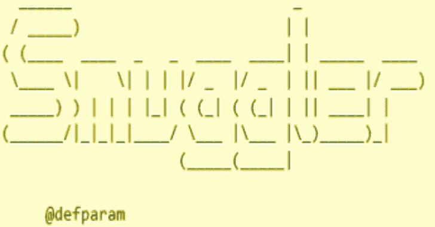

# Smuggler:一个 HTTP 请求走私/ Desync 测试工具

> 原文：<https://kalilinuxtutorials.com/smuggler/>

**smugger**是一个用 Python 3 编写的 HTTP 请求走私/ Desync 测试工具

**安装**

*   git 克隆 https://github.com/defparam/smuggler.git
*   cd 走私者
*   python3 走私者. py -h

**例句用法**

单一主机:

**python 3 smugger . py-u**

主机列表:

**cat list _ of _ hosts . txt | python 3 smugger . py**

**选项**

**用法:smuggler . py[-h][-u URL][-v VHOST][-x][-m METHOD][-l LOG][-q]
[-t time out][–no-color][-c config file]
可选参数:
-h，–帮助显示此帮助消息并退出
-u URL，–URL URL 带有端点的目标 URL
-v VHOST，–vhost VHOST
指定一个虚拟主机
-x，–Exit _ 提前退出扫描 on –LOG LOG 指定一个日志文件
-q，–Quiet Quiet 模式将只记录发现的问题
-t TIMEOUT，–time out time out
套接字超时值默认值:5
–no-color Suppress color codes
-c config file，–config file config file
文件有效负载配置文件的路径**

Smuggler 至少需要一个通过-u/–url 参数的 URL 或者一个通过 stdin 输入脚本的 URL 列表。如果 URL 指定了`**https://**`，那么 Smuggler 将使用 SSL/TLS 连接到 host:port。如果 URL 指定了`**http://**`，那么将不会使用任何 SSL/TLS。如果只指定了主机，那么脚本将默认为`**https://**`

使用-v/–vhost<host>指定不同于服务器地址的主机头</host>

当发现潜在问题时，使用-x/–exit _ early 退出对给定服务器的扫描。在管道模式下，smuggler 将继续访问列表中的下一台主机

使用-m/–method<method>指定不同于 POST 的 HTTP 动词(即 GET/PUT/PATCH/OPTIONS/CONNECT/TRACE/DELETE/HEAD/etc…)</method>

使用-l/–log<file>将输出写入文件和标准输出</file>

使用-q/–quiet 减少冗长度，只记录发现的问题

使用-t/–time out<value>来指定套接字超时。该值应该足够高以断定套接字挂起，但也应该足够低以加速测试(缺省值:5)</value>

使用–no-color 抑制打印到 stdout 的输出颜色代码(默认情况下，日志不包含颜色代码)

使用-c/–config file<configfile>来指定您的走私者变异配置文件(默认:default.py)</configfile>

**配置文件**

配置文件是 python 文件，存在于。/config 走私者的目录。这些文件描述了 HTTP 请求的内容和要测试的传输编码变化。

以下是 default.py 的示例内容:

**def render _ template(gadget):
RN = " \ r \ n "
p = Payload()
p . header = "方法端点？CB = RANDOM HTTP/1.1 "+RN
# p . header+= " Transfer-Encoding:chunked "+RN
p . header+= gadget+RN
p . header+= " Host:Host "+RN
p . header+= " User-Agent:Mozilla/5.0(Windows NT 10.0；Win64x64) AppleWebKit/537.36 (KHTML，像壁虎一样)Chrome/78 . 0 . 3904 . 87 Safari/537.36 "+RN
p . header+= " Content-type:application/x-www-form-urlencoded；charset = UTF-8 "+RN
p . header+= " Content-Length:REPLACE _ CL "+RN
return p
突变[" name prefix 1 "] = render _ template(" Transfer-Encoding:chunked ")
突变[" tab prefix 1 "]= render _ template(" Transfer-Encoding:\ t chunked ")
突变[" tab prefix 2 "]= render _ template(" Transfer-Encoding \ t:\ t chunked ")
突变["space1"] =突变**

关于指定您自己的客户头和用户代理，还没有输入参数。建议基于 default.py 创建自己的配置文件，并根据自己的喜好进行修改。

Smuggler 自带 3 个配置文件:default.py(快)，doubles.py(小众，慢)，exhaustive.py(非常慢)default.py 是最快的，因为它包含的突变较少。

使用-c/–config file<configfile>命令行选项指定配置文件</configfile>

**有效载荷目录**

走私者目录里面是有效载荷目录。当 Smuggler 发现潜在的 CLTE 或 TECL 同步问题时，它会自动将有问题的有效载荷的二进制 txt 文件转储到有效载荷目录中。所有有效载荷文件名都标注了主机名、同步类型和突变类型。使用这些有效负载直接 netcat 到服务器或导入到其他分析工具中。

[**Download**](https://github.com/defparam/smuggler)