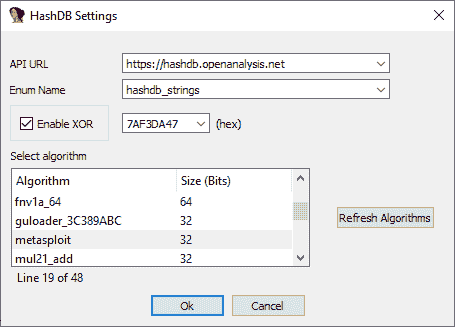
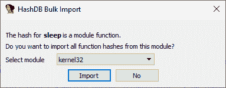
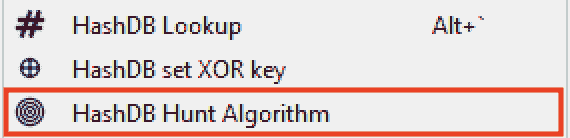
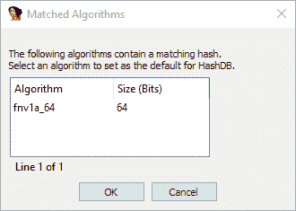

# Hash db-Ida:Ida Pro 的 HashDB API 哈希查找插件

> 原文：<https://kalilinuxtutorials.com/hashdb-ida/>

**Hashdb-Ida** 是 IDA Pro 的恶意软件字符串哈希查找插件工具。这个插件连接到 OALABS HashDB 查找服务。

**添加新的哈希算法**

哈希算法数据库是开源的，可以在 GitHub 上添加新的算法。拉请求大部分是自动化的，只要我们的自动化测试通过，新算法将在几分钟内在 HashDB 上可用。

**使用 HashDB**

通过在 IDA 反汇编视图中右键单击 hash 常量并启动`**HashDB Lookup**`客户端，可以使用 HashDB 来查找恶意软件中已经散列的字符串。

**设置**

在插件可以用来查找散列之前，必须配置 HashDB 设置。可以从插件菜单 **`Edit->Plugins->HashDB`启动设置窗口。**

**哈希算法**

单击`**Refresh Algorithms**`从 HashDB API 中提取支持的哈希算法列表，然后选择您正在分析的恶意软件中使用的算法。

**Optional XOR**

还有一个选项是对每个哈希值启用 XOR，因为这是恶意软件作者用来进一步混淆哈希的常用技术。

API URL

HashDB 查找服务的默认 API URL 是`**https://hashdb.openanalysis.net/**`。如果您使用自己的内部服务器，可以将此 URL 更改为指向您的服务器。

**枚举名称**

当一个新的散列被 HashDB 识别时，该散列及其相关的字符串被添加到 IDA 中的一个**枚举**中。然后，可以使用该枚举将 IDA 中的哈希常量转换为它们对应的枚举名称。在与现有枚举冲突的情况下，可以从设置中配置枚举名称。

**哈希查找**

一旦插件设置被配置，你可以在 IDA 反汇编窗口中右键点击任何常量，并以散列的形式查找该常量。如果需要，右键单击还提供了设置 XOR 值的快速方法。

**批量导入**

如果一个散列是一个模块的一部分，一个提示将询问你是否想要从那个模块导入所有的散列。这是批量拉取散列的快速方法。例如，如果识别出的散列之一是来自`**kernel32**`模块的`**Sleep**`，那么 HashDB 可以从 **`kernel32`提取所有散列的导出。**

**算法搜索**

HashDB 还包括一个基本的算法搜索，它将尝试根据散列值来识别散列算法。**搜索将返回包含哈希值的所有算法，由分析师决定哪个(如果有)算法是正确的。**要使用该功能，右击哈希常数并选择`**HashDB Hunt Algorithm**`。

包含该散列的所有算法将显示在一个选择框中。选择框可以用来直接选择 HashDB 使用的算法。如果选择了`**Cancel**`，将不会选择任何算法。

**动态导入地址表哈希扫描**

一些恶意软件开发人员将在内存中创建一个导入散列块，而不是单独解析 API 散列(内嵌在代码中)。然后，在一个函数中解析这些散列，创建一个动态导入地址表，稍后在代码中引用该表。在这些情况下，可以使用**哈希数据库扫描 IAT** 功能。

只需选择导入散列块，右键单击并选择`HashDB Scan IAT`。HashDB 将尝试解析所选范围内的每个单独的整数类型(`DWORD/QWORD`)。

**安装 HashDB**

在使用这个插件之前，你必须在你的 IDA 环境中安装 python **请求**模块。最简单的方法是在 IDA 外部的 shell 中使用 pip。
`**pip install requests**`

一旦你安装了请求模块，只需将最新版本的`hashdb.py`复制到你的 IDA 插件目录中，你就可以开始查找散列了！

[**Download**](https://github.com/OALabs/hashdb-ida)