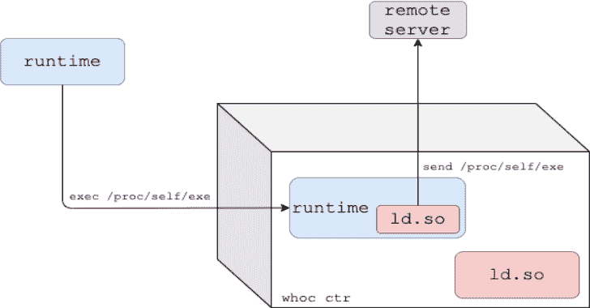
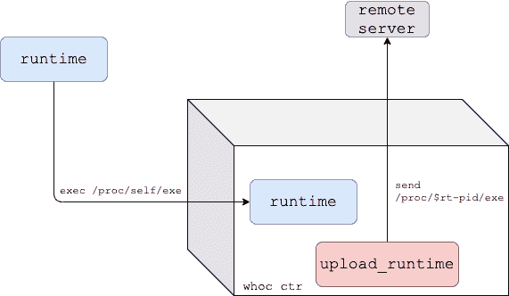

# Whoc:提取底层容器运行时的容器映像

> 原文：<https://kalilinuxtutorials.com/whoc/>

[](https://blogger.googleusercontent.com/img/a/AVvXsEhoOtXTTgwAILo7_iVmwKDHiYFqUbdTTAaLwtkxF_o1uEl7cVjxgpPyycB1hmrcJSoO90Y4AtQLloD-nlpUfcurdePCzt5E-Za6ZryJW_LfFnAViUjIOVrhRxo0ggi0HDzk8rx5xJ3puaZ94h7wElqjr0Ei2xDYrIVBlfjrUN-g425lpMXY4pY5DD3d=s728)

Whoc 是一个容器映像，它提取底层的容器运行时，并将其发送到远程服务器。戳一下你喜欢的 CSP 容器平台的底层容器运行时！

它是如何工作的？

如 runc [CVE-2019-5736](https://unit42.paloaltonetworks.com/breaking-docker-via-runc-explaining-cve-2019-5736/) 所示，传统的 Linux 容器运行时将自己暴露给它们正在运行的容器`/proc/self/exe`。`whoc`使用这个链接来读取执行它的容器运行时。

**动态模式**

这是针对动态链接容器运行时的默认模式。

1.  `whoc`图像入口点设置为`/proc/self/exe`，图像的动态链接器(`ld.so`)替换为`upload_runtime`。
2.  一旦映像运行，容器运行时将在容器内重新执行自身。
3.  假设运行时是动态链接的，内核将我们的假动态链接器(`upload_runtime`)加载到运行时进程，并将执行传递给它。
4.  `upload_runtime`通过`/proc/self/exe`读取运行时二进制，并发送给配置好的远程服务器。


**等待执行模式**

对于静态链接的容器运行时，`whoc`有另一种风格:`whoc:waitforexec`。

1.  `upload_runtime`是图像入口点，作为`whoc`容器 PID 1 运行。
2.  用户应该执行到`whoc`容器中，并调用一个指向`/proc/self/exe`的文件(例如`docker exec whoc_ctr /proc/self/exe`)。
3.  一旦 exec 发生，容器运行时就在容器内部重新执行自己。
4.  `upload_runtime`通过`/proc/$runtime-pid/exe`读取运行时二进制，并发送给配置好的远程服务器。



**尝试本地**

你需要安装`docker`和`python3`。克隆存储库:

```
$ git clone git@github.com:twistlock/whoc.git
```

设置文件服务器以接收提取的容器运行时:

```
$ cd whoc
$ mkdir -p stash && cd stash
$ ln -s ../util/fileserver.py fileserver 
$ ./fileserver
```

从另一个 shell，在您选择的容器环境中运行`whoc`映像，例如 Docker:

```
$ cd whoc
$ docker build -f Dockerfile_dynamic -t whoc:latest src  # or ./util/build.sh
$ docker run --rm -it --net=host whoc:latest 127.0.0.1  # or ./util/run_local.sh
```

查看文件服务器收到了容器运行时。如果在 vanilla Docker 下运行`whoc`，收到的容器运行时应该是 [runc](https://github.com/opencontainers/runc) 。

*`--net=host`仅在本地测试中使用，这样`whoc`容器可以通过`127.0.0.1`轻松到达主机上的文件服务器。*

**其他平台**

默认情况下，`whoc`是为`linux/amd64`构建的，但它也支持其他 CPU 架构。等待执行模式可以照常构建。为了在动态模式下为其他 CPU 架构构建`whoc`，您必须用目标架构上的动态链接器的路径填充`PLATFORM_LD_PATH_ARG`构建参数。

在`util/build_arm64.sh`上有一个`arm64`的示例构建脚本。

**帮助**

`whoc`的主二进制文件`upload_runtime`的帮助:

```
Usage: upload_runtime [options] <server_ip>

Options:
 -p, --port                 Port of remote server, defaults to 8080
 -e, --exec                 Wait-for-exec mode for static container runtimes, waits until an exec to the container occurred
 -b, --exec-bin             In exec mode, overrides the default binary created for the exec, default is /bin/enter
 -a, --exec-extra-argument  In exec mode, pass an additional argument to the runtime so it won't exit quickly
 -r, --exec-readdir-proc    In exec mode, instead of guessing the runtime pid (which gives whoc one shot of catching the runtime),
                            find the runtime by searching for new processes under '/proc'

```

[**Download**](https://github.com/twistlock/whoc)