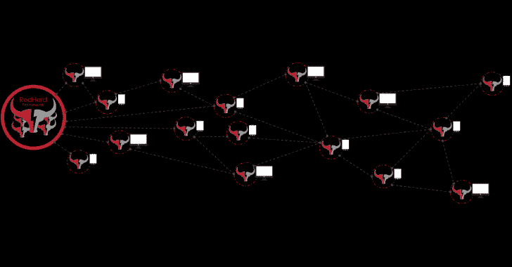

# Redherd 框架:一个协作的无服务器框架

> 原文：<https://kalilinuxtutorials.com/redherd/>

RedHerd 是一个协作和无服务器的框架，用于协调地理上分布的一组资产，能够进行模拟复杂的进攻性网络空间作战的 T2。

**入门**

看看 RedHerd [文档](https://redherd.readthedocs.io)中关于如何开始使用该框架的说明。

**变更日志**

前往[变更日志](https://github.com/redherd-project/redherd-framework/blob/main/CHANGELOG.md)查看所有版本变更。

**免责声明**

提供的内容和工具仅用于认知和研究目的。我们的目标受众是那些对学习道德黑客、安全、渗透测试和 Red Teaming 感兴趣的人。我们对提议材料和讨论主题的任何不当或非法使用不负任何责任。

[**Download**](https://github.com/redherd-project/redherd-framework)