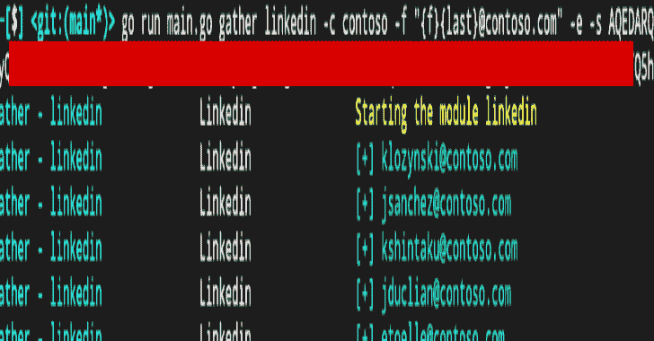
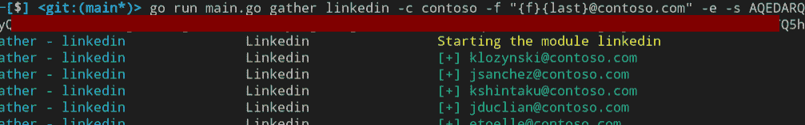
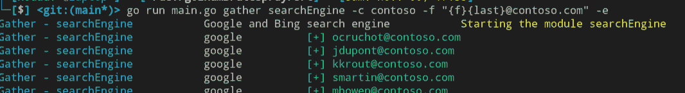
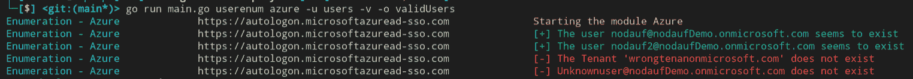
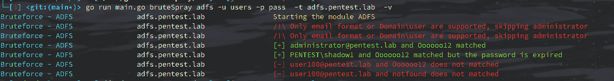
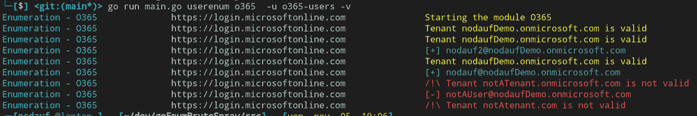
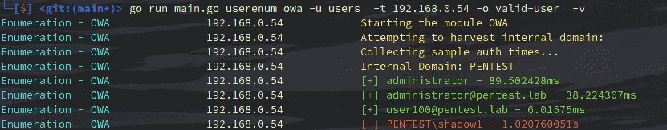
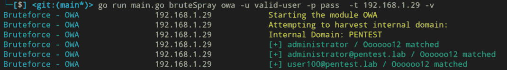

# goenumbrutesplay:Azure、ADFS、OWA、O365 上的用户枚举和密码暴力，以及在 Linkedin 上收集电子邮件

> 原文：<https://kalilinuxtutorials.com/goenumbrutespray/>

对于用户枚举和密码强制/喷射，建议模块为 o365。可以检索附加信息以避免帐户锁定，了解密码有效但已过期，MFA 已启用，…

**Linkedin**

在通过用户枚举模块验证电子邮件地址之前，应该使用该模块来检索电子邮件地址列表。将在 Linkedin 上搜索该公司，并以指定的格式返回在这些公司工作的所有人员。

Linkedin 的会话 cookie `li_at`是必需的。

**搜索引擎**

在通过用户枚举模块验证电子邮件地址之前，应该使用该模块来检索电子邮件地址列表。公司名称会带着呆瓜在 Google 和 Bing 上搜索，找到在公司工作的人(`site:linkedin.com/in+"%s"`)。结果标题将被解析为指定格式的输出电子邮件地址。

**蔚蓝色**

**用户枚举**

Azure 模块仅可用于枚举租户的用户。认证请求将在`https://autologon.microsoftazuread-sso.com`提出，详细的响应显示如果账户不存在，需要 MFA，如果账户被锁定，…

**ADFS**

**密码暴力/喷雾**

ADFS 模块只可用于暴力或喷射密码。认证请求被发送到`https://<target>/adfs/ls/idpinitiatedsignon.aspx?client-request-id=<randomGUID>&pullStatus=0`。如果密码过期，错误消息会通知用户

**O365**

该模块允许枚举用户和暴力/喷射密码。

**用户枚举**

有几种模式可用:office、oauth2 和 onedrive(尚未实现)。建议使用办公模式，因为不进行身份验证。Oauth2 可以通过 [AADSTS 错误代码](https://docs.microsoft.com/en-us/azure/active-directory/develop/reference-aadsts-error-codes)检索附加信息(MFA 启用、锁定帐户、禁用帐户)

**密码暴力/喷雾**

至于用户枚举，有两种模式可用:oauth2 和 autodiscover(尚未实现)。Oauth2 是推荐的模式，由于有了 [AADSTS 错误代码](https://docs.microsoft.com/en-us/azure/active-directory/develop/reference-aadsts-error-codes)，它可以获得更多信息。

**OWA**

该模块允许枚举用户和暴力/喷射密码。

**用户枚举**

通过身份验证请求进行枚举。对不存在的用户进行身份验证比对有效用户进行身份验证需要更长的时间。首先，计算无效用户的平均响应时间，然后比较每个身份验证请求的响应时间。

**密码暴力/喷雾**

请注意，不能实现任何帐户锁定机制，因为没有关于它的信息被返回。

[**Download**](https://github.com/nodauf/GoMapEnum)