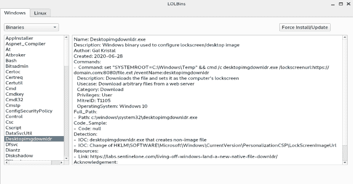

# LOLBins:用于 LOLBAS 和 GTFOBins 的 PyQT5 应用程序

> 原文：<https://kalilinuxtutorials.com/lolbins/>

PyQT 应用程序列出了所有来自 [LOLBAS](https://github.com/LOLBAS-Project/LOLBAS) 的 Windows 二进制文件和脚本，以及来自 [GTFOBins](https://github.com/GTFOBins/GTFOBins.github.io) 的 Unix 二进制文件，它们可以用来绕过错误配置系统中的本地安全限制。

***Windows***

**Linux**

[**Download**](https://github.com/Hamza-Megahed/LOLBins)