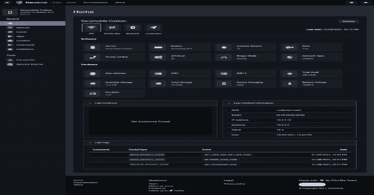

# Nanobrok:远程控制和保护你的 Android 设备的网络服务

> 原文：<https://kalilinuxtutorials.com/nanobrok/>

Nanobrok-Server 是一个强大的开源 web 服务，用于控制和保护您的 android 设备，用 Python 编写，允许并提供与您的 android 设备的稳定和安全的连接，用于远程保护和控制。

**主要特点**

*   映射您设备的位置
*   警报标志(万一丢失或被盗)
*   录音机音频麦克风
*   远程文件传输[专业版]
*   网络扫描仪
*   还有**更**！

**安全特性**

我们实现了一些安全功能来保护你的远程服务器。但是请记住，没有一种通过互联网传输的方法或电子存储的方法是 100%安全可靠的，我不能保证它绝对安全。

*   CSRF 代币
*   登录尝试阻止限制
*   x-框架-选项
*   同源政策(SOP)
*   CORS 烧瓶实施
*   HTTPS 力重定向
*   API Header X-CSRFToken
*   自签名证书(CA)

我们一直在寻求实现安全功能。

**支持的平台**

*   **Python** :你需要 **Python 3.7 或更高版本**来运行 Nanobrok-Server。
*   可以运行 [localhost](https://github.com/P0cL4bs/Nanobrok/wiki/Installation#virtualenv) 、 [VPS](https://github.com/P0cL4bs/Nanobrok/wiki/Installation#install-on-vps) 或者作为 [heroku app](https://github.com/P0cL4bs/Nanobrok/wiki/Installation#heroku) 。
*   **操作系统**:
    *   Linux 的最新版本(我们在 **Ubuntu 18.04 LTS** 上进行了测试)；
    *   请注意: **Windows** 是**支持的**(尚未测试)

**安装&文档**

了解有关使用 [wiki](https://github.com/P0cL4bs/Nanobrok/wiki) 的更多信息

*   [安装](https://github.com/P0cL4bs/Nanobrok/wiki/Installation)

[**Download**](https://github.com/P0cL4bs/Nanobrok)