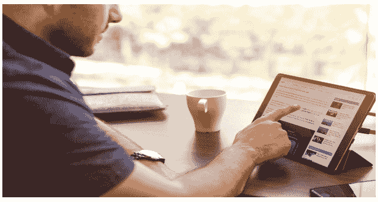
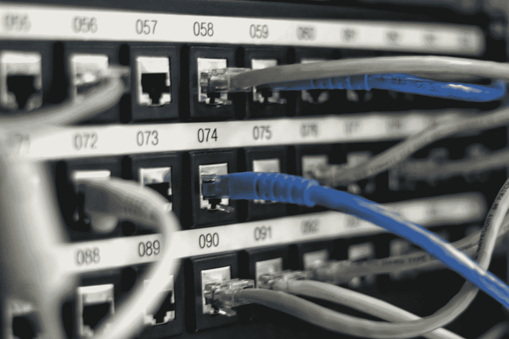

# 在互联网上保护自己安全的 7 种方法

> 原文：<https://kalilinuxtutorials.com/7-ways-in-which-you-can-keep-yourself-safe-on-the-internet/>

很容易找到在互联网上保持安全的方法。借助当今的技术，您可以在自己家中方便地与世界各地的亲朋好友保持联系。然而，如果你在上网时没有采取适当的互联网安全措施，你可能会遇到一系列危险的网络行为，使你面临成为欺诈或身份盗窃受害者的风险。

你可能成为目标的另一种方式是通过使用间谍软件。[研究表明](https://celltrackingapps.com/how-to-spy-on-cell-phone-without-having-access-to-the-phone/)一些间谍应用程序可以跟踪你的智能手机或电脑的所有活动，包括通话、信息、电子邮件、社交媒体通信和浏览器历史记录。

这篇文章深入探讨了在互联网上保护自己安全的一些最佳方法。下面是最重要的七个。

## **分享个人信息时要小心**

小心你给谁的个人信息。通过电子邮件或聊天程序很容易泄露个人信息。对于你给谁提供你的信息要非常小心，特别是如果他们通过自动程序或网站询问你的个人信息。如果您使用信用卡，请检查您使用的网站是否安全。如果没有，避免透露你的信用卡信息。网上也有许多免费的信用卡检查工具可供使用。

## **安装杀毒软件**

安装并运行防病毒软件。病毒和其他恶意软件会破坏您计算机上的文件。未受保护的计算机是非常易受攻击的目标。您的防病毒软件可以帮助您检测和消除威胁，但它不能保护您免受它旨在检测的攻击。定期下载反病毒和反恶意软件，以确保您的计算机安全。

## **让您的电脑保持最新状态**

让您的计算机保持最新。大多数反病毒程序都包括自动更新。如果您的计算机感染了恶意病毒或恶意软件，使其无法正常运行，这些功能会特别有用。使用反恶意软件应用程序定期扫描您的计算机，以检查间谍软件、广告软件和其他威胁。

## **使用反恶意软件**

即使你认为你的电脑没有威胁，也要使用最新的反恶意软件程序。许多恶意软件程序采用先进的技术来躲避最流行的反恶意软件应用程序，因此请保持您的反恶意软件软件最新，以确保最大限度的保护。每天运行防病毒扫描以在新威胁成为问题之前检测它们也是一个好主意。这样，您就能够在恶意软件造成损害之前阻止它。

## **保护您的网络安全**

确保您的网络安全。保护您的手机或电脑免受未经授权的访问是保持互联网安全的最重要的方式之一。始终确保您授权所有员工或朋友访问您的计算机，并且所有系统都有密码保护。您可能需要安装某种类型的防病毒程序以及防火墙，以防止间谍软件和恶意软件进入您的计算机。一个好的防火墙将阻止黑客访问你的系统并发送病毒或木马。

## **千万不要远离可靠的网站**

你必须始终确定你所使用的网站的类型。这些网站必须可靠，值得信赖。相反，如果你在搜索栏的链接前看到一个写着“不安全”的网站，最好是避免使用甚至访问它。此外，如果你觉得某个文件可疑，不要下载，因为它可能是潜在病毒或恶意软件感染你的计算机或网络的入口。

## **使用强密码**

随着人们经常访问和使用的网站和社交媒体网站的数量增加，他们的电子邮件总是显示在屏幕上并易于访问。然而，考虑到这种暴露程度，您必须确保您的密码是强有力的和不可破解的。

千万不要用 1234 或 ABCD 或你的出生日期这样的密码。相反，它应该是大小写字母的字母数字组合，以确保最大的安全性。

## **在互联网上始终保持良好的判断力**

无论何时使用互联网，都要运用常识和良好的判断力。不要分享任何个人信息，不要访问任何您不熟悉的网站，并始终保护您的计算机免受其他人可能希望利用您的个人信息的攻击。尽管您的计算机是安全的，但这并不意味着您完全受到保护。意识到网上的危险，努力保护你的电脑免受不必要的入侵。

## **总之**

这些只是在互联网上保持安全的几种方法。你应该每天练习这些方法，因为它们很容易做到。这需要一点努力和时间，但你将得到的内心平静是值得的。通过被告知，你将知道如果问题出现时如何反应，这样做的最好方法是通过像[细胞追踪应用](https://celltrackingapps.com/)这样的网站上的研究来了解最新的研究。

所以，遵循上面的这些做法来确保你在互联网上的安全吧！