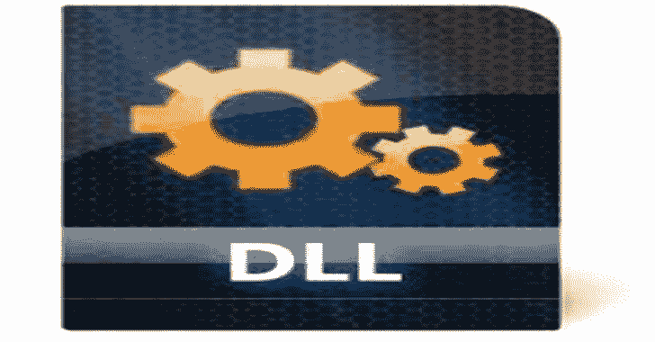

# Koppeling:自适应 DLL 劫持/动态导出转发

> -= the last fantasy =-荣誉出品本字幕仅供学习交流，严禁用于商业途径

Koppeling 展示了先进的 DLL 劫持技术。它是与“自适应 DLL 劫持”博文一起发布的。我建议您从这里开始理解这段代码。

该项目由以下要素组成:

*   **Harness.exe:** 易被劫持的“受害者”应用程序(静态/动态)
*   **Functions.dll:** “真正的”库，向线束公开有效的功能
*   **Theif.dll:** 试图获得执行权的“邪恶”库
*   NetClone.exe: 一个 C#应用程序，它将从一个 DLL 导出克隆到另一个 DLL
*   PyClone.py: 一个模仿 NetClone 功能的 python 3 脚本

VS 解决方案本身支持 4 种构建配置，它们映射到 4 种不同的代理功能方法。这应该为将来展示更多技术提供了一个很好的可扩展的方式。

*   **Stc-Forward:** 在构建过程中使用链接器注释转发导出名称
*   **Dyn-NetClone:** 使用 NetClone 将导出表从 functions.dll 的*克隆到 theif.dll 的*上**
*   **Dyn-PyClone:** 使用 PyClone 将导出表从 functions.dll 的*克隆到 theif.dll 的*上**
*   **Dyn-Rebuild:** 在加载后重建导出表并修补链接的导入表，以动态准备函数代理

每种技术的目标都是成功地捕获代码执行，同时将功能代理给合法的 DLL。每项技术都经过测试，以确保处理静态和动态接收器情况。到目前为止，这不是每一个原始或技术的变化。上面的帖子更详细。

**例子**

用一个明显不正确的 DLL 准备一个劫持场景

**复制 C:\windows\system32\whoami.exe。\whoami.exe
复制了 1 个文件。**

**复制 C:\ windows \ system32 \ kernel 32 . dll。\wkscli.dll
1 个文件被复制。**

在当前配置下执行应该会导致错误

**whoami.exe
“找不到入口点”**

将 kernel32 转换为 wkscli 的代理功能

**NetClone.exe–目标 C:\ windows \ system32 \ kernel 32 . dll–引用 C:\ windows \ system32 \ wks CLI . dll–输出 wkscli.dll
[+]完成。【whoami.exe】T2
电脑\用户**

[**Download**](https://github.com/monoxgas/Koppeling)