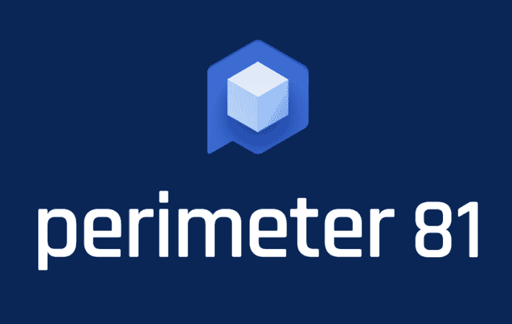

# 你需要了解的全球首个网络安全体验(CSX)平台:Perimeter 81

> 原文：<https://kalilinuxtutorials.com/what-you-need-to-know-about-the-worlds-first-cybersecurity-experience-csx-platform-perimeter-81/>

零信任网络领导者 Perimeter 81 宣布创建全球首个网络安全体验(CSX)平台，从而成为第一家存在于全新类别的网络安全工具中的公司。

Perimeter 81 发现现代企业网络安全市场迫切需要单一来源的简化安全访问服务边缘(SASE ),以将数十种传统网络安全和网络工具(如 VPN)合并到一个智能、设计良好的平台中。

从[小型企业](https://kalilinuxtutorials.com/the-top-it-and-tech-challenges-for-businesses-in-2019/)到财富 500 强企业，需要安全远程网络访问的各种企业都已经在使用 Perimeter 81 独一无二的网络安全解决方案。请继续阅读，了解您需要了解的关于全球首个 CSX 平台的一切，以及它为现代企业解决了哪些问题。

81 号边界是什么？

Perimeter 81 应用 SASE 网络架构来消除网络安全工具蔓延，并从根本上简化现代企业网络安全体验。

网络安全体验平台为各行各业各种规模的企业提供以下网络服务:

*   贴足邮资写明发信人…姓名地址的回信信封
*   零信任网络访问
*   防火墙即服务
*   监控仪表板
*   零信任应用程序访问
*   软件定义的边界
*   VPN 替代方案

与 VPN 等传统解决方案相比，这种新型的[网络安全体验平台](https://www.perimeter81.com/)允许企业 IT 团队和专业人员等网络管理员对其公司网络和系统安全的所有方面进行更精细的控制。

Perimeter 81 基于零信任原则运行，这意味着有权访问企业网络的每个人都必须被授予非常明确的权限，以便只访问他们需要的系统和应用程序。

这大大降低了网络风险，不像 VPN 那样，任何人都可以通过登录凭证访问网络的每个角落。使用 Perimeter 81 的 CSX 平台的最终结果是大幅缩小了网络攻击的潜在攻击面。

网络安全体验(CSX)平台解决了哪些问题？

传统的网络安全解决方案，如 VPN，已经运行了几十年，但它们很快就会过时，因为它们无法满足现代公司的网络和 IT 系统安全需求。Perimeter 81 正在解决传统网络安全工具带来的许多问题。让我们仔细看看它是如何做到这一点的…

1.  **混合动力和远程工作**
2.  **网络复杂性陷阱**
3.  **易于部署**
4.  **可扩展性**
5.  **灵活性**

## **混合动力和远程工作**

如果说过去几年教会了我们什么的话，那就是混合和远程工作已经存在[并将继续存在](https://www.forbes.com/sites/joemckendrick/2021/08/31/remote-and-hybrid-work-is-here-to-stay-and-thats-why-quality-of-worklife-matters/?sh=384276d27091)(全球远程员工的数量将继续增长)。

这是传统 VPN 不再提供足够级别的网络风险防护的最大原因之一-通过不同 WiFi 网络和不同位置从不同设备连接到企业网络和系统的人越多，网络攻击的潜在攻击面就越大。

有了 Perimeter 81 及其零信任原则，攻击面就很小，因为每个用户只能访问他们特别授权的内容。换句话说，黑客不可能只获得一个用户的登录凭证就进入企业网络并大肆破坏。

## **网络复杂性陷阱**

Perimeter 81 存在的催化剂是他们所谓的网络复杂性陷阱。这是大多数企业 IT 和网络安全团队使用数十种不同工具来保护公司数据安全的趋势。

事实上，根据 Perimeter 81 的一项研究，拥有 1，000 多名员工的公司中有 50%使用 20 种或更多网络安全工具和解决方案来完成工作。这导致管理企业网络的复杂性和时间的增加。

Perimeter 81 允许网络管理员从一个中央枢纽控制其公司在线系统的各个方面，从而防止公司陷入 Cyber Complexity 陷阱(或摆脱陷阱)。

## **易于部署**

Perimeter 81 的另一个优势是易于部署。传统解决方案可能需要 7 天或更长时间来设置和完全部署，而大多数客户可以在 20 分钟内部署 Perimeter 81 CSX 平台。

## **可扩展性**

除了部署速度慢之外，传统的网络安全解决方案在可扩展性方面也存在不足。许多 VPN 服务是打包出售的，限制了网络上允许的用户数量，因此如果一家公司快速发展，他们必须部署全新的 VPN 来容纳所有员工。Perimeter 81 提供按用户定价计划，因此很容易快速扩展。

## **灵活性**

传统解决方案通常旨在解决非常具体的问题，并且不容易与其他工具集成，而 Perimeter 81 的设计考虑了灵活性。它在一个中心提供对全系列网络安全工具的访问，并与第三方工具轻松集成，如亚马逊 AWS、微软 Azure、[谷歌云](https://kalilinuxtutorials.com/kubebot-slackbot-google-cloud/)、Salesforce 等。

## **关键外卖**

作为全球首个网络安全体验平台，Perimeter 81 正在解决现代企业网络安全需求，解决传统解决方案呈现的问题。

各种规模的企业都可以从实施 Perimeter 81 中受益，以消除工具蔓延，并将其网络安全体验统一到一个易于使用的工具中。因此，当您在寻找一个一体化的 CSX 平台来解决您所有的企业网络安全问题时，请记住 Perimeter 81！