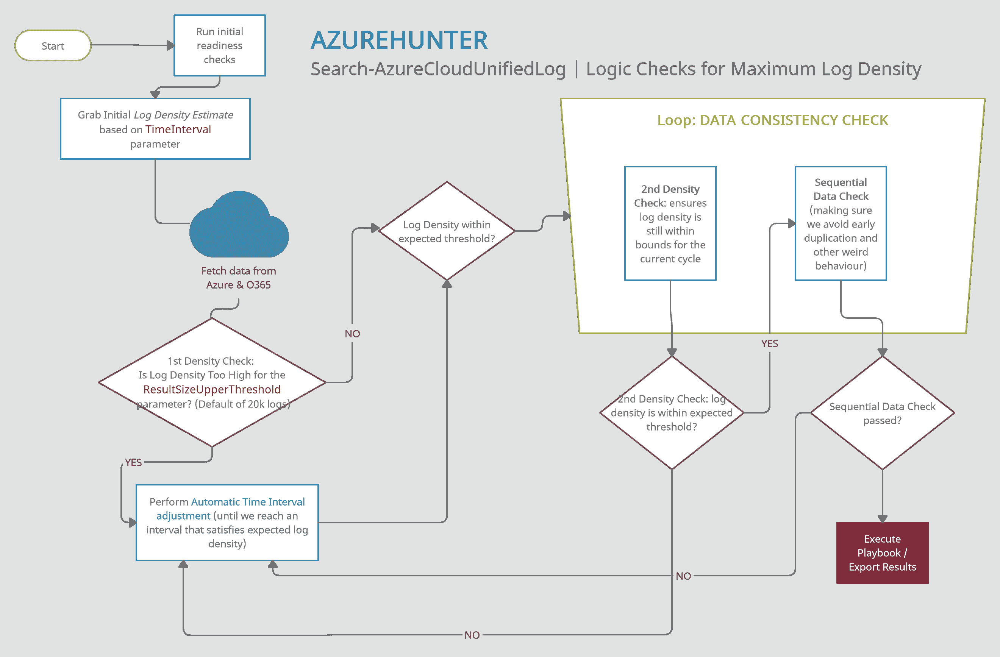

# AzureHunter:一个云取证 Powershell 模块，用于对来自 Azure 和 O365 的数据运行威胁搜索剧本

> 原文：<https://kalilinuxtutorials.com/azurehunter/>

AzureHunter 是一个 Powershell 模块，用于针对来自 Azure 和 O365 的数据运行威胁追踪行动手册，以实现云取证目的

**入门**

**检查您是否拥有 O365 权限**

为了能够使*对 UnifiedAuditLog 具有只读*访问权限，Exchange Online 中需要以下角色:`View-Only **Audit Logs**`或`**Audit Logs**`。

默认情况下，这些角色被分配给 Exchange 管理中心中的`**Compliance Management**`角色组。

**注意**:如果您是安全分析师、事件响应者或威胁搜寻者，而您的组织不允许您对这些审计日志进行**只读**访问，您需要认真质疑他们的检测和响应策略是什么！

更多信息:

*   如何使用 GUI 搜索审计日志
*   管理 Exchange Online 中的角色组
*   如何启用统一审计日志

**注意**:您的管理员可以通过在您的 Azure 租赁云 shell 或连接到 Azure 的本地 powershell 实例中运行`**Get-ManagementRoleEntry "*\Search-UnifiedAuditLog"**`来验证这些需求。

**确保安装了 exchange online management v2 PowerShell 模块**

请确保您已经安装了**exchange online management**(*exo v2*)。您可以在网上找到相关说明，或者在 soc 分析师卷轴上直接访问我的小知识库

**要么克隆 Repo，要么从 PSGallery 安装 AzureHunter】**

**克隆回购**

1.  克隆此存储库
2.  导入模块`**Import-Module .\source\AzureHunter.psd1**`

**从 PSGallery 安装 AzureHunter】**

你需要做的就是:

安装模块 azure hunter-Scope CurrentUser
导入模块 AzureHunter

**什么是 UnifiedAuditLog？**

统一审核日志包含在 Microsoft 365 管理中心或 Azure 管理门户中执行的用户、组、应用程序、域和目录活动。有关 Azure AD 事件的完整列表，请参见记录类型列表。

UnifiedAuditLog 是一个很好的云取证信息来源，因为它包含多种类型的云操作的大量数据，如 ExchangeItems、SharePoint、Azure AD、OneDrive、数据治理、数据丢失预防、Windows Defender 警报和隔离事件、Microsoft Defender for Office 365 中的威胁情报事件等等！

**AzureHunter 数据一致性检查**

AzureHunter 实现了一些有用的逻辑，以确保从 Azure & O365 审计日志中挖掘和导出最高的日志密度。为此，我们为每个周期(批次)运行两个不同的操作:

1.  **自动窗口时间减少**:该检查确保时间间隔根据 **ResultSizeUpperThreshold** 参数减少到最佳间隔，默认为 20k。这意味着，如果在您指定的**时间间隔**内返回的日志量高于 **ResultSizeUpperThreshold** ，那么将会进行自动调整。
2.  **顺序数据检查**:返回的记录索引顺序有效吗？

**用途**

**确保连接到 ExchangeOnline**

建议您在运行任何`**AzureHunter**`命令之前运行`**Connect-ExchangeOnline**`。该程序检查一个活跃的远程会话，并试图连接，但有些版本的 Powershell 不允许这样做，你需要自己做。

**运行 AzureHunter**

**AzureHunter** 有两个主要命令:`**Search-AzureCloudUnifiedLog**`和`**Invoke-AzHunterPlaybook**`。

`**Search-AzureCloudUnif**iedLog`的目的是实现一个复杂的逻辑，确保最高百分比的 *UnifiedAuditLog 记录*是从 Azure 中挖掘出来的。默认情况下，它会将提取和消除重复的记录导出到 CSV 文件。

`**Invoke-AzHunterPlaybook**`的目的是为存储在`**playbooks**`文件夹中的狩猎剧本提供一个灵活的接口。这些行动手册旨在让任何人都可以贡献自己的分析和想法。到目前为止，只开发了两个非常简单的剧本:`**AzHunter.Playbook.Exporter**`和`**AzHunter.Playbook.LogonAnalyser**`。在对数据应用重复数据删除和排序操作之后，`**Exporter**`负责导出记录。`**LogonAnalyser**`处于 beta 模式，提取`**Operations**`属性为`**UserLoggedIn**`的事件。这是一个使用行动手册可以做些什么以及创建一个行动手册有多容易的例子。

运行`**Search-AzureCloudUnifiedLog**`时，您可以传入每个日志批次要运行的剧本列表。`**Search-AzureCloudUnifiedLog**`将通过 **`Invoke-AzHunterPlaybook`将批次传递给剧本。**

最后`I**nvoke-AzHunterPlaybook**`可以独立使用。如果您有 UnifiedAuditLog 记录的导出，您可以将它们加载到 Powershell 数组中，并将它们传递给此命令，并指定相关的行动手册。

**示例 1 |在 Azure UnifiedAuditLog 上运行搜索，并将记录提取到 CSV 文件(默认行为)**

**Search-AzureCloudUnifiedLog-start date " 2020-03-06t 10:00:00 "-end date " 2020-06-09t 12:40:00 "-time interval 12-AggregatedResultsFlushSize 5000-Verbose**

该命令将:

*   搜索在*开始日期*和*结束日期*之间的数据
*   在这些日期之间实施一个 12 小时的窗口，该窗口将用于扫描整个时间间隔长度(start date –> end date)。该窗口将自动缩小**并调整**以在窗口内提供最大数量的记录，从而确保更高的输出质量。时间窗口按顺序滑动，直到到达**结束日期**。
*   `AggregatedResultsFlushSize`参数指定将由下游剧本处理的记录批次。我们在这里告诉 **AzureHunter** 一旦总数达到 **5000** 就处理该批记录。这样，您可以即时获得结果，而不必等待几个小时，直到将大量记录导出到 CSV 文件。

**例 2 |运行****CSV 文件上的狩猎攻略**

我们假设您已经将 UnifiedAuditLog 记录导出到 CSV 文件，如果是这样，您可以执行以下操作:

**$RecordArray = Import-Csv。\ my-exported-Records . CSV
Invoke-AzHunterPlaybook-Records $ record array-Playbooks ' az hunter。Playbook.UAL.LogonAnalyser'**

您可以通过用逗号分隔来运行多个行动手册，它们将按顺序运行:

**$RecordArray = Import-Csv。\ my-exported-Records . CSV
Invoke-AzHunterPlaybook-Records $ record array-Playbooks ' az hunter。战术手册. UAL.Exporter '，'阿兹亨特'。Playbook.UAL.LogonAnalyser'**

**示例 3 |运行搜索行动手册以生成干净的电子发现摘要报告**

我们假设您已经将电子发现摘要报告导出为 CSV 文件，如果是这样，您可以执行以下操作:

**$ ediscorportfile =。\ eDisco-Summary-Report-person of interest . CSV
Invoke-AzHunter playbook-Records $ ediscoreport file-Playbooks ' az hunter。playbook . edisco . summaryreportcleaner '**

可选地，我们可以向剧本传递一些参数，如下所示:

**$ ediscorportfile =。\ eDisco-Summary-Report-person of interest . CSV
Invoke-AzHunter playbook-Records $ ediscoreport file-Playbooks ' az hunter。playbook . edisco . summaryreportcleaner '-playbook parameters @ { " CsvRecordsBatchSize " = 700 }**

参数“CsvRecordsBatchSize”将告诉剧本以 700 条记录为一批将记录刷新到磁盘。

**为什么？**

自从网络安全管理软件产品供应链妥协案爆发以来，许多工具都是由网络打铁的忍者们精心打造，由一批又一批网络权威人士精雕细刻而成。这些工具通常可以帮助您在 Azure 中执行云取证。我使用 AzureHunter 的目的不是为了给这个拥挤的领域带来更多噪音，但是，我发现自己有必要填补我在该领域的一些工具中观察到的一些空白(但我可能是错的，因为工具正在激增，而且我并不完全了解这些工具……):

1.  *Azure 云取证工具通常不会为`**UnifiedAuditLog**`* 解决 Powershell API 的复杂性。这个 API 在导出大量数据时**非常不稳定和不一致**。我想开发一个容错的界面(**足够多**)来解决这些问题，只关注 *UnifiedAuditLog* ，因为这是 Azure 的人工制品，包含了用户、应用程序和服务的最相关和详细的活动日志。
2.  *Azure 云取证工具通常不会把重点放在开发可扩展的`**Playbooks**`* 上。我想提出一个简单的框架，帮助社区创建和分享新的剧本，从相同的数据中提取不同类型的意义。

然而，**如果你正在寻找一个功能更丰富、更成熟的 Azure 云取证应用程序**，我建议你去看看创建了以下应用程序的网络安全专家所做的出色工作:

*   CISA 麻雀
*   鹰
*   Azure CRT 的 CrowdStrike 报告工具

我确信还有更广泛的工具列表，但这些是我能想到的。请随意提出更多的建议。

[**Download**](https://github.com/darkquasar/AzureHunter)