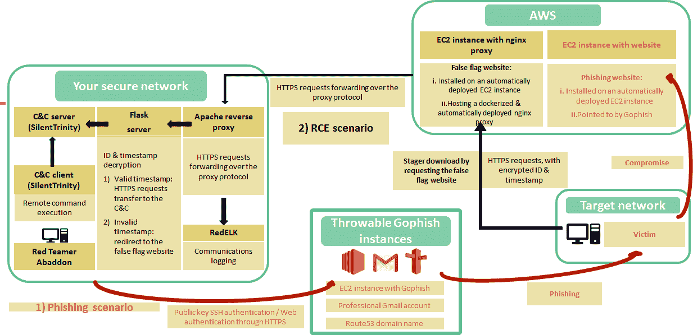

# 亚巴顿:让红队的行动更快，更可重复，更隐秘，同时包括增值工具和带来众多的报告能力

> 原文：<https://kalilinuxtutorials.com/abaddon/>

**亚巴顿**是一个红队，作战涉及杂七杂八的技能，历时数月且政治敏感；它们需要大量的监控、整合和谨慎。Wavestone 的红队行动管理软件亚巴顿旨在使红队行动更快、更可重复、更隐秘，同时包括增值工具并带来众多报告功能。

**因为**:

*   红队队员使用大量的工具
*   …但是没有运营管理(以及免费和开源)软件
*   …无论如何，这些工具之间没有聚合
*   …而且“运营安全”故障很常见

我们想要亚巴顿做什么？:

亚巴顿旨在通过以下方式促进红队行动:

*   **缩短构建基础设施的时间**
*   **通过 1 或 2 次点击实现复杂动作**
*   **简化长时间操作的报告**
*   **降低“OPSEC 故障”风险**

在 RSAC2020 上展示亚巴顿的幻灯片可以在这里找到:(亚巴顿，红队天使)

**你能部署什么**

*   30 分钟内部署完毕
*   可投掷的，认证的，秘密的
*   支持网络钓鱼和远程命令执行

**其他特征**

*   侦察:NMAP、侦察、亨特里奥和阿马斯的图形界面
*   武器化:开发中的模糊有效载荷的生成
*   交付:一次或两次点击部署 EC2 实例，Gophish，以及一个全功能，隐形和 dockered ed C&C 基础设施，如上所示
*   剥削与后剥削:发展中的理念🙂
*   报告:一个简单的仪表板已经准备好，但仍在开发中，以跟踪您的操作

**安装并启动亚巴顿**

亚巴顿已经在 Debian，LUbuntu，当然还有 KALI Linux 上进行了测试(最新的测试是在 5.4.0 amd64 版本上进行的)。如果您想在本地部署您的 C&C 服务器，您还需要有互联网接入和一个公共 IP 地址。

请注意，要配置您的 AWS 环境，最简单的方法可能是安装 aws-cli，如下所示:https://docs . AWS . Amazon . com/fr _ fr/CLI/latest/user guide/install-CLI v2-Linux . html

**curl " https://AWS CLI . Amazon AWS . com/AWS CLI-exe-Linux-x86 _ 64 . zip "-o " AWS cliv 2 . zip "
unzip AWS cliv 2 . zip
sudo。/aws/install**

克隆此存储库并移入存储库文件夹

**git 克隆 git@github.com/wavestone-cdt/abaddon.git
CD 阿巴顿**

创建文件~/。AWS/凭据和~/。aws/config 与您的 aws 凭证和配置，使用以下命令:

**aws 配置**

将 settings.py.sample 移动到 settings.py. Add 更改数据库用户密码(在安装过程中将会询问此密码)

**mv Abaddon/settings . py . sample Abaddon/settings . py
sed-I ' s/your password here//g ' Abaddon/settings . py**

在 abaddon/setup 文件夹中启动以下命令:

**bash setup/install.sh**

该脚本将:

*   更新您的操作系统
*   安装姜戈和亚巴顿需要的包(包括 docker 和 docker-compose)
*   安装所有的 python 依赖项(包括 Django 3。x)
*   创建一个 PostgreSQL 数据库和一个具有正确角色的用户(您需要提供的数据库密码在 abaddon/settings.py 文件中，建议更改密码)
*   应用 Django 迁移
*   为 Django 应用程序创建一个超级用户，用于连接到亚巴顿的图形界面。

**启动红队天使！**

**bash abaddon.sh**

**打开浏览器，转到 URL 127.0.0.1:8000(使用安装期间创建的 Django 超级用户证书连接)。**

**在亚巴顿**部署空调基础设施&

*   如果以前没有从亚巴顿部署过 EC2 实例(从亚巴顿部署 EC2 很重要，这样您就可以访问位于 aws 文件夹中的 SSH 密钥)，请转到 **Delivery/Let's phish！**页面。点击**部署 EC2！**。等待部署结束(您可以在用于启动亚巴顿的终端内部检查 EC2 是否可以使用，所有部署步骤都出现在 shell 中)。
*   转到**misc/Apache/default-SSL . conf**文件，**更新**第二个虚拟主机内 EC2 的域名。为了避免检测到您的基础设施，请购买一个新的域名，并将其配置为指向您的 EC2。在 Apache 配置文件中使用此域名，并相应地更新**misc/Apache/top secret . key**和**misc/Apache/top secret . CRT**，这是您的新域的私钥和证书。
*   然后转到**监控当前场景**页面，点击**配置重新对话基础设施**。给这个场景起个名字。亚巴顿当时实际上只支持一种情况。选择一个从您的亚巴顿部署的 EC2 实例，并选择**本地部署**(因为您在本地部署您的 Apache docker)。然后，选择部署的 EC2 用来接收 HTTP 和 SSL 连接的端口，以及 Apache 反向代理将流量转发到的端口和 IP 地址(例如，SILENTTRINITY 服务器监听的 IP 和端口)。常见的配置如下:
*   **`http port = 80``ssl port = 443``Listening Port= 9999``C2 IP adress = 172.16.0.1`**
*   等待部署结束，并返回到**监控当前场景页面**。

[**Download**](https://github.com/wavestone-cdt/abaddon)