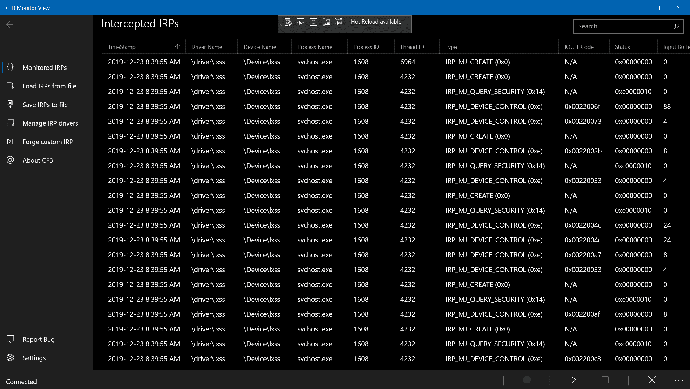
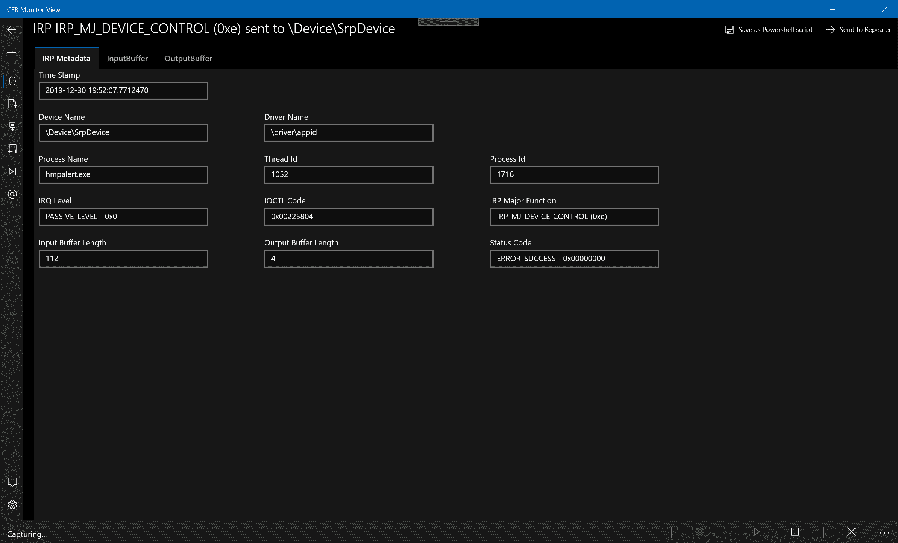
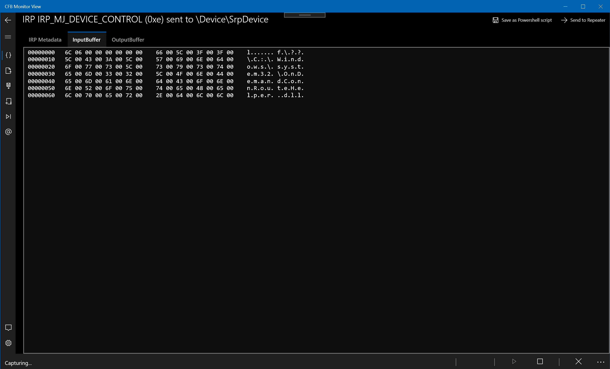
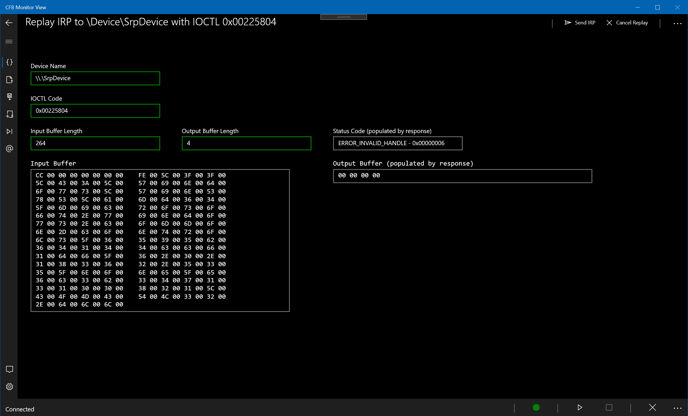
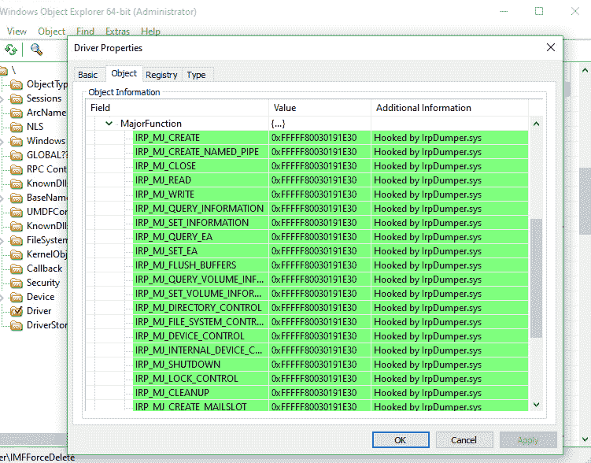

# 加拿大狂怒的海狸:一种工具，用于监控 Windows 驱动程序中的 IRP 处理程序，并促进分析、重放和模糊 Windows 驱动程序漏洞的过程

> 原文：<https://kalilinuxtutorials.com/canadian-furious-beaver/>

加拿大狂怒海狸是一个分布式工具，用于捕获发送到任何 Windows 驱动程序的 IRP。它分为两个部分:

1.  “代理”结合了一个用户代理和一个可自行提取的驱动程序(`**IrpDumper.sys**`)，该驱动程序将在目标系统上自行安装。一旦运行，它将暴露(取决于编译选项)一个远程命名管道(可从`**\\target.ip.address\pipe\cfb**`到达)，或者一个监听 TCP/1337 的 TCP 端口。通信协议设计得很简单(即不安全)，允许任何第三方工具轻松地从同一个代理转储驱动程序 IRP(通过简单的 JSON 消息)。
2.  GUI 是一个以`**ProcMo**n`风格制作的 Windows 10 UWP 应用程序:它将连接到代理所在的任何地方，并提供一个方便的 GUI 来操作代理(驱动程序枚举、挂钩和 IRP 捕获)。它还提供了伪造/重放 IRP、自动模糊化(即在每个捕获的 IRP 的*上应用特定的模糊化策略)或提取各种格式的 IRP(raw，作为 Python 脚本，作为 PowerShell 脚本)以供进一步分析的功能。捕获的数据可以以易于解析的格式(`***.cfb**` = SQLite)保存在磁盘上，以供进一步分析，和/或以后在 GUI 中重新加载。*

虽然 GUI 显然需要 Windows 10 环境(UWP 应用程序)，但代理本身可以部署在任何 Windows 7+主机上(x86 或 x64)。目标主机必须启用`**testsigning**` BCD 策略，因为自解压驱动程序对 WHQL 不友好。

**截图**

**拦截了 IRP 的观点**

**IRP 详情**

**IRP 回放**

**概念**

驱动程序是 CFB 代理的一部分，启动后会自动解压并安装。驱动程序将负责通过从代理传递来的 IOCTL 来挂钩被请求挂钩的驱动程序的 IRP 主函数表。成功后，驱动程序的 IRP 表将指向`**IrpDumper.sys**`拦截例程，我们可以很容易地用调试器或类似`**WinObjEx64**`的工具看到。

然后，它本身就充当了一个 rootkit，代理所有对目标驱动程序的调用。当一个`**DeviceIoControl**`被发送到一个被钩住的驱动程序时，`**IrpDumper**`将简单地捕获数据(如果有的话)，并把一个消息推送到用户域代理(`**Broker**`，并把执行返回给合法的驱动程序，允许预期的代码按预期继续执行。`**Broker**`将所有这些数据存储在用户空间中，等待一个事件来请求它们。

**打造**

**桂**

克隆存储库，并使用 Visual Studio 在项目根目录下构建解决方案`**CFB.sln**`中的`**Broker**`(调试–非常详细–或发布)。此外，您可以通过构建`**GUI (Universal Windows)**`项目来构建应用程序 GUI。

**命令行**

克隆存储库并在 VS 提示符下运行

C:\ CFB>msbuild CFB . SLN/p:Conficonfiguration = $ Conf

其中`**$Conf**`可以设置为`**Release**`到`**Debug**`。

**设置**

Windows 7+计算机(建议使用 Windows 10 SDK 虚拟机)

在该目标机器上，只需启用 BCD 测试签名标志(以管理员身份在`**cmd.exe**`中):

**C:>bcdedit.exe/set { whatever-profile } test signing on**

如果在调试模式下使用，`**IrpDumper.sys**`将提供更多有价值的信息，比如什么被钩住了(性能的代价)。所有这些信息都可以通过像`**DebugView.exe**`这样的工具或者像 WinDbg 这样的内核调试器看到。无论哪种情况，您都必须启用内核调试 BCD 标志(在`**cmd.exe**`中作为管理员):

**C:>bcdedit.exe/set { whatever-profile }调试开**

还建议通过以下方式编辑 KD 详细级别:

*   永久生效的注册(`**reg add "HKLM\SYSTEM\CurrentControlSet\Control\Session Manager\Debug Print Filter" /v DEFAULT /t REG_DWORD /d 0xf**`)
*   直接来自 WinDbg，仅用于当前会话(`**ed nt!Kd_Default_Mask 0xf**`)

如果你计划(重新)编译任何工具，你必须安装 VS (2019 首选)。如果使用发布的二进制文件，您只需要安装 VS c++ Redist(x86 或 x64，取决于您的 VM 架构)。

按照`**Docs/**`文件夹中的指示改进您的设置。

[**Download**](https://github.com/hugsy/CFB)