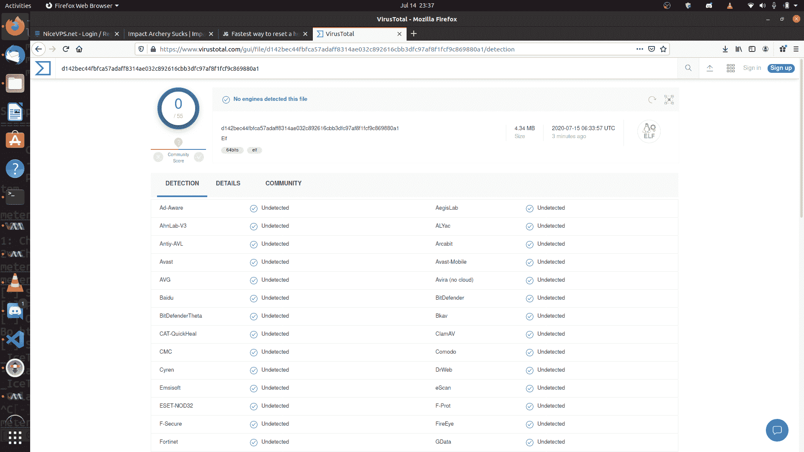

# 飞鱼:反病毒规避，不可探测，有效载荷运载工具

> 原文：<https://kalilinuxtutorials.com/exocet/>

由于 EXOCET 在 GCM 模式(伽罗瓦/计数器模式)下使用 AES-256，因此 EXOCET 优于 Metasploit 的“规避有效载荷”模块。Metasploit 的规避有效负载使用一种易于检测的 RC4 加密。虽然 RC4 可以更快地解密，但 AES-256 很难确定恶意软件的意图。

但是，可以使用 Metasploit 构建一个回避的有效负载，然后用 EXOCET 链接它。因此，EXOCET 将通过 AES-256 解密，然后 Metasploit 规避有效载荷从 RC4 解密自己。

很像我之前的项目，DarkLordObama，这个工具包被设计成一个运载/发射工具，就像面纱规避一样。

黑暗君主奥巴马计划

然而，EXOCET 并不局限于单个代码库或运行 Python 的平台。EXOCET 可以在 Go 支持的所有平台和架构上运行。

**飞鱼概述**

EXOCET 实际上是一个密码器类型的恶意软件下载程序，可以回收 WannaCry 等容易检测到的有效载荷，使用比 AES-CBC 更安全的 AES-GCM (Galois/Counter Mode)加密它们，然后为大多数架构和平台创建下载文件。

基本上…

1.  它吸收危险的恶意软件，现在可以被反病毒引擎检测到
2.  然后对它们进行加密，并生成自己的 Go 文件
3.  那么 Go 文件可以被交叉编译成 99%已知架构
4.  执行时，加密的有效负载被写入磁盘，并立即在命令行上执行
5.  或者，它将使用 amenzhinsky 的 go-memexec 模块 github.com/amenzhinsky/go-memexec 在内存中执行重组外壳代码，而不是文件删除
6.  **一个定制的外壳代码执行器正在工作中**，它获取普通的 C 外壳代码，在 num-transform 之后，它将在分配正确的虚拟地址空间并授予它在 Windows 上的 RWX 权限之后，通过创建一个新进程来运行它

这意味着 32 位和 64 位架构，它可以在 Linux、Windows、MAC、Unix、Android、iPhone 等平台上运行。你拿走任何东西，我是说任何东西，比如 1988 年差点让互联网瘫痪的莫里斯蠕虫(它利用了 UNIX 上 fingerd listener 守护进程的一个缺陷)，让它再次成为一种可行的网络武器。

飞鱼是为 DSX 计划设计的，或者是我想象中的“网络金属装备”。能够在没有可追踪的发射轨迹的情况下发射和扩散危险的恶意软件。

飞鱼完全是用 Go 写的。

**如何使用**

EXOCET，不管你用哪个二进制来运行它，都需要 Golang 来工作。默认情况下，它会生成一个密码器。去归档。

1.  Windows 用户:在此安装
2.  Linux 用户:运行`**sudo apt-get update && sudo apt-get install -y golang**`
3.  你必须在 golang 中安装 EXOCET 源文件`**go get github.com/tanc7/EXOCET-AV-Evasion**`
4.  子需求也将被下载和安装
5.  对于 Windows 和 Mac x64 用户，预编译的二进制文件位于/bin 文件夹中

**跑起来**

**去运行 exocet . go detectablemalware.exe 输出 malware.go**

系统会自动为您生成一个密钥。密钥长度为 64 个字符，完全由 bash 和 cmd.exe shell 管道重定向器组成，通过在法医分析师的设备上造成不可预测的破坏性行为来混淆和破坏对密钥的暴力破解尝试。

对于 64 位 Windows 目标…

**env GOOS = windows go arch = amd64 go build-LD flags "-s-w "-o outputMalware.exe 输出 malware.go**

又出来一个 **`outputmalware.exe`** 文件

对于 64 位 MacOS 目标

**env GOOS = Darwin go arch = amd64 go build-LD flags "-s-w "-o output malware . macho output malware . go**

对于 64 位 Linux 目标

**env GOOS = Linux go arch = amd64 go build-LD flags "-s-w "-o output malware . elf output malware . go**

[**Download**](https://github.com/tanc7/EXOCET-AV-Evasion)