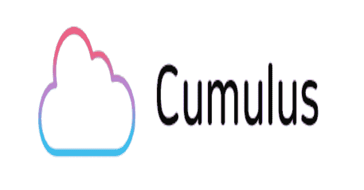
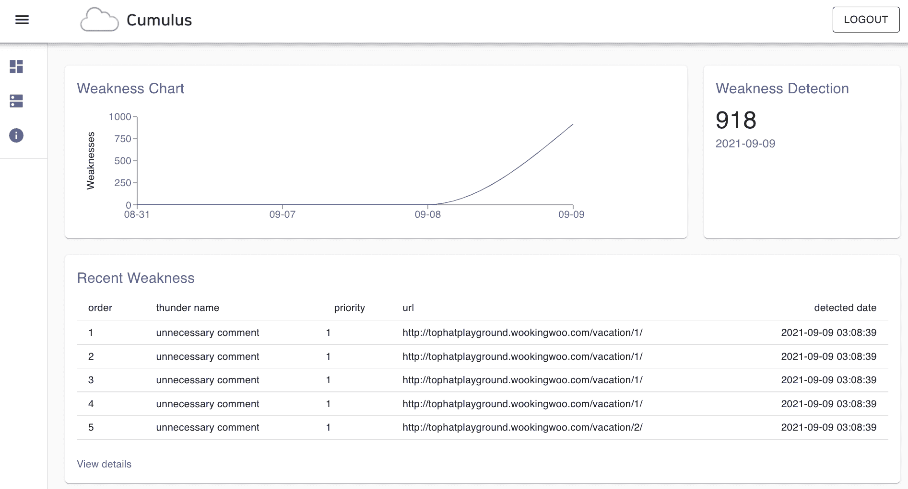

# 积云:Web 应用程序弱点监控，只需添加 3 行代码就能工作

> 原文：<https://kalilinuxtutorials.com/cumulus/>

积云是一种帮助你实时监控和修复安全漏洞的服务。这些问题将在 web dashboard 上报告。很简单，功能强大。

**主要特征**

只要在 web 前端安装 SDK，就可以发现服务上的安全漏洞

*   SDK 从内层动态检测弱点(ex_ DOM 事件，XHR 请求)
*   扫描器静态地从外层检测弱点(例如基于 Web 爬行的分析)

| 名字 | 起源 | 描述 |
| --- | --- | --- |
| XSS | 软件开发工具包(Software Development Kit) | 当用户输入一个 xss 模式字符串时，触发 XSS 检测 |
| SQL 注入 | 软件开发工具包(Software Development Kit) | 当用户输入 sqlinjection 模式时，触发 SQLInjection 检测 |
| 敏感有效载荷 | 软件开发工具包(Software Development Kit) | 当请求敏感负载时。例如，未编码的原始密码 |
| 文件上传 | 软件开发工具包(Software Development Kit) | 当用户嵌入任何担心系统的文件时。例如，web shell |
| 不必要的评论 | 扫描仪 | 代码注释在提供的 HTML 或 JS 上 |
| 目录遍历 | 扫描仪 | 检测目录列表漏洞 |
| 认为 | 扫描仪 | 检测敏感页面，如 admin |
| 无混淆代码 | 扫描仪 | 检测未混淆的易受攻击的代码 |

如果你认为能够检测到额外的弱点，请在 SDK 或扫描仪上做出贡献

**积云 JavaScript SDK**

JavaScript 的官方 Cumulus SDK，作为 npm 提供

注意:当前版本是 typescript 项目不支持的版本，但我们现在正在考虑，并将尽快制作！( [#2](https://github.com/tophat-cloud/cumulus/issues/2) )

**安装**

要安装 SDK，只需添加如下所示的包:

**npm 安装–保存 https://github.com/tophat-cloud/cumulus
纱线添加 https://github.com/tophat-cloud/cumulus**

SDK 的设置和使用始终遵循相同的原则。

**从‘积云’导入{ protect，capture message }；
保护({
key: 'key '，
})；
捕获信息(‘你好，世界！’);**

如果你还没有`**__key__**`，请[注册](https://cumulus.tophat.cloud/signup)并创建项目以获得钥匙

[Download](https://github.com/tophat-cloud/cumulus)